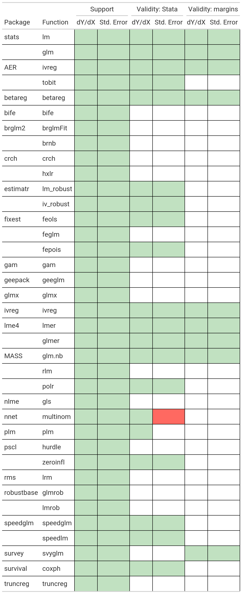

# The `marginaleffects` package for `R` 

<!-- badges: start -->
[](https://lifecycle.r-lib.org/articles/stages.html#experimental)
[](https://codecov.io/gh/vincentarelbundock/marginaleffects?branch=main)
[](https://github.com/vincentarelbundock/marginaleffects/actions)
<!-- badges: end -->

```{r, include = FALSE}
knitr::opts_chunk$set(
  collapse = TRUE,
  comment = "#>",
  fig.path = "man/figures/README-",
  out.width = "100%"
)
```

## What?

The `marginaleffects` package allows `R` users to compute and plot four principal quantities of interest for a *wide* variety of models:

* [_Marginal Effect_ (Vignette)](https://vincentarelbundock.github.io/marginaleffects/articles/mfx.html) 
    - A partial derivative (slope) of the regression equation with respect to a regressor of interest.
* [_Adjusted Prediction_ (Vignette)](https://vincentarelbundock.github.io/marginaleffects/articles/predictions.html) 
    - The outcome predicted by a model for some combination of the regressors' values, such as their means or factor levels (a.k.a. "reference grid"). 
* [_Contrast_ (Vignette)](https://vincentarelbundock.github.io/marginaleffects/articles/contrasts.html) 
    - The difference between two adjusted predictions, calculated for meaningfully different regressor values (e.g., College graduates vs. Others).
* [_Marginal Mean_ (Vignette)](https://vincentarelbundock.github.io/marginaleffects/articles/marginalmeans.html) 
    - Adjusted predictions of a model, averaged across a "reference grid" of categorical predictors.

## Why?

To calculate marginal effects we need to take derivatives of the regression equation. This can be challenging to do manually, especially when our models are non-linear, or when regressors are transformed or interacted. Computing the variance of a marginal effect is even more difficult. 

The `marginaleffects` package hopes to do most of this hard work for you.

Many `R` packages advertise their ability to compute "marginal effects." However, most of them do *not* actually compute marginal effects *as defined above*. Instead, they compute "adjusted predictions" for different regressor values, or differences in adjusted predictions (i.e., "contrasts"). The rare packages that actually compute marginal effects are typically limited in the model types they support, and in the range of transformations they allow (interactions, polynomials, etc.).

The main packages in the `R` ecosystem to compute marginal effects are the trailblazing and powerful [`margins` by Thomas J. Leeper](https://cran.r-project.org/package=margins), and [`emmeans` by Russell V. Lenth and contributors.](https://cran.r-project.org/package=emmeans) The `marginaleffects` package is essentially a clone of `margins`, with some additional features from `emmeans`.

So why did I write a clone?

* _Powerful:_ Marginal effects and contrasts can be computed for about 40 different kinds of models. Adjusted predictions and marginal means can be computed for about 100 model types. 
* _Extensible:_ Adding support for new models is very easy, often requiring less than 10 lines of new code. Please submit [feature requests on Github.](https://github.com/vincentarelbundock/marginaleffects/issues)
* _Fast:_ [In one benchmark,](https://vincentarelbundock.github.io/marginaleffects/articles/benchmark.html) computing unit-level standard errors is over 400x faster with `marginaleffects` (minutes vs. milliseconds).
* _Efficient:_ Smaller memory footprint (1.8GB vs 52MB in the same example).
* _Valid:_  When possible, numerical results are checked against alternative software like `Stata`, or other `R` packages.
* _Beautiful:_ `ggplot2` support for plotting (conditional) marginal effects and adjusted predictions.
* _Tidy:_ The results produced by `marginaleffects` follow "tidy" principles. They are easy to program with and feed to [other packages like `modelsummary`.](https://vincentarelbundock.github.io/marginaleffects/) 
* _Simple:_ All functions share a simple, unified, and well-documented interface.
* _Thin:_ The package requires few dependencies.
* _Safe:_  User input is checked extensively before computation. When needed, functions fail gracefully with informative error messages.
* _Active development_

Downsides of `marginaleffects` include:

* Functions to estimate contrasts and marginal means are considerably less flexible than `emmeans`.
* Simulation-based inference is not supported.
* Newer package with a smaller (read: nonexistent) user base.

## How?

By using [the `numDeriv` package](https://cran.r-project.org/package=numDeriv) to compute gradients and jacobians, and [the `insight` package](https://easystats.github.io/insight/) to extract information from model objects. That's it. That's the secret sauce.

## Supported models

#### Adjusted predictions and marginal means

Under the hood, `marginaleffects`'s `predictions` function uses the `insight` package to retrieve adjusted predictions from a wide variety of models. Currently, `insight` [supports over 200 types of model objects](https://easystats.github.io/insight/), and most of those should work out-of-the-box with the `predictions` function. If you run into problems, do not hesitate to report them on Github or via email.

#### Marginal effects and contrasts

This table shows the list of models supported by the `marginaleffects` function, and shows which numerical results -- marginal effects (dY/dX) or standard errors (Std. Error) -- have been checked against alternative software packages: Stata's `margins` command and R's `margins` package. Empty cells mean that the results of a model have not yet been validated against external software. Green cells indicate that the results of [at least one model from the test suite](https://github.com/vincentarelbundock/marginaleffects/tree/main/tests/testthat) match to a reasonable tolerance. Red cells mean that `marginaleffects` results do *not* match those produced by alternative software packages. Obviously, caution is especially warranted when working with estimates from red cells.

I am *very* eager to add support for new models. Feel free to file a request on Github or -- even better -- submit some code.

Warning: When using `marginaleffects` with different models, you will probably have to adjust the `type` argument. Refer to the documentation of your modeling package to see what `type` argument is allowed in the `predict` function. 

```{r, echo = FALSE, out.width = "60%"}

```

## Installation

You can install the released version of `marginaleffects` from CRAN:

```{r, eval=FALSE}
install.packages("marginaleffects")
```

You can install the development version of `marginaleffects` from Github:

```{r, eval=FALSE}
remotes::install_github("vincentarelbundock/marginaleffects")
```

## Getting started

First, we estimate a linear regression model with multiplicative interactions:

```{r}
library(marginaleffects)

mod <- lm(mpg ~ hp * wt * am, data = mtcars)
```

#### Marginal effects

A "marginal effect" is a unit-specific measure of association between a change in a regressor and a change in the regressand. The `marginaleffects` function thus computes a distinct estimate of the marginal effect and of the standard error for each regressor ("term"), for each unit of observation ("rowid"). You can view and manipulate the full results with functions like `head`, as you would with any other `data.frame`:

```{r}
mfx <- marginaleffects(mod)

head(mfx, 4)
```

The function `summary` calculates the "Average Marginal Effect," that is, the average of all unit-specific marginal effects:

```{r}
summary(mfx)
```

The `plot_cme` plots "Conditional Marginal Effects," that is, the marginal effects estimated at different values of a regressor (often an interaction):

```{r}
plot_cme(mod, effect = "hp", condition = c("wt", "am"))
```

#### Adjusted predictions

Beyond marginal effects, we can also use the `predictions` function to estimate -- you guessed it -- adjusted predicted values. We use the `variables` argument to select the categorical variables that will form a "grid" of predictor values over which to compute means/predictions:

```{r, message=FALSE}
predictions(mod, variables = c("am", "wt"))
```

The [`typical` function gives us an even more powerful way](https://vincentarelbundock.github.io/marginaleffects/reference/typical.html) to customize the grid:

```{r}
predictions(mod, newdata = typical(am = 0, wt = c(2, 4)))
```

We can plot the adjusted predictions with the `plot_cap` function:

```{r}
plot_cap(mod, condition = c("hp", "wt"))
```


Or you can work with the output of the `predictions` or `marginaleffects` directly to create your own plots. For example:

```{r, message = FALSE, warning = FALSE}
library(tidyverse)

predictions(mod, 
              newdata = typical(am = 0:1, 
                                wt = fivenum(mtcars$wt), 
                                hp = seq(100, 300, 10))) %>%
    ggplot(aes(x = hp, y = predicted, ymin = conf.low, ymax = conf.high)) +
    geom_ribbon(aes(fill = factor(wt)), alpha = .2) +
    geom_line(aes(color = factor(wt))) +
    facet_wrap(~am)
```

And of course, categorical variables work too:

```{r}
mod <- lm(mpg ~ factor(cyl), data = mtcars)
plot_cap(mod, condition = "cyl")
```

#### Marginal means

To compute marginal means, we first need to make sure that the categorical variables of our model are coded as such in the dataset:


```{r}
dat <- mtcars
dat$am <- as.logical(dat$am)
dat$cyl <- as.factor(dat$cyl)
```

Then, we estimate the model and call the `marginalmeans` function:

```{r}
mod <- lm(mpg ~ am + cyl + hp, data = dat)
mm <- marginalmeans(mod)
summary(mm)
```

#### More

There is *much* more you can do with `marginaleffects`. Please read the other articles on this website to learn how to report marginal effects and means in [nice tables with the `modelsummary` package](https://vincentarelbundock.github.io/modelsummary/), how to define your own prediction "grid", and more:

* [_Marginal Effect_ (Vignette)](https://vincentarelbundock.github.io/marginaleffects/articles/mfx.html) 
* [_Adjusted Prediction_ (Vignette)](https://vincentarelbundock.github.io/marginaleffects/articles/predictions.html) 
* [_Contrast_ (Vignette)](https://vincentarelbundock.github.io/marginaleffects/articles/contrasts.html) 
* [_Marginal Mean_ (Vignette)](https://vincentarelbundock.github.io/marginaleffects/articles/marginalmeans.html) 
