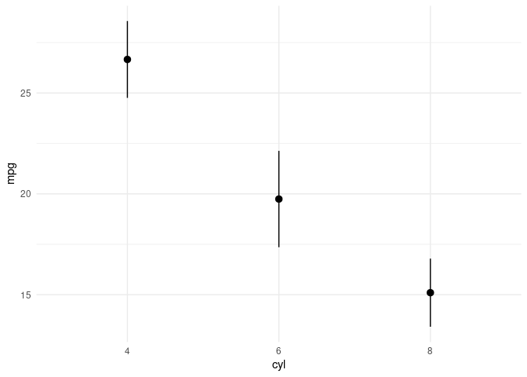

fastmargins: Fast Marginal Effects
================

<!-- README.md is generated from README.Rmd. Please edit that file -->

# Proof of concept

This is just a proof of concept. Please do not use in serious
applications.

# Installation

You can install the released version of fastmargins from Github:

``` r
remotes::install_github("vincentarelbundock/fastmargins")
```

# Examples

## Logit regression with a multiplicative interaction term

Load the library, simulate data, and estimate a logistic regression
model with interaction terms:

``` r
library(fastmargins)

N <- 1000
dat <- data.frame(
    x2 = rnorm(N),
    x1 = rnorm(N),
    x3 = rnorm(N),
    x4 = rnorm(N),
    e = rnorm(N))
dat$y <- rbinom(N, 1, plogis(
    dat$x1 + dat$x2 + dat$x3 + dat$x4 + dat$x3 * dat$x4))

mod <- glm(y ~ x1 + x2 + x3 * x4, data = dat, family = binomial)

coef(mod)
#> (Intercept)          x1          x2          x3          x4       x3:x4 
#>  -0.1128156   1.0141016   1.1067059   0.8045853   1.0235580   0.8679344
```

Compute unit-level marginal effects and variances:

``` r
res <- mfx(mod)
head(res)
#>   rowid term        dydx  std.error y        x1         x2         x3
#> 1     1   x1  0.23813205 0.01968382 1 0.9172122  0.6030016 -1.2651308
#> 2     1   x3  0.08948162 0.02441014 1 0.9172122  0.6030016 -1.2651308
#> 3     1   x4 -0.01749262 0.03448268 1 0.9172122  0.6030016 -1.2651308
#> 4     1   x2  0.25987715 0.02221290 1 0.9172122  0.6030016 -1.2651308
#> 5     2   x4  0.11631003 0.01195424 1 0.9032544 -0.2952875  0.3317008
#> 6     2   x1  0.08993967 0.01180490 1 0.9032544 -0.2952875  0.3317008
#>           x4
#> 1 -0.4879685
#> 2 -0.4879685
#> 3 -0.4879685
#> 4 -0.4879685
#> 5  1.1225853
#> 6  1.1225853
```

Notice that the results are presented in `tidy` format: each row of the
original dataset gets a unique `rowid` value, each unit-level marginal
effect appears on a distinct row, and metadata appears neatly in
separate columns. This makes it easy to operate on the results
programmatically.

We can obtain similar results with the `margins` package, but the two
packages use slightly different numerical approximation strategies, so
the results will differ very slightly:

``` r
library(margins)

mar <- margins(mod, unit_ses = TRUE)

head(data.frame(mar), 2)
#>           x2        x1         x3         x4          e y    fitted  se.fitted
#> 1  0.6030016 0.9172122 -1.2651308 -0.4879685 -1.6085638 1 0.6231924 0.03974125
#> 2 -0.2952875 0.9032544  0.3317008  1.1225853  0.8638109 1 0.9016309 0.01762985
#>      dydx_x1    dydx_x2    dydx_x3    dydx_x4 Var_dydx_x1  Var_dydx_x2
#> 1 0.23813500 0.25988067 0.08948204 -0.0174926 0.000114257 0.0001251213
#> 2 0.08994334 0.09815666 0.15777673  0.1163162 0.000114257 0.0001251213
#>    Var_dydx_x3 Var_dydx_x4 SE_dydx_x1 SE_dydx_x2 SE_dydx_x3 SE_dydx_x4
#> 1 0.0001266054 0.000124684 0.01968513 0.02221435 0.02440984 0.03448305
#> 2 0.0001266054 0.000124684 0.01180561 0.01599235 0.02059237 0.01195434
#>   X_weights X_at_number
#> 1        NA           1
#> 2        NA           1

cor(mar$dydx_x1, res[res$term == "x1", "dydx"])
#> [1] 1
cor(mar$SE_dydx_x1, res[res$term == "x1", "std.error"])
#> [1] 1

cor(mar$dydx_x3, res[res$term == "x3", "dydx"])
#> [1] 1
cor(mar$SE_dydx_x3, res[res$term == "x3", "std.error"])
#> [1] 1
```

## Conditional marginal effects with `ggplot2`

We can use the `newdata` argument to do a “counterfactual” analysis:o

``` r
counterfactuals <- data.frame(
    x1 = 0,
    x2 = 0,
    x3 = 1,
    x4 = seq(min(dat$x4), max(dat$x4), length.out = 100))

mfx(mod, newdata = counterfactuals) |> head()
#>   rowid term         dydx   std.error x1 x2 x3        x4
#> 1     1   x1  0.001965177 0.001137908  0  0  1 -3.665946
#> 2     1   x4  0.003665589 0.001867172  0  0  1 -3.665946
#> 3     1   x2  0.002144640 0.001230894  0  0  1 -3.665946
#> 4     1   x3 -0.004605909 0.002205534  0  0  1 -3.665946
#> 5     2   x4  0.004132264 0.002060534  0  0  1 -3.602328
#> 6     2   x2  0.002417680 0.001361827  0  0  1 -3.602328
```

The nice thing about the `tidy` output format is that we can pipe the
output of the `mfx` function directly to `ggplot2`:

``` r
library(tidyverse)

mfx(mod, newdata = counterfactuals) |>
    mutate(conf.low = dydx - 1.96 * std.error,
           conf.high = dydx + 1.96 * std.error) |>
    ggplot(aes(x = x4, 
               y = dydx, 
               ymin = conf.low, 
               ymax = conf.high)) +
    geom_ribbon(alpha = .1) +
    geom_line() + 
    facet_wrap(~term)
```



# Benchmarks

Here are a couple naive benchmarks to compare the speed of computation
with the `fastmargins` and `margins` packages. Since unit-level standard
errors can be expensive to compute, we run the benchmarks with and
without standard errors.

## Marginal effects and standard errors (unit-level)

In this naive benchmark, computing marginal effects with their
unit-level standard errors is over 300x faster.

``` r
b1 = bench::mark(
    margins(mod, unit_ses = TRUE),
    mfx(mod, variance = vcov(mod)),
    check = FALSE,
    max_iterations = 3)
#> Warning: Some expressions had a GC in every iteration; so filtering is disabled.
b1
#> # A tibble: 2 × 6
#>   expression                          min   median `itr/sec` mem_alloc `gc/sec`
#>   <bch:expr>                     <bch:tm> <bch:tm>     <dbl> <bch:byt>    <dbl>
#> 1 margins(mod, unit_ses = TRUE)     52.5s    52.5s    0.0191   946.6MB     1.20
#> 2 mfx(mod, variance = vcov(mod))  133.8ms  144.1ms    6.61      14.2MB     2.20
```

## Marginal effects only

In this naive benchmark, computing marginal effects *without* their
unit-level standard errors is over 40% faster.

``` r
b2 = bench::mark(
    margins(mod, unit_ses = FALSE),
    mfx(mod, variance = NULL),
    check = FALSE,
    max_iterations = 3)
b2
#> # A tibble: 2 × 6
#>   expression                          min   median `itr/sec` mem_alloc `gc/sec`
#>   <bch:expr>                     <bch:tm> <bch:tm>     <dbl> <bch:byt>    <dbl>
#> 1 margins(mod, unit_ses = FALSE)  112.6ms  117.1ms      8.54   22.46MB     4.27
#> 2 mfx(mod, variance = NULL)        69.9ms   73.5ms     13.8     3.14MB     0
```
