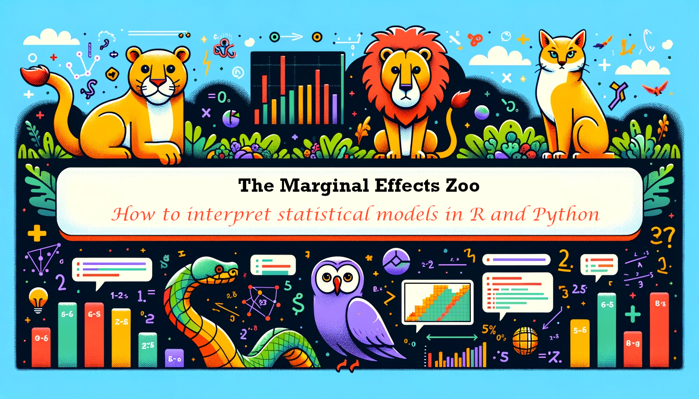

Parameter estimates are often hard to interpret substantively,
especially when they are generated by complex models with non-linear
components, interactions, or transformations. Instead of reporting
unintuitive parameters, data analysts would rather focus on simple
quantities of interest, which have straightforward scientific
interpretations. Unfortunately, meaningful estimands—and their standard
errors—are often tedious to compute, and the terminology used to
describe them varies tremendously across fields.

These problems are compounded by the fact that modeling packages produce
objects with very different structures and which hold different
information. This means that end-users often have to write customized
code to interpret the output of different models. This can lead to
wasted effort, confusion, and mistakes, and it can hinder the
implementation of best practices.

## Marginal Effects Zoo: The Book

[This free online book](https://marginaleffects.com/) introduces a
conceptual framework to clearly define statistical quantities of
interest, and shows how to estimate those quantities using the
`marginaleffects` package for `R` and `Python`. The techniques
introduced herein can enhance the interpretability of [over 100 classes
of statistical and machine learning
models](https://marginaleffects.com/vignettes/supported_models.html),
including linear, GLM, GAM, mixed-effects, bayesian, categorical
outcomes, XGBoost, and more. With a single unified interface, users can
compute and plot many estimands, including:

-   Predictions (aka fitted values or adjusted predictions)
-   Comparisons such as contrasts, risk differences, risk ratios, odds,
    etc.
-   Slopes (aka marginal effects or partial derivatives)
-   Marginal means
-   Linear and non-linear hypothesis tests
-   Equivalence tests
-   Uncertainty estimates using the delta method, bootstrapping,
    simulation, or conformal inference.
-   Much more!

[The Marginal Effects Zoo](https://marginaleffects.com/) book includes
over 30 chapters of tutorials, case studies, and technical notes. It
covers a wide range of topics, including how the `marginaleffects`
package can facilitate the analysis of:

-   Experiments
-   Observational data
-   Causal inference with G-Computation
-   Machine learning models
-   Bayesian modeling
-   Multilevel regression with post-stratification (MRP)
-   Missing data
-   Matching
-   Inverse probability weighting
-   Conformal prediction

[Get started by clicking
here!](https://marginaleffects.com/vignettes/get_started.html)

## `marginaleffects`: The Package

The `marginaleffects` package for `R` and `Python` offers a single point
of entry to easily interpret the results of [over 100 classes of
models,](https://marginaleffects.com/vignettes/supported_models.html)
using a simple and consistent user interface. Its benefits include:

-   *Powerful:* It can compute and plot predictions; comparisons
    (contrasts, risk ratios, etc.); slopes; and conduct hypothesis and
    equivalence tests for over 100 different classes of models in `R`.
-   *Simple:* All functions share a simple and unified interface.
-   *Documented*: Each function is thoroughly documented with abundant
    examples. The Marginal Effects Zoo website includes 20,000+ words of
    vignettes and case studies.
-   *Efficient:* [Some
    operations](https://marginaleffects.com/vignettes/performance.html)
    can be up to 1000 times faster and use 30 times less memory than
    with the `margins` package.  
-   *Valid:* When possible, [numerical results are
    checked](https://marginaleffects.com/vignettes/supported_models.html)
    against alternative software like `Stata` or other `R` packages.
-   *Thin:* The `R` package requires relatively few dependencies.
-   *Standards-compliant:* `marginaleffects` follows “tidy” principles
    and returns objects that work with standard functions like
    `summary()`, `tidy()`, and `glance()`. These objects are easy to
    program with and feed to other packages like
    [`ggplot2`](https://marginaleffects.com/vignettes/plot.html) or
    [`modelsummary`.](https://marginaleffects.com/vignettes/tables.html)
-   *Extensible:* Adding support for new models is very easy, often
    requiring less than 10 lines of new code. Please submit [feature
    requests on
    Github.](https://github.com/vincentarelbundock/marginaleffects/issues)
-   *Active development*: Bugs are fixed promptly.

## How to help

The `marginaleffects` package and the Marginal Effects Zoo book will
always be free. If you like this project, you can contribute in four
ways:

1.  Make a donation to the [Native Women’s Shelter of
    Montreal](https://www.nwsm.info/) or to [Give
    Directly](https://www.givedirectly.org/), and send me (Vincent) a
    quick note. You’ll make my day.
2.  Submit bug reports, documentation improvements, or code
    contributions to the Github repositories of the [R
    version](https://github.com/vincentarelbundock/marginaleffects) or
    the [Python
    version](https://github.com/vincentarelbundock/pymarginaleffects) of
    the package.
3.  [Cite the `marginaleffects`
    package](https://marginaleffects.com/CITATION.html) in your work and
    tell your friends about it.
4.  Create a new entry [for the Meme
    Gallery!](https://marginaleffects.com/vignettes/meme.html)

   

  
