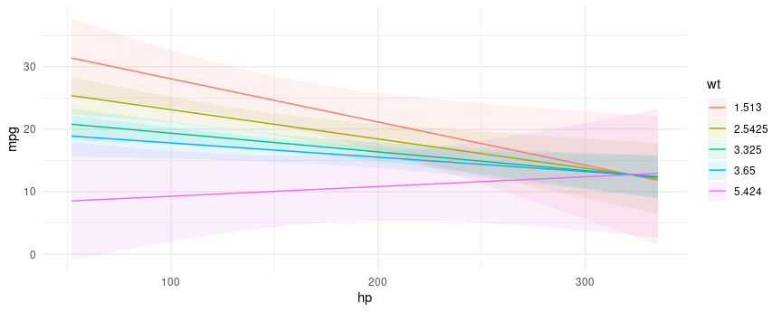
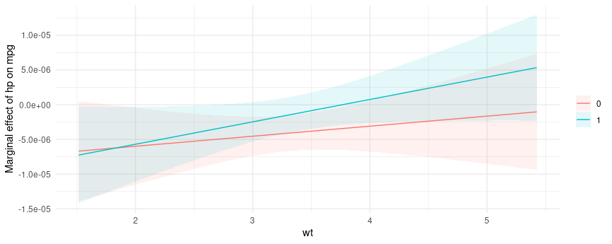

# The `marginaleffects` package for `R` 

<!-- badges: start -->

[](https://app.codecov.io/gh/vincentarelbundock/marginaleffects?branch=main)
[](https://github.com/vincentarelbundock/marginaleffects/actions)
[](https://CRAN.R-project.org/package=marginaleffects)
[](https://CRAN.R-project.org/package=marginaleffects)
<!-- badges: end -->

Compute and plot adjusted predictions, contrasts, marginal effects, and
marginal means for 71 classes of statistical models in `R`. Conduct
linear and non-linear hypothesis tests using the delta method.

## Table of contents

Introduction:

  - [Definitions](https://vincentarelbundock.github.io/marginaleffects/#definitions)
  - [Motivation](https://vincentarelbundock.github.io/marginaleffects/#motivation)
  - [Installation](https://vincentarelbundock.github.io/marginaleffects/#installation)
  - [Getting
    started](https://vincentarelbundock.github.io/marginaleffects/#getting-started)

Vignettes:

  - [Adjusted
    Predictions](https://vincentarelbundock.github.io/marginaleffects/articles/predictions.html)
  - [Contrasts](https://vincentarelbundock.github.io/marginaleffects/articles/contrasts.html)
  - [Marginal
    Effects](https://vincentarelbundock.github.io/marginaleffects/articles/marginaleffects.html)
  - [Marginal
    Means](https://vincentarelbundock.github.io/marginaleffects/articles/marginalmeans.html)
  - [Hypothesis Tests and Custom Contrasts using the Delta
    Method](https://vincentarelbundock.github.io/marginaleffects/articles/hypothesis.html)

Case studies:

  - [Bayesian Analyses with
    `brms`](https://vincentarelbundock.github.io/marginaleffects/articles/brms.html)
  - [Causal Inference with the
    g-Formula](https://vincentarelbundock.github.io/marginaleffects/articles/gformula.html)
  - [Elasticity](https://vincentarelbundock.github.io/marginaleffects/articles/elasticity.html)
  - [Experiments](https://vincentarelbundock.github.io/marginaleffects/articles/experiments.html)
  - [Generalized Additive
    Models](https://vincentarelbundock.github.io/marginaleffects/articles/gam.html)
  - [Mixed effects
    models](https://vincentarelbundock.github.io/marginaleffects/articles/lme4.html)
  - [Multinomial Logit and Discrete Choice
    Models](https://vincentarelbundock.github.io/marginaleffects/articles/mlogit.html)
  - [Multiple
    Imputation](https://vincentarelbundock.github.io/marginaleffects/articles/multiple_imputation.html)
  - [Plots: interactions, predictions, contrasts, and
    slopes](https://vincentarelbundock.github.io/marginaleffects/articles/plot.html)
  - [Python NumPyro models in
    `marginaleffects`](https://vincentarelbundock.github.io/marginaleffects/articles/python.html)
  - [Unit-level contrasts in logistic
    regressions](https://vincentarelbundock.github.io/marginaleffects/articles/logistic_contrasts.html)

Tips and technical notes:

  - [71 Supported Classes of
    Models](https://vincentarelbundock.github.io/marginaleffects/articles/supported_models.html)
  - [Index of Functions and
    Documentation](https://vincentarelbundock.github.io/marginaleffects/reference/index.html)
  - [Extending `marginaleffects`: add new models or modify existing
    ones](https://vincentarelbundock.github.io/marginaleffects/articles/extensions.html)
  - [Standard Errors and Confidence
    Intervals](https://vincentarelbundock.github.io/marginaleffects/articles/sandwich.html)
  - [Tables and
    Plots](https://vincentarelbundock.github.io/marginaleffects/articles/modelsummary.html)
  - [Performance](https://vincentarelbundock.github.io/marginaleffects/articles/performance.html)
  - [Alternative
    Software](https://vincentarelbundock.github.io/marginaleffects/articles/alternative_software.html)
  - [Frequently Asked
    Questions](https://vincentarelbundock.github.io/marginaleffects/articles/faq.html)

External links:

  - [Bayesian model averaged marginal
    effects](https://www.ajordannafa.com/blog/2022/05/24/bma-ames/) by
    A. Jordan Nafa
  - [Marginalia: A guide to figuring out what the heck marginal effects,
    marginal slopes, average marginal effects, marginal effects at the
    mean, and all these other marginal things
    are](https://www.andrewheiss.com/blog/2022/05/20/marginalia/) by
    Andrew Heiss
  - [Double propensity score adjustment using
    g-computation](https://stats.stackexchange.com/questions/580118/adjusting-the-model-by-propensity-scores-after-propensity-score-matching/580174#580174)
    by Noah Greifer
  - [Subgroup Analysis After Propensity Score Matching Using
    R](https://ngreifer.github.io/blog/subgroup-analysis-psm/) by Noah
    Greifer

## Definitions

The `marginaleffects` package allows `R` users to compute and plot four
principal quantities of interest for [71 different classes of
models:](https://vincentarelbundock.github.io/marginaleffects/articles/supported_models.html)

  - [*Adjusted
    Prediction*](https://vincentarelbundock.github.io/marginaleffects/articles/predictions.html)
      - The outcome predicted by a fitted model on a specified scale for
        a given combination of values of the predictor variables, such
        as their observed values, their means, or factor levels (a.k.a.
        “reference grid”).
      - [`predictions(),`](https://vincentarelbundock.github.io/marginaleffects/reference/predictions.html)
        [`plot_cap()`](https://vincentarelbundock.github.io/marginaleffects/reference/predictions.html)
  - [*Marginal
    Effect*](https://vincentarelbundock.github.io/marginaleffects/articles/marginaleffects.html)
      - A partial derivative (slope) of the regression equation with
        respect to a regressor of interest.
      - [`marginaleffects(),`](https://vincentarelbundock.github.io/marginaleffects/reference/marginaleffects.html)
        [`plot(),`](https://vincentarelbundock.github.io/marginaleffects/reference/plot.marginaleffects.html)
        [`plot_cme()`](https://vincentarelbundock.github.io/marginaleffects/reference/plot_cme.html)
  - [*Contrast*](https://vincentarelbundock.github.io/marginaleffects/articles/contrasts.html)
      - A difference, ratio, or function of adjusted predictions,
        calculated for meaningfully different predictor values (e.g.,
        College graduates vs. Others).
      - [`comparisons(),`](https://vincentarelbundock.github.io/marginaleffects/reference/comparisons.html)
        [`plot_cco()`](https://vincentarelbundock.github.io/marginaleffects/reference/plot_cco.html)
  - [*Marginal
    Mean*](https://vincentarelbundock.github.io/marginaleffects/articles/marginalmeans.html)
      - Adjusted predictions of a model, averaged across a “reference
        grid” of categorical predictors.
      - [`marginalmeans()`](https://vincentarelbundock.github.io/marginaleffects/reference/marginalmeans.html)

### What does “marginal” mean?

One confusing aspect of the definitions above is that they use the word
“marginal” in two different and *opposite* ways:

1.  In “marginal effects,” we refer to the effect of a tiny (marginal)
    change in the regressor on the outcome. This is a slope, or
    derivative.
2.  In “marginal means,” we refer to the process of marginalizing across
    rows of a prediction grid. This is an average, or integral.

Another potential confusion arises when some analysts use “marginal” to
distinguish some estimates from “conditional” ones. As noted in [the
marginal
effects](https://vincentarelbundock.github.io/marginaleffects/articles/marginaleffects.html)
and [the
contrasts](https://vincentarelbundock.github.io/marginaleffects/articles/contrasts.html)
vignettes, slopes and contrasts often vary from individual to
individual, based on the values of all the regressors in the model. When
we estimate a slope or a contrast for a specific combination of
predictors – for one (possibly representative) individual – some people
will call this a “conditional” estimate. When we compute the average of
several individual-level estimates, some people will call this a
“marginal” estimate.

On this website and in this package, we will reserve the expression
“marginal effect” to mean a “slope” or “derivative”. When we take the
average unit-level estimates, we will call this an “average marginal
effect.”

This is all very confusing, but the terminology is so widespread and
inconsistent that we must press on…

## Motivation

To calculate marginal effects we need to take derivatives of the
regression equation. This can be challenging to do manually, especially
when our models are non-linear, or when regressors are transformed or
interacted. Computing the variance of a marginal effect is even more
difficult.

The `marginaleffects` package hopes to do most of this hard work for
you.

Many `R` packages advertise their ability to compute “marginal effects.”
However, most of them do *not* actually compute marginal effects *as
defined above*. Instead, they compute “adjusted predictions” for
different regressor values, or differences in adjusted predictions
(i.e., “contrasts”). The rare packages that actually compute marginal
effects are typically limited in the model types they support, and in
the range of transformations they allow (interactions, polynomials,
etc.).

The main packages in the `R` ecosystem to compute marginal effects are
the trailblazing and powerful [`margins` by Thomas J.
Leeper](https://cran.r-project.org/package=margins), and [`emmeans` by
Russell V. Lenth and
contributors.](https://cran.r-project.org/package=emmeans) The
`marginaleffects` package is essentially a clone of `margins`, with some
additional features from `emmeans`.

So why did I write a clone?

  - *Powerful:* Marginal effects and contrasts can be computed for 71
    different classes of models. Adjusted predictions and marginal means
    can be computed for about 100 model types.
  - *Extensible:* Adding support for new models is very easy, often
    requiring less than 10 lines of new code. Please submit [feature
    requests on
    Github.](https://github.com/vincentarelbundock/marginaleffects/issues)
  - *Fast:* [Computing unit-level standard
    errors](https://vincentarelbundock.github.io/marginaleffects/articles/performance.html)
    can be orders of magnitude faster than `margins` in large datasets.
  - *Efficient:* Much smaller memory footprint.
  - *Valid:* When possible, numerical results are checked against
    alternative software like `Stata`, or other `R` packages.
  - *Beautiful:* `ggplot2` support for plotting (conditional) marginal
    effects and adjusted predictions.
  - *Tidy:* The results produced by `marginaleffects` follow “tidy”
    principles. They are easy to program with and feed to [other
    packages like
    `modelsummary`.](https://vincentarelbundock.github.io/marginaleffects/)
  - *Simple:* All functions share a simple, unified, and well-documented
    interface.
  - *Thin:* The package requires relatively few dependencies.
  - *Safe:* User input is checked extensively before computation. When
    needed, functions fail gracefully with informative error messages.
  - *Active development*

Downsides of `marginaleffects` include:

  - No multiplicity adjustments. (Use `p.adjust()` instead.)
  - Marginal means are often slower to compute than with `emmeans`.
  - No omnibus test

## Installation

You can install the released version of `marginaleffects` from CRAN:

``` r
install.packages("marginaleffects")
```

You can install the development version of `marginaleffects` (and its
dependency `insight`) from R-Universe:

``` r
install.packages(
    c("marginaleffects", "insight"),
    repos = c(
        "https://vincentarelbundock.r-universe.dev",
        "https://easystats.r-universe.dev"))
```

**Restart `R` completely before moving on.**

## Getting started

#### Adjusted predictions

To begin, we estimate a linear regression model with multiplicative
interactions:

``` r
library(marginaleffects)

mod <- lm(mpg ~ hp * wt * am, data = mtcars)
```

An “adjusted prediction” is the outcome predicted by a model for some
combination of the regressors’ values, such as their observed values,
their means, or factor levels (a.k.a. “reference grid”).

By default, the `predictions()` function returns adjusted predictions
for every value in original dataset:

``` r
predictions(mod) |> head()
#>   rowid     type predicted std.error statistic       p.value conf.low conf.high  mpg  hp    wt am
#> 1     1 response  22.48857 0.8841487  25.43528 1.027254e-142 20.66378  24.31336 21.0 110 2.620  1
#> 2     2 response  20.80186 1.1942050  17.41900  5.920119e-68 18.33714  23.26658 21.0 110 2.875  1
#> 3     3 response  25.26465 0.7085307  35.65781 1.783452e-278 23.80232  26.72699 22.8  93 2.320  1
#> 4     4 response  20.25549 0.7044641  28.75305 8.296026e-182 18.80155  21.70943 21.4 110 3.215  0
#> 5     5 response  16.99782 0.7118658  23.87784 5.205109e-126 15.52860  18.46704 18.7 175 3.440  0
#> 6     6 response  19.66353 0.8753226  22.46433 9.270636e-112 17.85696  21.47011 18.1 105 3.460  0
```

The [`datagrid` function gives us a powerful way to define a grid of
predictors.](https://vincentarelbundock.github.io/marginaleffects/reference/datagrid.html)
All the variables not mentioned explicitly in `datagrid()` are fixed to
their mean or mode:

``` r
predictions(mod, newdata = datagrid(am = 0, wt = seq(2, 3, .2)))
#>   rowid     type predicted std.error statistic       p.value conf.low conf.high      mpg       hp am  wt
#> 1     1 response  21.95621 2.0386301  10.77008  4.765935e-27 17.74868  26.16373 20.09062 146.6875  0 2.0
#> 2     2 response  21.42097 1.7699036  12.10290  1.019401e-33 17.76807  25.07388 20.09062 146.6875  0 2.2
#> 3     3 response  20.88574 1.5067373  13.86157  1.082834e-43 17.77599  23.99549 20.09062 146.6875  0 2.4
#> 4     4 response  20.35051 1.2526403  16.24609  2.380723e-59 17.76518  22.93583 20.09062 146.6875  0 2.6
#> 5     5 response  19.81527 1.0144509  19.53301  5.755097e-85 17.72155  21.90900 20.09062 146.6875  0 2.8
#> 6     6 response  19.28004 0.8063905  23.90906 2.465206e-126 17.61573  20.94435 20.09062 146.6875  0 3.0
```

We can plot how predictions change for different values of one or more
variables – Conditional Adjusted Predictions – using the `plot_cap`
function:

``` r
plot_cap(mod, condition = c("hp", "wt"))
```


``` r
mod2 <- lm(mpg ~ factor(cyl), data = mtcars)
plot_cap(mod2, condition = "cyl")
```



[The Adjusted Predictions
vignette](https://vincentarelbundock.github.io/marginaleffects/articles/predictions.html)
shows how to use the `predictions()` and `plot_cap()` functions to
compute a wide variety of quantities of interest:

  - Adjusted Predictions at User-Specified Values (aka Predictions at
    Representative Values)
  - Adjusted Predictions at the Mean
  - Average Predictions at the Mean
  - Conditional Predictions
  - Adjusted Predictions on different scales (e.g., link or response)

#### Contrasts

A contrast is the difference between two adjusted predictions,
calculated for meaningfully different predictor values (e.g., College
graduates vs. Others).

What happens to the predicted outcome when a numeric predictor increases
by one unit, and logical variable flips from FALSE to TRUE, and a factor
variable shifts from baseline?

``` r
titanic <- read.csv("https://vincentarelbundock.github.io/Rdatasets/csv/Stat2Data/Titanic.csv")
titanic$Woman <- titanic$Sex == "female"
mod3 <- glm(Survived ~ Woman + Age * PClass, data = titanic, family = binomial)

cmp <- comparisons(mod3)
summary(cmp)
#>     Term     Contrast   Effect Std. Error z value   Pr(>|z|)     2.5 %    97.5 %
#> 1  Woman TRUE - FALSE  0.50329   0.031654  15.899 < 2.22e-16  0.441244  0.565327
#> 2    Age           +1 -0.00558   0.001084  -5.147 2.6471e-07 -0.007705 -0.003455
#> 3 PClass    2nd - 1st -0.22603   0.043546  -5.191 2.0950e-07 -0.311383 -0.140686
#> 4 PClass    3rd - 1st -0.38397   0.041845  -9.176 < 2.22e-16 -0.465985 -0.301957
#> 
#> Model type:  glm 
#> Prediction type:  response
```

The contrast above used a simple difference between adjusted
predictions. We can also used different functions to combine and
contrast predictions in different ways. For instance, researchers often
compute Adjusted Risk Ratios, which are ratios of predicted
probabilities. We can compute such ratios by applying a transformation
using the `transform_pre` argument. We can also present the results of
“interactions” between contrasts. What happens to the ratio of
predicted probabilities for survival when `PClass` changes between each
pair of factor levels (“pairwise”) and `Age` changes by 2 standard
deviations simultaneously:

``` r
cmp <- comparisons(
    mod3,
    transform_pre = "ratio",
    variables = list(Age = "2sd", PClass = "pairwise"))
summary(cmp)
#>                   Age    PClass Effect Std. Error z value   Pr(>|z|)  2.5 % 97.5 %
#> 1 (x - sd) / (x + sd) 1st / 1st 0.7043    0.05946  11.846 < 2.22e-16 0.5878 0.8209
#> 2 (x - sd) / (x + sd) 2nd / 1st 0.3185    0.05566   5.723 1.0442e-08 0.2095 0.4276
#> 3 (x - sd) / (x + sd) 3rd / 1st 0.2604    0.05308   4.907 9.2681e-07 0.1564 0.3645
#> 4 (x - sd) / (x + sd) 2nd / 2nd 0.3926    0.08101   4.846 1.2588e-06 0.2338 0.5514
#> 5 (x - sd) / (x + sd) 3rd / 2nd 0.3162    0.07023   4.503 6.7096e-06 0.1786 0.4539
#> 6 (x - sd) / (x + sd) 3rd / 3rd 0.7053    0.20273   3.479 0.00050342 0.3079 1.1026
#> 
#> Model type:  glm 
#> Prediction type:  response
```

The code above is explained in detail in the [vignette on
Transformations and Custom
Contrasts.](https://vincentarelbundock.github.io/marginaleffects/articles/transformation.html)

[The Contrasts
vignette](https://vincentarelbundock.github.io/marginaleffects/articles/contrasts.html)
shows how to use the `comparisons()` function to compute a wide variety
of quantities of interest:

  - Custom comparisons for:
      - Numeric variables (e.g., 1 standard deviation, interquartile
        range, custom values)
      - Factor or character
      - Logical
  - Contrast interactions
  - Unit-level Contrasts
  - Average Contrasts
  - Group-Average Contrasts
  - Contrasts at the Mean
  - Contrasts Between Marginal Means
  - Adjusted Risk Ratios

#### Marginal effects

A “marginal effect” is a partial derivative (slope) of the regression
equation with respect to a regressor of interest. It is unit-specific
measure of association between a change in a regressor and a change in
the regressand. The `marginaleffects()` function uses numerical
derivatives to estimate the slope of the regression equation with
respect to each of the variables in the model (or contrasts for
categorical variables).

By default, `marginaleffects()` estimates the slope for each row of the
original dataset that was used to fit the model:

``` r
mfx <- marginaleffects(mod)

head(mfx, 4)
#>   rowid     type term        dydx  std.error statistic     p.value    conf.low     conf.high predicted predicted_hi predicted_lo  mpg  hp    wt am    eps
#> 1     1 response   hp -0.03690556 0.01850172 -1.994710 0.046074551 -0.07316825 -0.0006428553  22.48857     22.48752     22.48857 21.0 110 2.620  1 0.0283
#> 2     2 response   hp -0.02868936 0.01562861 -1.835695 0.066402771 -0.05932087  0.0019421508  20.80186     20.80105     20.80186 21.0 110 2.875  1 0.0283
#> 3     3 response   hp -0.04657166 0.02258715 -2.061866 0.039220507 -0.09084166 -0.0023016728  25.26465     25.26333     25.26465 22.8  93 2.320  1 0.0283
#> 4     4 response   hp -0.04227128 0.01328278 -3.182412 0.001460541 -0.06830506 -0.0162375066  20.25549     20.25430     20.25549 21.4 110 3.215  0 0.0283
```

The function `summary` calculates the “Average Marginal Effect,” that
is, the average of all unit-specific marginal effects:

``` r
summary(mfx)
#>   Term   Effect Std. Error  z value   Pr(>|z|)    2.5 %   97.5 %
#> 1   hp -0.03807    0.01279 -2.97725 0.00290848 -0.06314 -0.01301
#> 2   wt -3.93909    1.08596 -3.62728 0.00028642 -6.06754 -1.81065
#> 3   am -0.04811    1.85260 -0.02597 0.97928234 -3.67913  3.58292
#> 
#> Model type:  lm 
#> Prediction type:  response
```

The `plot_cme` plots “Conditional Marginal Effects,” that is, the
marginal effects estimated at different values of a regressor (often an
interaction):

``` r
plot_cme(mod, effect = "hp", condition = c("wt", "am"))
```



[The Marginal Effects
vignette](https://vincentarelbundock.github.io/marginaleffects/articles/marginaleffects.html)
shows how to use the `marginaleffects()` function to compute a wide
variety of quantities of interest:

  - Unit-level Marginal Effects
  - Average Marginal Effects
  - Group-Average Marginal Effects
  - Marginal Effects at the Mean
  - Marginal Effects Between Marginal Means
  - Conditional Marginal Effects
  - Tables and Plots

#### Marginal means

Marginal Means are the adjusted predictions of a model, averaged across
a “reference grid” of categorical predictors. To compute marginal means,
we first need to make sure that the categorical variables of our model
are coded as such in the dataset:

``` r
dat <- mtcars
dat$am <- as.logical(dat$am)
dat$cyl <- as.factor(dat$cyl)
```

Then, we estimate the model and call the `marginalmeans` function:

``` r
mod <- lm(mpg ~ am + cyl + hp, data = dat)
mm <- marginalmeans(mod)
summary(mm)
#>   Term Value  Mean Std. Error z value   Pr(>|z|) 2.5 % 97.5 %
#> 1   am FALSE 18.32     0.7854   23.33 < 2.22e-16 16.78  19.86
#> 2   am  TRUE 22.48     0.8343   26.94 < 2.22e-16 20.84  24.11
#> 3  cyl     4 22.88     1.3566   16.87 < 2.22e-16 20.23  25.54
#> 4  cyl     6 18.96     1.0729   17.67 < 2.22e-16 16.86  21.06
#> 5  cyl     8 19.35     1.3771   14.05 < 2.22e-16 16.65  22.05
#> 
#> Model type:  lm 
#> Prediction type:  response 
#> Results averaged over levels of: am, cyl
```

[The Marginal Means
vignette](https://vincentarelbundock.github.io/marginaleffects/articles/marginalmeans.html)
offers more detail.

#### More

There is *much* more you can do with `marginaleffects`. Return to the
[Table of
Contents](https://vincentarelbundock.github.io/marginaleffects/#table-of-contents)
to read the vignettes, learn how to report marginal effects and means in
[nice tables with the `modelsummary`
package](https://vincentarelbundock.github.io/modelsummary/), how to
define your own prediction “grid”, and much more.
