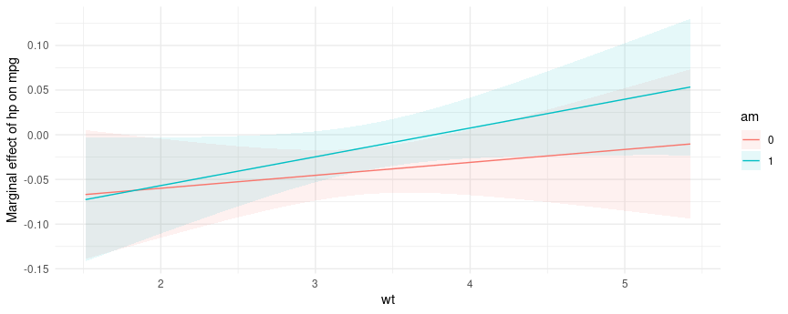
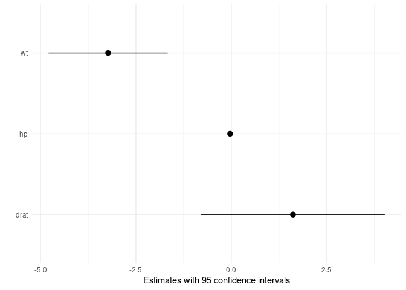

# The `marginaleffects` package for `R` 

<!--
[](https://app.codecov.io/gh/vincentarelbundock/marginaleffects?branch=main)
[](https://github.com/vincentarelbundock/marginaleffects/actions)
[](https://CRAN.R-project.org/package=marginaleffects)
[](https://CRAN.R-project.org/package=marginaleffects)
-->

Compute and plot predictions, slopes, marginal means, and comparisons
(contrasts, risk ratios, etc.) for over 70 classes of statistical models
in R. Conduct linear and non-linear hypothesis tests using the delta
method.

The code on this website was executed using `marginaleffects`
0.8.1.9116. See the [installation
section](https://vincentarelbundock.github.io/marginaleffects/#installation)
to install the latest CRAN or development version.

## Table of contents

Introduction:

  - [Motivation](https://vincentarelbundock.github.io/marginaleffects/#motivation)
  - [Installation](https://vincentarelbundock.github.io/marginaleffects/#installation)
  - Interpreting model estimates:
    1.  [Estimands: Predictions, Comparisons, and
        Slopes](https://vincentarelbundock.github.io/marginaleffects/#estimands-predictions-comparisons-and-slopes)
    2.  [Prediction
        Grid](https://vincentarelbundock.github.io/marginaleffects/#prediction-grid)
    3.  [Averaging](https://vincentarelbundock.github.io/marginaleffects/#averaging)
    4.  [Hypothesis Tests, Custom Contrasts, and Equivalence
        Tests](https://vincentarelbundock.github.io/marginaleffects/#hypothesis-and-equivalence-tests)

Vignettes:

  - [Predictions](https://vincentarelbundock.github.io/marginaleffects/articles/predictions.html)
  - [Comparisons](https://vincentarelbundock.github.io/marginaleffects/articles/contrasts.html)
  - [Slopes](https://vincentarelbundock.github.io/marginaleffects/articles/slopes.html)
  - [Marginal
    Means](https://vincentarelbundock.github.io/marginaleffects/articles/marginalmeans.html)
  - [Hypothesis Tests, Equivalence Tests, and Custom
    Contrasts](https://vincentarelbundock.github.io/marginaleffects/articles/hypothesis.html)

Case studies:

  - [Bayesian Analyses with
    `brms`](https://vincentarelbundock.github.io/marginaleffects/articles/brms.html)
  - [Causal Inference with the
    g-Formula](https://vincentarelbundock.github.io/marginaleffects/articles/gformula.html)
  - [Elasticity](https://vincentarelbundock.github.io/marginaleffects/articles/elasticity.html)
  - [Experiments](https://vincentarelbundock.github.io/marginaleffects/articles/experiments.html)
  - [Generalized Additive
    Models](https://vincentarelbundock.github.io/marginaleffects/articles/gam.html)
  - [Mixed effects
    models](https://vincentarelbundock.github.io/marginaleffects/articles/lme4.html)
  - [Multinomial Logit and Discrete Choice
    Models](https://vincentarelbundock.github.io/marginaleffects/articles/mlogit.html)
  - [Multiple
    Imputation](https://vincentarelbundock.github.io/marginaleffects/articles/multiple_imputation.html)
  - [Plots: interactions, predictions, contrasts, and
    slopes](https://vincentarelbundock.github.io/marginaleffects/articles/plot.html)
  - [Python NumPyro models in
    `marginaleffects`](https://vincentarelbundock.github.io/marginaleffects/articles/python.html)
  - [Unit-level contrasts in logistic
    regressions](https://vincentarelbundock.github.io/marginaleffects/articles/logistic_contrasts.html)

Tips and technical notes:

  - [73 Supported Classes of
    Models](https://vincentarelbundock.github.io/marginaleffects/articles/supported_models.html)
  - [Index of Functions and
    Documentation](https://vincentarelbundock.github.io/marginaleffects/reference/index.html)
  - [Extending `marginaleffects`: add new models or modify existing
    ones](https://vincentarelbundock.github.io/marginaleffects/articles/extensions.html)
  - [Standard Errors and Confidence
    Intervals](https://vincentarelbundock.github.io/marginaleffects/articles/sandwich.html)
  - [Tables and
    Plots](https://vincentarelbundock.github.io/marginaleffects/articles/modelsummary.html)
  - [Performance](https://vincentarelbundock.github.io/marginaleffects/articles/performance.html)
  - [Alternative
    Software](https://vincentarelbundock.github.io/marginaleffects/articles/alternative_software.html)
  - [Frequently Asked
    Questions](https://vincentarelbundock.github.io/marginaleffects/articles/faq.html)

External links:

  - [Marginal and conditional effects for GLMMs with
    `marginaleffects`](https://www.andrewheiss.com/blog/2022/11/29/conditional-marginal-marginaleffects/)
    by Andrew Heiss
  - [Marginalia: A guide to figuring out what the heck marginal effects,
    marginal slopes, average marginal effects, marginal effects at the
    mean, and all these other marginal things
    are](https://www.andrewheiss.com/blog/2022/05/20/marginalia/) by
    Andrew Heiss
  - [Matching](https://cran.r-project.org/web/packages/MatchIt/vignettes/estimating-effects.html)
    by Noah Greifer
  - [Double propensity score adjustment using
    g-computation](https://stats.stackexchange.com/questions/580118/adjusting-the-model-by-propensity-scores-after-propensity-score-matching/580174#580174)
    by Noah Greifer
  - [Subgroup Analysis After Propensity Score Matching Using
    R](https://ngreifer.github.io/blog/subgroup-analysis-psm/) by Noah
    Greifer
  - [Bayesian Model Averaged Marginal
    Effects](https://www.ajordannafa.com/blog/2022/being-less-wrong/) by
    A. Jordan Nafa

## Motivation

Parameter estimates are often hard to interpret substantively,
especially when they are generated by complex models with non-linear
components or transformations. Many applied researchers would rather
focus on simple quantities of interest, which have straightforward
scientific interpretations. Unfortunately, these estimands (and their
standard errors) are tedious to compute. Moreover, the different
modeling packages in `R` often produce inconsistent objects that require
special treatment.

`marginaleffects` offers a single point of entry to easily interpret the
results of over 73 classes of models, using a simple and consistent user
interface.

Benefits of `marginaleffects` include:

  - *Powerful:* It can compute predictions, comparisons (contrasts, risk
    ratios, etc.), slopes, and conduct hypothesis tests for 73 different
    classes of models in `R`.
  - *Simple:* All functions share a simple, unified, and well-documented
    interface.
  - *Efficient:* [Some
    operations](https://vincentarelbundock.github.io/marginaleffects/articles/performance.html)
    are orders of magnitude faster than with the `margins` package, and
    the memory footprint is much smaller.
  - *Valid:* When possible, [numerical results are
    checked](https://vincentarelbundock.github.io/marginaleffects/articles/supported_models.html)
    against alternative software like `Stata` or other `R` packages.
  - *Thin:* Few dependencies.
  - *Standards-compliant:* `marginaleffects` follows “tidy” principles
    and returns objects that work with standard functions like `plot`,
    `summary()`, `tidy()`, and `glance()`. These objects are easy to
    program with and feed to [other packages like
    `modelsummary`.](https://vincentarelbundock.github.io/marginaleffects/)
  - *Extensible:* Adding support for new models is very easy, often
    requiring less than 10 lines of new code. Please submit [feature
    requests on
    Github.](https://github.com/vincentarelbundock/marginaleffects/issues)
  - *Active development*: Bugs are fixed promptly.

Downsides of `marginaleffects` include:

  - No multiplicity adjustments. (Use `p.adjust()` instead.)
  - Marginal means are often slower to compute than with `emmeans`.
  - No omnibus test

If `marginaleffects` does not meet your needs, I recommend you try
[`emmeans`](https://github.com/rvlenth/emmeans) or one of the other
[alternative `R`
packages.](https://vincentarelbundock.github.io/marginaleffects/articles/alternative_software.html)

## Installation

You can install the released version of `marginaleffects` from CRAN:

``` r
install.packages("marginaleffects")
```

You can install the development version of `marginaleffects` (and its
dependency `insight`) from R-Universe:

``` r
install.packages(
    c("marginaleffects", "insight"),
    repos = c(
        "https://vincentarelbundock.r-universe.dev",
        "https://easystats.r-universe.dev"))
```

**Restart `R` completely before moving on.**

## Estimands: Predictions, Comparisons, and Slopes

The `marginaleffects` package allows `R` users to compute and plot three
principal quantities of interest: (1) predictions, (2) comparisons, and
(3) slopes. In addition, the package includes a convenience function to
compute a fourth estimand, “marginal means”, which is a special case of
averaged predictions.

[*Predictions*:](https://vincentarelbundock.github.io/marginaleffects/articles/predictions.html)

> The outcome predicted by a fitted model on a specified scale for a
> given combination of values of the predictor variables, such as their
> observed values, their means, or factor levels. a.k.a. Fitted values,
> adjusted predictions.

[*Comparisons*:](https://vincentarelbundock.github.io/marginaleffects/articles/contrasts.html)

> Compare the predictions made by a model for different regressor values
> (e.g., college graduates vs. others): contrasts, differences, risk
> ratios, odds, etc.

[*Slopes*:](https://vincentarelbundock.github.io/marginaleffects/articles/slopes.html)

> Partial derivative of the regression equation with respect to a
> regressor of interest. a.k.a. Marginal effects, trends.

[*Marginal
Means*:](https://vincentarelbundock.github.io/marginaleffects/articles/marginalmeans.html)

> Predictions of a model, averaged across a “reference grid” of
> categorical predictors.

Predictions, comparisons, and slopes are fundamentally unit-level (or
“conditional”) quantities. Except in the simplest linear case,
estimates will typically vary based on the values of all the regressors
in a model. Each of the observations in a dataset is thus associated
with its own prediction, comparison, and slope estimates. Below, we will
see that it can be useful to marginalize (or “average over”) unit-level
estimates to report an “average prediction”, “average comparison”, or
“average slope”.

One ambiguous aspect of the definitions above is that the word
“marginal” comes up in two different and *opposite* ways:

1.  In “marginal effects,” we refer to the effect of a tiny (marginal)
    change in the regressor on the outcome. This is a slope, or
    derivative.
2.  In “marginal means,” we refer to the process of marginalizing across
    rows of a prediction grid. This is an average, or integral.

On this website and in this package, we reserve the expression “marginal
effect” to mean a “slope” or “partial derivative”.

The `marginaleffects` package includes functions to estimate, average,
plot, and summarize all of the estimands described above. The objects
produced by `marginaleffects` are “tidy”: they produce simple data
frames in “long” format. They are also “standards-compliant” and work
seamlessly with standard functions like `summary()`, `plot()`, `tidy()`,
and `glance()`, as well with [external packages like
`modelsummary`.](https://vincentarelbundock.github.io/marginaleffects/)

| Estimand                                                                                           | Functions                                                                                               |
| -------------------------------------------------------------------------------------------------- | ------------------------------------------------------------------------------------------------------- |
| [Predictions](https://vincentarelbundock.github.io/marginaleffects/articles/predictions.html)      | [`predictions()`](https://vincentarelbundock.github.io/marginaleffects/reference/predictions.html)      |
|                                                                                                    | [`avg_predictions()`](https://vincentarelbundock.github.io/marginaleffects/reference/predictions.html)  |
|                                                                                                    | [`plot_cap()`](https://vincentarelbundock.github.io/marginaleffects/reference/plot_cap.html)            |
| [Comparisons](https://vincentarelbundock.github.io/marginaleffects/articles/contrasts.html)        | [`comparisons()`](https://vincentarelbundock.github.io/marginaleffects/reference/comparisons.html)      |
|                                                                                                    | [`avg_comparisons()`](https://vincentarelbundock.github.io/marginaleffects/reference/comparisons.html)  |
|                                                                                                    | [`plot_cco()`](https://vincentarelbundock.github.io/marginaleffects/reference/plot_cap.html)            |
|                                                                                                    | [`plot_avg()`](https://vincentarelbundock.github.io/marginaleffects/reference/plot_avg.html)            |
| [Slopes](https://vincentarelbundock.github.io/marginaleffects/articles/slopes.html)                | [`slopes()`](https://vincentarelbundock.github.io/marginaleffects/reference/slopes.html)                |
|                                                                                                    | [`avg_slopes()`](https://vincentarelbundock.github.io/marginaleffects/reference/slopes.html)            |
|                                                                                                    | [`plot_cme()`](https://vincentarelbundock.github.io/marginaleffects/reference/plot_cme.html)            |
|                                                                                                    | [`plot_avg()`](https://vincentarelbundock.github.io/marginaleffects/reference/plot_avg.html)            |
| [Marginal means](https://vincentarelbundock.github.io/marginaleffects/articles/marginalmeans.html) | [`marginal_means()`](https://vincentarelbundock.github.io/marginaleffects/reference/marginalmeans.html) |

### Examples

We now apply `marginaleffects` functions to compute each of the
estimands described above. First, we fit a linear regression model with
multiplicative interactions:

``` r
library(marginaleffects)

mod <- lm(mpg ~ hp * wt * am, data = mtcars)
```

Then, we call the `predictions()` function. As noted above, predictions
are unit-level estimates, so there is one specific prediction per
observation. By default, the `predictions()` function makes one
prediction per observation in the dataset that was used to fit the
original model. Since `mtcars` has 32 rows, the `predictions()` outcome
also has 32 rows:

``` r
pre <- predictions(mod)

nrow(mtcars)
#> [1] 32

nrow(pre)
#> [1] 32

pre
#> 
#>  Estimate Std. Error      z   Pr(>|z|)  2.5 % 97.5 %
#>     22.49     0.8841 25.435 < 2.22e-16 20.756  24.22
#>     20.80     1.1942 17.419 < 2.22e-16 18.461  23.14
#>     25.26     0.7085 35.658 < 2.22e-16 23.876  26.65
#>     20.26     0.7045 28.753 < 2.22e-16 18.875  21.64
#>     17.00     0.7119 23.878 < 2.22e-16 15.603  18.39
#> --- 22 rows omitted. See ?avg_predictions and ?print.marginaleffects --- 
#>     29.59     1.8735 15.795 < 2.22e-16 25.921  33.27
#>     15.90     1.3107 12.128 < 2.22e-16 13.327  18.47
#>     19.41     1.1454 16.947 < 2.22e-16 17.167  21.66
#>     14.79     2.0174  7.330 2.2943e-13 10.834  18.74
#>     21.46     1.0719 20.022 < 2.22e-16 19.361  23.56 
#> 
#> Prediction type:  response 
#> Columns: rowid, type, estimate, std.error, statistic, p.value, conf.low, conf.high, mpg, cyl, disp, hp, drat, wt, qsec, vs, am, gear, carb
```

Now, we use the `comparisons()` function to compute the different in
predicted outcome when each of the predictors is incremented by 1 unit
(one predictor at a time, holding all others constant). Once again,
comparisons are unit-level quantities. And since there are 3 predictors
in the model and our data has 32 rows, we obtain 96 comparisons:

``` r
cmp <- comparisons(mod)

nrow(cmp)
#> [1] 96

cmp
#> 
#>  Term Contrast  Estimate Std. Error       z   Pr(>|z|)     2.5 %     97.5 %
#>    hp       +1 -0.036906    0.01850 -1.9947 0.04607449  -0.07317 -0.0006429
#>    hp       +1 -0.028689    0.01563 -1.8357 0.06640282  -0.05932  0.0019422
#>    hp       +1 -0.046572    0.02259 -2.0619 0.03922051  -0.09084 -0.0023017
#>    hp       +1 -0.042271    0.01328 -3.1824 0.00146054  -0.06831 -0.0162375
#>    hp       +1 -0.039018    0.01341 -2.9095 0.00362022  -0.06530 -0.0127338
#> --- 86 rows omitted. See ?avg_comparisons and ?print.marginaleffects --- 
#>    am    1 - 0  4.080730    3.93510  1.0370 0.29973237  -3.63193 11.7933866
#>    am    1 - 0  2.106353    2.28920  0.9201 0.35750670  -2.38040  6.5931031
#>    am    1 - 0  0.895066    1.64419  0.5444 0.58617945  -2.32749  4.1176203
#>    am    1 - 0  4.027219    3.24024  1.2429 0.21391295  -2.32353 10.3779686
#>    am    1 - 0 -0.236915    1.58642 -0.1493 0.88128622  -3.34625  2.8724165 
#> 
#> Prediction type:  response 
#> Columns: rowid, type, term, contrast, estimate, std.error, statistic, p.value, conf.low, conf.high, predicted, predicted_hi, predicted_lo, mpg, cyl, disp, hp, drat, wt, qsec, vs, am, gear, carb, eps
```

The `comparisons()` function allows customized queries. For example,
what happens to the predicted outcome when the `hp` variable increases
from 100 to 120?

``` r
comparisons(mod, variables = list(hp = c(120, 100)))
#> 
#>  Term  Contrast Estimate Std. Error       z  Pr(>|z|)   2.5 %    97.5 %
#>    hp 120 - 100  -0.7381     0.3700 -1.9947 0.0460745 -1.4634 -0.012857
#>    hp 120 - 100  -0.5738     0.3126 -1.8357 0.0664028 -1.1864  0.038843
#>    hp 120 - 100  -0.9314     0.4517 -2.0619 0.0392205 -1.8168 -0.046033
#>    hp 120 - 100  -0.8454     0.2657 -3.1824 0.0014605 -1.3661 -0.324750
#>    hp 120 - 100  -0.7804     0.2682 -2.9095 0.0036202 -1.3061 -0.254677
#> --- 22 rows omitted. See ?avg_comparisons and ?print.marginaleffects --- 
#>    hp 120 - 100  -1.4515     0.7052 -2.0581 0.0395803 -2.8337 -0.069212
#>    hp 120 - 100  -0.3837     0.2698 -1.4221 0.1549843 -0.9125  0.145101
#>    hp 120 - 100  -0.6415     0.3345 -1.9178 0.0551304 -1.2970  0.014087
#>    hp 120 - 100  -0.1259     0.2722 -0.4627 0.6435969 -0.6594  0.407510
#>    hp 120 - 100  -0.6350     0.3323 -1.9112 0.0559829 -1.2862  0.016213 
#> 
#> Prediction type:  response 
#> Columns: rowid, type, term, contrast, estimate, std.error, statistic, p.value, conf.low, conf.high, predicted, predicted_hi, predicted_lo, mpg, cyl, disp, hp, drat, wt, qsec, vs, am, gear, carb, eps
```

What happens to the predicted outcome when the `wt` variable increases
by 1 standard deviation about its mean?

``` r
comparisons(mod, variables = list(hp = "sd"))
#> 
#>  Term                Contrast Estimate Std. Error       z  Pr(>|z|)  2.5 %   97.5 %
#>    hp (x + sd/2) - (x - sd/2)  -2.5304     1.2685 -1.9947 0.0460745 -5.017 -0.04408
#>    hp (x + sd/2) - (x - sd/2)  -1.9670     1.0715 -1.8357 0.0664028 -4.067  0.13316
#>    hp (x + sd/2) - (x - sd/2)  -3.1931     1.5486 -2.0619 0.0392205 -6.228 -0.15781
#>    hp (x + sd/2) - (x - sd/2)  -2.8982     0.9107 -3.1824 0.0014605 -4.683 -1.11329
#>    hp (x + sd/2) - (x - sd/2)  -2.6752     0.9195 -2.9095 0.0036202 -4.477 -0.87307
#> --- 22 rows omitted. See ?avg_comparisons and ?print.marginaleffects --- 
#>    hp (x + sd/2) - (x - sd/2)  -4.9758     2.4177 -2.0581 0.0395803 -9.714 -0.23727
#>    hp (x + sd/2) - (x - sd/2)  -1.3153     0.9249 -1.4221 0.1549843 -3.128  0.49743
#>    hp (x + sd/2) - (x - sd/2)  -2.1990     1.1466 -1.9178 0.0551304 -4.446  0.04829
#>    hp (x + sd/2) - (x - sd/2)  -0.4317     0.9330 -0.4627 0.6435969 -2.260  1.39700
#>    hp (x + sd/2) - (x - sd/2)  -2.1769     1.1390 -1.9112 0.0559829 -4.409  0.05558 
#> 
#> Prediction type:  response 
#> Columns: rowid, type, term, contrast, estimate, std.error, statistic, p.value, conf.low, conf.high, predicted, predicted_hi, predicted_lo, mpg, cyl, disp, hp, drat, wt, qsec, vs, am, gear, carb, eps
```

The `comparisons()` function also allows users to specify arbitrary
functions of predictions, with the `transform_pre` argument. For
example, what is the average ratio between predicted Miles per Gallon
after an increase of 50 units in Horsepower?

``` r
comparisons(
  mod,
  variables = list(hp = 50),
  transform_pre = "ratioavg")
#> 
#>  Term  Contrast Estimate Std. Error     z   Pr(>|z|)  2.5 % 97.5 %
#>    hp mean(+50)   0.9095    0.02895 31.42 < 2.22e-16 0.8528 0.9663
#> 
#> Prediction type:  response 
#> Columns: type, term, contrast, estimate, std.error, statistic, p.value, conf.low, conf.high, predicted, predicted_hi, predicted_lo
```

See the [Comparisons vignette for detailed explanations and more
options.](https://vincentarelbundock.github.io/marginaleffects/articles/contrasts.html)

The `slopes()` function allows us to compute the partial derivative of
the outcome equation with respect to each of the predictors. Once again,
we obtain a data frame with 96 rows:

``` r
mfx <- slopes(mod)

nrow(mfx)
#> [1] 96

mfx
#> 
#>  Term  Estimate Std. Error       z   Pr(>|z|)     2.5 %     97.5 %
#>    hp -0.036906    0.01850 -1.9947 0.04607449  -0.07317 -0.0006429
#>    hp -0.028689    0.01563 -1.8357 0.06640283  -0.05932  0.0019422
#>    hp -0.046572    0.02259 -2.0619 0.03922051  -0.09084 -0.0023017
#>    hp -0.042271    0.01328 -3.1824 0.00146054  -0.06831 -0.0162375
#>    hp -0.039018    0.01341 -2.9095 0.00362022  -0.06530 -0.0127338
#> --- 86 rows omitted. See ?avg_slopes and ?print.marginaleffects --- 
#>    am  4.080730    3.93510  1.0370 0.29973254  -3.63193 11.7933892
#>    am  2.106353    2.28920  0.9201 0.35750651  -2.38039  6.5931013
#>    am  0.895066    1.64419  0.5444 0.58617934  -2.32749  4.1176193
#>    am  4.027219    3.24024  1.2429 0.21391321  -2.32353 10.3779723
#>    am -0.236915    1.58642 -0.1493 0.88128623  -3.34625  2.8724169 
#> 
#> Prediction type:  response 
#> Columns: rowid, type, term, estimate, std.error, statistic, p.value, conf.low, conf.high, predicted, predicted_hi, predicted_lo, mpg, cyl, disp, hp, drat, wt, qsec, vs, am, gear, carb, eps
```

## Prediction grid

Predictions, comparisons, and slopes are typically “conditional”
quantities which depend on the values of all the predictors in the
model. By default, `marginaleffects` functions estimate quantities of
interest for empirical distribution of the data (i.e., for each row of
the original dataset). However, users can specify the exact values of
the predictors they want to investigate by using the `newdata` argument.

`newdata` accepts data frames, shortcut strings, or a call to the
`datagrid()` function. For example, to compute the predicted outcome for
a hypothetical car with all predictors equal to the sample mean or
median, we can do:

``` r
predictions(mod, newdata = "mean")
#> 
#>  Estimate Std. Error     z   Pr(>|z|) 2.5 % 97.5 %
#>     18.37     0.6799 27.02 < 2.22e-16 17.04   19.7
#> 
#> Prediction type:  response 
#> Columns: rowid, type, estimate, std.error, statistic, p.value, conf.low, conf.high, mpg, hp, wt, am

predictions(mod, newdata = "median")
#> 
#>  Estimate Std. Error     z   Pr(>|z|) 2.5 % 97.5 %
#>     19.37     0.6464 29.97 < 2.22e-16 18.11  20.64
#> 
#> Prediction type:  response 
#> Columns: rowid, type, estimate, std.error, statistic, p.value, conf.low, conf.high, mpg, hp, wt, am
```

The [`datagrid` function gives us a powerful way to define a grid of
predictors.](https://vincentarelbundock.github.io/marginaleffects/reference/datagrid.html)
All the variables not mentioned explicitly in `datagrid()` are fixed to
their mean or mode:

``` r
predictions(
  mod,
  newdata = datagrid(
    am = c(0, 1),
    wt = range))
#> 
#>  Estimate Std. Error     z   Pr(>|z|)  2.5 % 97.5 %
#>    23.259      2.706 8.596 < 2.22e-16 17.956  28.56
#>    12.793      2.978 4.295 1.7459e-05  6.955  18.63
#>    27.148      2.852 9.520 < 2.22e-16 21.559  32.74
#>     5.902      5.815 1.015    0.31013 -5.495  17.30
#> 
#> Prediction type:  response 
#> Columns: rowid, type, estimate, std.error, statistic, p.value, conf.low, conf.high, mpg, hp, am, wt
```

The same mechanism is available in `comparisons()` and `slopes()`. To
estimate the partial derivative of `mpg` with respect to `wt`, when `am`
is equal to 0 and 1, while other predictors are held at their means:

``` r
slopes(
  mod,
  variables = "wt",
  newdata = datagrid(am = 0:1))
#> 
#>  Term Estimate Std. Error      z Pr(>|z|)  2.5 %  97.5 %
#>    wt   -2.676      1.419 -1.886 0.059355 -5.458  0.1056
#>    wt   -5.432      2.152 -2.524 0.011605 -9.651 -1.2139
#> 
#> Prediction type:  response 
#> Columns: rowid, type, term, estimate, std.error, statistic, p.value, conf.low, conf.high, predicted, predicted_hi, predicted_lo, mpg, hp, wt, am, eps
```

We can also plot how predictions, comparisons, or slopes change across
different values of the predictors using [three powerful plotting
functions:](https://vincentarelbundock.github.io/marginaleffects/articles/plot.html)

  - `plot_cap`: Conditional Adjusted Predictions
  - `plot_cco`: Conditional Comparisons
  - `plot_cme`: Conditional Marginal Effects

For example, this plot shows the outcomes predicted by our model for
different values of the `wt` and `am` variables:

``` r
plot_cap(mod, condition = c("wt", "am"))
```



This plot shows how the derivative of `mpg` with respect to `am` varies
as a function of `wt` and `hp`:

``` r
plot_cme(mod, effect = "am", condition = list("wt", "hp" = "threenum"))
```



See this vignette for more information: [Plots, interactions,
predictions, contrasts, and
slopes](https://vincentarelbundock.github.io/marginaleffects/articles/plot.html)

## Averaging

Since predictions, comparisons, and slopes are conditional quantities,
they can be a bit unwieldy. Often, it can be useful to report a
one-number summary instead of one estimate per observation. Instead of
presenting “conditional” estimates, some methodologists recommend
reporting “marginal” estimates, that is, an average of unit-level
estimates.

(This use of the word “marginal” as “averaging” should not be confused
with the term “marginal effect” which, in the econometrics tradition,
correspond to a partial derivative, or the effect of a “small/marginal”
change.)

To marginalize (average over) our unit-level estimates, we can use the
`by` argument or the one of the convenience functions:
`avg_predictions()`, `avg_comparisons()`, or `avg_slopes()`. For
example, both of these commands give us the same result: the average
predicted outcome in the `mtcars` dataset:

``` r
avg_predictions(mod)
#> 
#>  Estimate Std. Error     z   Pr(>|z|) 2.5 % 97.5 %
#>     20.09     0.3904 51.46 < 2.22e-16 19.33  20.86
#> 
#> Prediction type:  response 
#> Columns: type, estimate, std.error, statistic, p.value, conf.low, conf.high
```

This is equivalent to manual computation by:

``` r
mean(predict(mod))
#> [1] 20.09062
```

The main `marginaleffects` functions all include a `by` argument, which
allows us to marginalize within sub-groups of the data. For example,

``` r
avg_comparisons(mod, by = "am")
#> 
#>  Term          Contrast am Estimate Std. Error       z  Pr(>|z|)    2.5 %    97.5 %
#>    hp          mean(+1)  1 -0.04364    0.02129 -2.0498 0.0403865 -0.08537 -0.001912
#>    hp          mean(+1)  0 -0.03426    0.01586 -2.1598 0.0307863 -0.06536 -0.003171
#>    wt          mean(+1)  1 -6.07176    1.97621 -3.0724 0.0021233 -9.94506 -2.198458
#>    wt          mean(+1)  0 -2.47990    1.23163 -2.0135 0.0440605 -4.89385 -0.065954
#>    am mean(1) - mean(0)  1  1.90290    2.30863  0.8243 0.4097951 -2.62193  6.427728
#>    am mean(1) - mean(0)  0 -1.38301    2.52499 -0.5477 0.5838789 -6.33191  3.565888
#> 
#> Prediction type:  response 
#> Columns: type, term, contrast, am, estimate, std.error, statistic, p.value, conf.low, conf.high, predicted, predicted_hi, predicted_lo

avg_slopes(mod, by = "cyl")
#> 
#>  Term    Contrast Estimate Std. Error       z   Pr(>|z|)    2.5 %    97.5 % cyl
#>    hp mean(dY/dX) -0.03667    0.01048 -3.4996 0.00046589 -0.05721 -0.016134   6
#>    hp mean(dY/dX) -0.05301    0.01989 -2.6657 0.00768339 -0.09199 -0.014034   4
#>    hp mean(dY/dX) -0.02704    0.01738 -1.5553 0.11987298 -0.06110  0.007034   8
#>    wt mean(dY/dX) -4.32457    1.39608 -3.0977 0.00195057 -7.06083 -1.588307   6
#>    wt mean(dY/dX) -6.44404    1.45832 -4.4188 9.9252e-06 -9.30230 -3.585773   4
#>    wt mean(dY/dX) -1.77819    1.00704 -1.7658 0.07743630 -3.75196  0.195572   8
#>    am mean(dY/dX) -1.12930    1.60146 -0.7052 0.48070738 -4.26810  2.009513   6
#>    am mean(dY/dX)  1.27543    2.63008  0.4849 0.62771979 -3.87944  6.430296   4
#>    am mean(dY/dX) -0.54744    2.77930 -0.1970 0.84385090 -5.99477  4.899891   8
#> 
#> Prediction type:  response 
#> Columns: type, term, contrast, estimate, std.error, statistic, p.value, conf.low, conf.high, cyl, predicted, predicted_hi, predicted_lo
```

Marginal Means are a special case of predictions, which are marginalized
(or averaged) across a balanced grid of categorical predictors. To
illustrate, we estimate a new model with categorical predictors:

``` r
dat <- mtcars
dat$am <- as.logical(dat$am)
dat$cyl <- as.factor(dat$cyl)
mod_cat <- lm(mpg ~ am + cyl + hp, data = dat)
```

We can compute marginal means manually using the functions already
described:

``` r
avg_predictions(
  mod_cat,
  newdata = datagrid(cyl = unique, am = unique),
  by = "am")
#> 
#>     am Estimate Std. Error     z   Pr(>|z|) 2.5 % 97.5 %
#>   TRUE    22.48     0.8343 26.94 < 2.22e-16 20.84  24.11
#>  FALSE    18.32     0.7854 23.33 < 2.22e-16 16.78  19.86
#> 
#> Prediction type:  response 
#> Columns: type, am, estimate, std.error, statistic, p.value, conf.low, conf.high
```

For convenience, the `marginaleffects` package also includes a
`marginal_means()` function:

``` r
marginal_means(mod_cat, variables = "am")
#> 
#>  Term Value  Mean Std. Error     z   Pr(>|z|) 2.5 % 97.5 %
#>    am FALSE 18.32     0.7854 23.33 < 2.22e-16 16.78  19.86
#>    am  TRUE 22.48     0.8343 26.94 < 2.22e-16 20.84  24.11
#> 
#> Prediction type:  response 
#> Results averaged over levels of: am, cyl 
#> Columns: type, term, value, am, estimate, std.error, statistic, p.value, conf.low, conf.high
```

[The Marginal Means
vignette](https://vincentarelbundock.github.io/marginaleffects/articles/marginalmeans.html)
offers more detail.

## Hypothesis and equivalence tests

The `hypotheses()` function and the `hypothesis` argument can be used to
conduct linear and non-linear hypothesis tests on model coefficients, or
on any of the quantities computed by the functions introduced above.

Consider this model:

``` r
mod <- lm(mpg ~ qsec * drat, data = mtcars)
coef(mod)
#> (Intercept)        qsec        drat   qsec:drat 
#>  12.3371987  -1.0241183  -3.4371461   0.5973153
```

Can we reject the null hypothesis that the `drat` coefficient is 2 times
the size of the `qsec` coefficient?

``` r
hypotheses(mod, "drat = 2 * qsec")
#> 
#>             Term Estimate Std. Error       z Pr(>|z|)  2.5 % 97.5 %
#>  drat = 2 * qsec   -1.389      10.78 -0.1289  0.89744 -22.51  19.73
#> 
#> Prediction type:  
#> Columns: term, estimate, std.error, statistic, p.value, conf.low, conf.high
```

We can ask the same question but refer to parameters by position, with
indices `b1`, `b2`, `b3`, etc. and get a nicer printout by using
`summary()`:

``` r
hypotheses(mod, "b3 = 2 * b2") |> summary()
#> 
#>         Term Estimate Std. Error       z Pr(>|z|)  2.5 % 97.5 %
#>  b3 = 2 * b2   -1.389      10.78 -0.1289  0.89744 -22.51  19.73
#> 
#> Prediction type:  
#> Columns: term, estimate, std.error, statistic, p.value, conf.low, conf.high
```

The main functions in `marginaleffects` all have a `hypothesis`
argument, which means that we can do complex model testing. For example,
consider two slope estimates:

``` r
slopes(
  mod,
  variables = "drat",
  newdata = datagrid(qsec = range))
#> 
#>  Term Estimate Std. Error     z Pr(>|z|)   2.5 % 97.5 %
#>  drat    5.224      3.791 1.378 0.168218 -2.2065  12.65
#>  drat   10.241      5.161 1.984 0.047233  0.1251  20.36
#> 
#> Prediction type:  response 
#> Columns: rowid, type, term, estimate, std.error, statistic, p.value, conf.low, conf.high, predicted, predicted_hi, predicted_lo, mpg, drat, qsec, eps
```

Are these two slopes significantly different from one another? To test
this, we can use the `hypothesis` argument:

``` r
slopes(
  mod,
  hypothesis = "b1 = b2",
  variables = "drat",
  newdata = datagrid(qsec = range))
#> 
#>   Term Estimate Std. Error       z Pr(>|z|)  2.5 % 97.5 %
#>  b1=b2   -5.017      8.519 -0.5889   0.5559 -21.72  11.68
#> 
#> Prediction type:  response 
#> Columns: type, term, estimate, std.error, statistic, p.value, conf.low, conf.high
```

Now, imagine that for theoretical (or substantive or clinical) reasons,
we only care about slopes larger than 2. We can use the `hypotheses()`
function to conduct an equivalence test:

``` r
avg_slopes(mod) |> hypotheses(equivalence = c(-2, 2))
#> 
#>  Term Estimate Std. Error     z   Pr(>|z|)  2.5 % 97.5 %      p (Inf)    p (Sup)     p (Eq)
#>  qsec    1.124     0.4331 2.595  0.0094487 0.2752  1.973 2.740286e-13 0.02158502 0.02158502
#>  drat    7.224     1.3652 5.292 1.2122e-07 4.5484  9.900 7.062313e-12 0.99993505 0.99993505
#> 
#> Prediction type:  response 
#> Columns: type, term, estimate, std.error, statistic, p.value, conf.low, conf.high, statistic.noninf, statistic.nonsup, p.value.noninf, p.value.nonsup, p.value.equiv
```

See the [Hypothesis Tests and Custom Contrasts
vignette](https://vincentarelbundock.github.io/marginaleffects/articles/hypothesis.html)
for background, details, and for instructions on how to conduct
hypothesis tests in more complex situations.

## More\!

There is *much* more you can do with `marginaleffects`. Return to the
[Table of
Contents](https://vincentarelbundock.github.io/marginaleffects/#table-of-contents)
to read the vignettes, learn how to report marginal effects and means in
[nice tables with the `modelsummary`
package](https://vincentarelbundock.github.io/modelsummary/), how to
define your own prediction “grid”, and much more. \*\*\*\*
