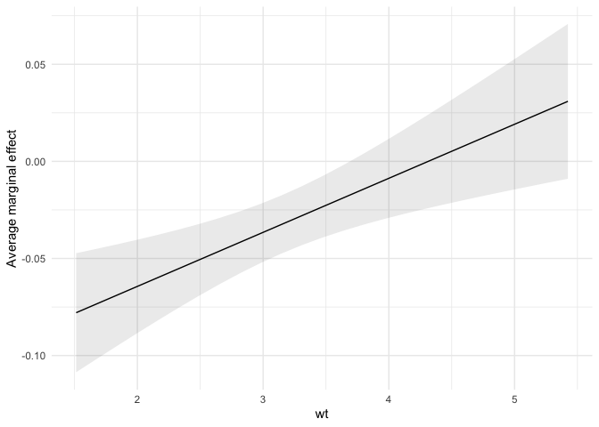
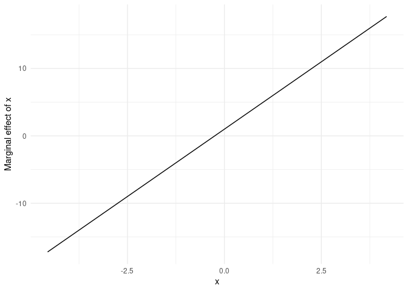

# `marginaleffects`

### Marginal effects using `R`, automatic differentiation, and the delta method

<!-- badges: start -->

[](https://www.tidyverse.org/lifecycle/#experimental)
[](https://github.com/vincentarelbundock/fastmargins/actions)
<!-- badges: end -->

This package is still experimental. *Use with caution!*

## What?

The `marginaleffects` package allows `R` users to compute and plot
“marginal effects” for a *wide* variety of models.

A “marginal effect” is a measure of the association between a change in
the regressors, and a change in the response variable. More formally,
[the `margins`
vignette](https://cran.r-project.org/web/packages/margins/index.html)
defines “marginal effects” as follows:

> “Marginal effects are partial derivatives of the regression equation
> with respect to each variable in the model for each unit in the data.”

Marginal effects are extremely useful, because they are intuitive and
easy to interpret. They are often the main quantity of interest in an
empirical analysis. Unfortunately, they can be often be quite difficult
to compute:

> In ordinary least squares regression with no interactions or
> higher-order term, the estimated slope coefficients are marginal
> effects. In other cases and for generalized linear models, the
> coefficients are not marginal effects at least not on the scale of the
> response variable.

To calculate marginal effects, we take derivatives of the regression
equation. This can be challenging, especially when our models are
non-linear, or when regressors are transformed or interacted. Computing
the variance is even more difficult. The `marginaleffects` package hopes
to do most of this hard work for you.

# Why?

Many `R` packages advertise their ability to compute “marginal effects.”
However, most of them do *not* actually compute marginal effects *as
defined above* (the term is ambiguously defined in the statistical
literature and used differently across fields). Instead, they compute
related quantities such as “Estimated Marginal Means” or “Differences in
Predicted Probabilities.” The rare packages which actually compute
marginal effects are typically limited in the model types they support,
and in the range of transformations they allow (interactions,
polynomials, etc.).

The main package in the `R` ecosystem to compute marginal effects is
[the fantastic, trailblazing, and powerful
`margins`](https://cran.r-project.org/web/packages/margins/index.html)
by [Thomas J. Leeper.](https://thomasleeper.com/) The `marginaleffects`
package is (essentially) a clone of `margins`.

So why did I write a new package?

-   *Speed:* In one benchmark (see below), computing unit-level standard
    errors is over 400x faster with `marginaleffects` (1 minute vs. 130
    milliseconds).
-   *Efficiency:* Smaller memory footprint.
-   *Extensibility:* Adding support for new models is very easy, often
    requires less than 10 lines of new code. In the medium run, the goal
    is to add support for *several* more model types.
-   `ggplot2` support: Plot your (conditional) marginal effects using
    `ggplot2`.
-   *Tidy:* The results produced by `marginaleffects` follow “tidy”
    principles. They are easy to process and program with.
-   *Active development*

Downsides of `marginaleffects` include:

-   No support for weights or simultation-based inference.
-   Possibly fragile handling of transformations in model formulas (not
    sure).
-   More dependencies.
-   Newer package with a much smaller (i.e., non-existent) user base.

## How?

By using [the `numDeriv`
package](https://cran.r-project.org/web/packages/numDeriv/index.html) to
compute gradients and jacobians. That’s it. That’s the secret sauce.

## Supported models

This table shows the list of models supported by `marginaleffect`, and
shows which numerical results have been checked against alternative
software packages: Stata’s `margins` command and R’s `margins` package.

| Model            | Support: Effect | Support: Std.Errors | Validity: Stata | Validity: margins |
|:-----------------|:----------------|:--------------------|:----------------|:------------------|
| stats::lm        | ✓               | ✓                   | ✓               | ✓                 |
| stats::glm       | ✓               | ✓                   | ✓               | ✓                 |
| stats::loess     | ✓               |                     |                 | ✓                 |
| AER::ivreg       | ✓               | ✓                   | ✓               | ✓                 |
| betareg::betareg | ✓               | ✓                   | ✓               | ✓                 |
| fixest::feols    | ✓               | ✓                   |                 |                   |
| fixest::feglm    | ✓               | ✓                   |                 |                   |
| ivreg::ivreg     | ✓               | ✓                   | ✓               | ✓                 |
| lme4::lmer       | ✓               | ✓                   |                 | dydx only         |
| lme4::glmer      | ✓               | ✓                   |                 | dydx only         |
| MASS::polr       | ✓               |                     | ✓               |                   |
| ordinal::clm     | ✓               |                     |                 | ✓                 |
| survey::svyglm   | ✓               | ✓                   |                 | ✓                 |

## Installation

You can install the latest version of `marginaleffects` from Github:

``` r
remotes::install_github("vincentarelbundock/marginaleffects")
```

## Getting started

First, we load the library, download the [Palmer
Penguins](https://allisonhorst.github.io/palmerpenguins/) data from the
[`Rdatasets`
archive](https://vincentarelbundock.github.io/Rdatasets/articles/data.html),
and estimate a GLM model:

``` r
library(marginaleffects)

dat <- read.csv("https://vincentarelbundock.github.io/Rdatasets/csv/palmerpenguins/penguins.csv")
dat$large_penguin <- ifelse(dat$body_mass_g > median(dat$body_mass_g, na.rm = TRUE), 1, 0)

mod <- glm(large_penguin ~ bill_length_mm + flipper_length_mm + species, 
           data = dat, family = binomial)
```

The `marginaleffects` function computes a distinct estimate of the
marginal effect and of the standard error for each regressor (“term”),
for each unit of observation (“rowid”). You can browse view and
manipulate the full results with functions like `head`, as you would any
`data.frame`:

``` r
mfx <- marginaleffects(mod)

head(mfx)
#>   rowid              term        dydx   std.error large_penguin bill_length_mm
#> 1     1    bill_length_mm 0.017622745 0.007837288             0           39.1
#> 2     1 flipper_length_mm 0.006763748 0.001561738             0           39.1
#> 3     2    bill_length_mm 0.035846649 0.011917159             0           39.5
#> 4     2 flipper_length_mm 0.013758244 0.002880122             0           39.5
#> 5     3    bill_length_mm 0.084433436 0.021119181             0           40.3
#> 6     3 flipper_length_mm 0.032406447 0.008159349             0           40.3
#>   flipper_length_mm species
#> 1               181  Adelie
#> 2               181  Adelie
#> 3               186  Adelie
#> 4               186  Adelie
#> 5               195  Adelie
#> 6               195  Adelie
```

Notice that the results are presented in “tidy” format: each row of the
original dataset gets a unique `rowid` value, each unit-level marginal
effect appears on a distinct row, and metadata appears neatly in
separate columns. This makes it easy to operate on the results
programmatically.

We can obtain similar (but arguably messier) results with the `margins`
package:

``` r
library(margins)

mar <- margins(mod)
mar <- data.frame(mar)

head(mar, 2)
#>   X species    island bill_length_mm bill_depth_mm flipper_length_mm
#> 1 1  Adelie Torgersen           39.1          18.7               181
#> 2 2  Adelie Torgersen           39.5          17.4               186
#>   body_mass_g    sex year large_penguin     fitted  se.fitted
#> 1        3750   male 2007             0 0.05123266 0.02294299
#> 2        3800 female 2007             0 0.11125087 0.03296249
#>   dydx_bill_length_mm dydx_flipper_length_mm dydx_speciesChinstrap
#> 1          0.01762256            0.006763789           -0.05093734
#> 2          0.03584626            0.013758266           -0.11056655
#>   dydx_speciesGentoo Var_dydx_bill_length_mm Var_dydx_flipper_length_mm
#> 1         0.05458668            3.335632e-05               5.498655e-06
#> 2         0.10402440            3.335632e-05               5.498655e-06
#>   Var_dydx_speciesChinstrap Var_dydx_speciesGentoo X_weights X_at_number
#> 1                0.00319684             0.01142364        NA           1
#> 2                0.00319684             0.01142364        NA           1
```

## Average Marginal Effects

A dataset with one marginal effect estimate per unit of observation is a
bit unwieldy and difficult to interpret. Many analysts like to report
the “Average Marginal Effect”, that is, the average of all the
observation-specific marginal effects. These are easy to compute based
on the full `data.frame` shown above, but the `summary` function is
convenient:

``` r
summary(mfx)
#> Average marginal effects 
#>                term           contrast   Effect Std. Error z value   Pr(>|z|)
#> 1    bill_length_mm                     0.02757    0.00849 3.24819  0.0011614
#> 2 flipper_length_mm                     0.01058    0.00332 3.18766  0.0014343
#> 3           species Chinstrap - Adelie -5.20837    1.04973         2.0906e-06
#> 4           species    Gentoo - Adelie  0.78461    1.25627          0.8066373
#> 5           species Gentoo - Chinstrap  5.99298    1.30388         1.2828e-05
#>      2.5 %   97.5 %
#> 1  0.01093  0.04421
#> 2  0.00408  0.01709
#> 3 -7.26580 -3.15094
#> 4 -1.67763  3.24685
#> 5  3.43743  8.54853
#> 
#> Model type:  glm 
#> Prediction type:  response
```

If the `emmeans` package is installed, `summary.marginaleffects` will
try to display contrasts for logical, factor, and character variables.

You can also extract average marginal effects using `tidy` and `glance`
methods which conform to the [`broom` package
specification](https://broom.tidymodels.org/):

``` r
tidy(mfx)
#> # A tibble: 5 × 8
#> # Groups:   term [3]
#>   term              contrast estimate std.error statistic p.value conf.low conf.high
#>   <chr>             <chr>       <dbl>     <dbl>     <dbl>   <dbl>    <dbl>     <dbl>
#> 1 bill_length_mm    <NA>       0.0276   0.00849      3.25 1.16e-3  0.0109     0.0442
#> 2 flipper_length_mm <NA>       0.0106   0.00332      3.19 1.43e-3  0.00408    0.0171
#> 3 species           Chinstr…  -5.21     1.05        NA    2.09e-6 -7.27      -3.15  
#> 4 species           Gentoo …   0.785    1.26        NA    8.07e-1 -1.68       3.25  
#> 5 species           Gentoo …   5.99     1.30        NA    1.28e-5  3.44       8.55

glance(mfx)
#>   null.deviance df.null    logLik      AIC      BIC deviance df.residual nobs
#> 1      473.8202     341 -84.92257 179.8451 199.0192 169.8451         337  342
```

## Typical Marginal Effects

Sometimes, we are not interested in *all* the unit-specific marginal
effects, but would rather look at the estimated marginal effects for
certain “typical” individuals. The `typical` function helps us build
datasets full of “typical” rows. For example, to generate very unhappy
individuals with or without kids:

``` r
typical(mod, 
        at = list(flipper_length_mm = 180, 
                  species = c("Adelie", "Gentoo")))
#>   bill_length_mm flipper_length_mm species
#> 1          44.45               180  Adelie
#> 2          44.45               180  Gentoo
```

This dataset can then be used in `marginaleffects` to compute marginal
effects for those (fictional) individuals:

``` r
nd <- typical(mod, 
              at = list(flipper_length_mm = 180, 
                        species = c("Adelie", "Gentoo")))
marginaleffects(mod, newdata = nd)
#>   rowid              term       dydx   std.error bill_length_mm
#> 1     1    bill_length_mm 0.06730577 0.035695232          44.45
#> 2     1 flipper_length_mm 0.02583260 0.005812085          44.45
#> 3     2    bill_length_mm 0.08815874 0.032833988          44.45
#> 4     2 flipper_length_mm 0.03383629 0.005861848          44.45
#>   flipper_length_mm species
#> 1               180  Adelie
#> 2               180  Adelie
#> 3               180  Gentoo
#> 4               180  Gentoo
```

When a variable is omitted from the `at` list, `typical` will
automatically select the median (or mode) of the missing variable.

## Counterfactual Marginal Effects

The `typical` function allowed us look at completely fictional
individual. The `counterfactual` lets us compute the marginal effects
for the actual observations in our dataset, but with a few manipulated
values. For example, this code will create a `data.frame` twice as long
as the original `dat`, where each observation is repeated with different
values of the `kids` variable:

``` r
nd <- counterfactual(mod, at = list(flipper_length_mm = c(160, 180)))
```

We see that the rows 1, 2, and 3 of the original dataset have been
replicated twice, with different values of the `kids` variable:

``` r
nd[nd$rowid %in% 1:3,]
#>     rowid bill_length_mm species flipper_length_mm
#> 1       1           39.1  Adelie               160
#> 2       2           39.5  Adelie               160
#> 3       3           40.3  Adelie               160
#> 343     1           39.1  Adelie               180
#> 344     2           39.5  Adelie               180
#> 345     3           40.3  Adelie               180
```

Again, we can use this to compute average (or median) marginal effects
over the counterfactual individuals:

``` r
library(dplyr)

marginaleffects(mod, newdata = nd) %>%
    group_by(term) %>%
    summarize(across(dydx:std.error, median))
#> # A tibble: 2 × 3
#>   term                 dydx std.error
#>   <chr>               <dbl>     <dbl>
#> 1 bill_length_mm    0.00985   0.00628
#> 2 flipper_length_mm 0.00378   0.00144
```

## Tables

Average marginal effects are easy to display in a regression table using
packages like `modelsummary`:

``` r
library(modelsummary)

# fit models and store them in a named list
mod <- list(
    "Logit" = glm(large_penguin ~ flipper_length_mm, data = dat, family = binomial),
    "OLS" = lm(body_mass_g ~ flipper_length_mm + bill_length_mm, data = dat))

# apply the `marginaleffects` function to all the models using `lapply`
mfx <- lapply(mod, marginaleffects)

# build a table
modelsummary(mfx)
```

|                     |  Logit   |    OLS    |
|:--------------------|:--------:|:---------:|
| flipper\_length\_mm |  0.020   |  48.145   |
|                     | (0.003)  |  (2.011)  |
| bill\_length\_mm    |          |   6.047   |
|                     |          |  (5.180)  |
| Num.Obs.            |   342    |    342    |
| R2                  |          |   0.760   |
| R2 Adj.             |          |   0.759   |
| AIC                 |  222.2   |  5063.5   |
| BIC                 |  229.9   |  5078.8   |
| Log.Lik.            | -109.111 | -2527.741 |
| F                   |          |  536.626  |

You can also display models with contrasts using `modelsummary`’s
`group` argument:

``` r
mod <- list(
    "Logit" = glm(large_penguin ~ species, data = dat, family = binomial),
    "OLS" = lm(body_mass_g ~ flipper_length_mm + species, data = dat))

mfx <- lapply(mod, marginaleffects)

modelsummary(mfx, group = term + contrast ~ model)
```

|                     |                    |  Logit   |    OLS    |
|:--------------------|:-------------------|:--------:|:---------:|
| species             | Chinstrap - Adelie |  -0.371  | -206.510  |
|                     |                    | (0.384)  | (57.731)  |
|                     | Gentoo - Adelie    |  6.078   |  266.810  |
|                     |                    | (1.023)  | (95.264)  |
|                     | Gentoo - Chinstrap |  6.449   |  473.320  |
|                     |                    | (1.057)  | (86.746)  |
| flipper\_length\_mm |                    |          |  40.705   |
|                     |                    |          |  (3.068)  |
| Num.Obs.            |                    |   342    |    342    |
| R2                  |                    |          |   0.783   |
| R2 Adj.             |                    |          |   0.781   |
| AIC                 |                    |  236.4   |  5031.5   |
| BIC                 |                    |  247.9   |  5050.7   |
| Log.Lik.            |                    | -115.188 | -2510.762 |
| F                   |                    |          |  405.693  |

## Plots (`ggplot2`)

Since the output of the `marginaleffects` function is “tidy”, it is very
easy to use the `data.frame` that this function produces directly to
draw plots with any drawing package you like. In addition, the
`marginaleffects` package also offers functions to draw frequently used
plots with `ggplot2`.

The first is a simple `plot` command to draw the average marginal
effects:

``` r
mod <- lm(mpg ~ hp + wt + drat, data = mtcars)
mfx <- marginaleffects(mod)

plot(mfx)
```


The second is a `plot_cme` function to draw “Conditional Marginal
Effects.” This is useful when a model includes interaction terms and we
want to plot how the marginal effect of a variable changes as the value
of a “condition” (or “moderator”) variable changes:

``` r
mod <- lm(mpg ~ hp * wt + drat, data = mtcars)

plot_cme(mod, effect = "hp", condition = "wt")
```



## Simple analytic example: Quadratic term

Say you estimate a linear regression model with a quadratic term:

*Y* = *β*<sub>0</sub> + *β*<sub>1</sub>*X* + *ε*
,

and obtain the following estimates:
*β*<sub>1</sub> = 1; *β*<sub>2</sub> = 2. By taking the partial
derivative with respect to *X* we obtain the marginal effect of *X* on
*Y* variable:

∂*Y*/∂*X* = *β*<sub>1</sub> + 2 ⋅ *β*<sub>2</sub>*X*

Plugging in our estimates leads us to conclude that the effect of *X* on
*Y* increases as *X* itself increases. An increase in *X* is associated
with 1 + 4*X*. When *X* is large, an increase in *X* has a large effect
on *Y*. When *X* is small, an increase in *X* has a small effect on *Y*.

`marginaleffects` arrives at the same conclusion in simultated data:

``` r
N <- 1e5
dat <- data.frame(x = rnorm(N))
dat$y <- 1 + 1 * dat$x + 2 * dat$x^2 + rnorm(N)
mod <- lm(y ~ x + I(x^2), dat)

marginaleffects(mod, 
                newdata = typical(data = dat, at = list(x = -2:2))) %>%
    mutate(truth = 1 + 4 * x) %>%
    select(dydx, truth)
#>         dydx truth
#> 1 -6.9938438    -7
#> 2 -2.9975707    -3
#> 3  0.9987025     1
#> 4  4.9949756     5
#> 5  8.9912488     9
```

We can also plot the result easily with the `plot_cme` function:

``` r
plot_cme(mod, effect = "x", condition = "x")
```



## Benchmarks

Here are two *very* naive benchmarks to compare the speed of
`marginaleffects` and `margins`. Computing the unit-level marginal
effects and standard errors in a logistic regression model with 2000
observations is over 400 times faster with `marginaleffects`.
Calculating only the marginal effects is about 20% faster.

Simulate data and fit model:

``` r
N <- 2000
dat <- data.frame(
    x2 = rnorm(N),
    x1 = rnorm(N),
    x3 = rnorm(N),
    x4 = rnorm(N),
    e = rnorm(N))
dat$y <- rbinom(N, 1, plogis(
    dat$x1 + dat$x2 + dat$x3 + dat$x4 + dat$x3 * dat$x4))

mod <- glm(y ~ x1 + x2 + x3 * x4, data = dat, family = binomial)
```

Marginal effects and standard errors:

``` r
bench::mark(
    margins::margins(mod, unit_ses = TRUE),
    marginaleffects(mod),
    check = FALSE)

> expression                                  min   median `itr/sec` mem_alloc
> margins::margins(mod, unit_ses = TRUE)    1.08m    1.08m    0.0154    1.85GB
> marginaleffects(mod)                    124.5ms 154.43ms    5.75     51.63MB
```

Marginal effects only:

``` r
bench::mark(
    margins::margins(mod, unit_ses = FALSE),
    marginaleffects(mod, variance = FALSE),
    check = FALSE)

  expression                                   min   median `itr/sec` mem_alloc
> margins::margins(mod, unit_ses = FALSE)    131ms    146ms      6.97    43.8MB
> marginaleffects(mod, variance = FALSE)     111ms    121ms      8.32    32.7MB
```

## Extending `marginaleffects` to support new models

In most cases, extending `marginaleffects` to support new models is
easy. Imagine you want to add support for an object called “`model`” of
class “`Example`” with N observations.

#### *Step 1:* Check if `marginaleffects` default functions work:

``` r
# returns a named vector of coefficients
get_coef(model)

# returns a named vector of predictions 
# returns a named matrix of size NxK for models with K levels (e.g., multinomial logit)
get_predict(model)

# returns a named square matrix of size equal to the number of coefficients
stats::vcov(model)

# returns a new model object with different stored coefficients 
# calling predict(model) and predict(model_new) should produce different results
model_new <- set_coef(model, rep(0, length(get_coef(model))))
```

If all of these functions work out-of-the-box, there’s a good chance
your model will be supported automatically. If they do *not* work, move
to…

#### *Step 2:* Define the missing methods.

Find the class name of your model by calling:

``` r
class(model)
```

Then, create functions (methods) called `get_coef.EXAMPLE`,
`get_predict.EXAMPLE`, `vcov.EXAMPLE`, and `set_coef.EXAMPLE`, with the
“EXAMPLE” replace by the name your model class.

#### *Step 3:* Add tests

Create a file called `tests/testthat/test-PKGNAME.R` and write a few
tests. Ideally, we would like to compare the results obtained by
`marginaleffect` to an external source, like the `margins` package or
`Stata`.

#### *Step 4:* Finalize

Add your new model class to the lists of supported models:

-   In the `sanity_dydx_model` function of the `R/sanity.R` file.
-   In the supported models table of the `README.Rmd` file.
-   In the “Details” section of the `R/marginaleffects.R` documentation
