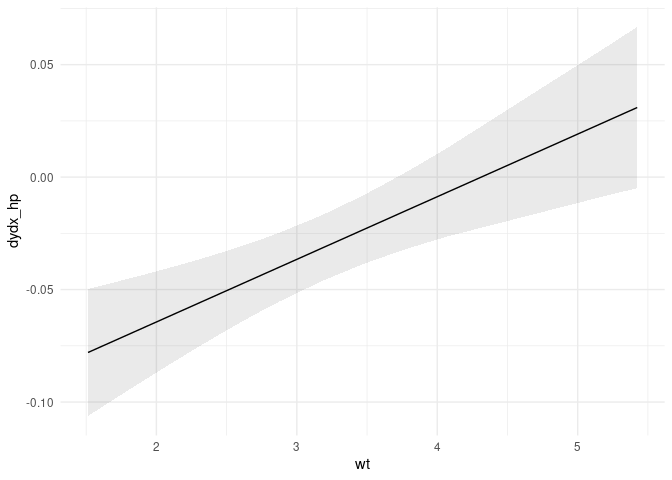
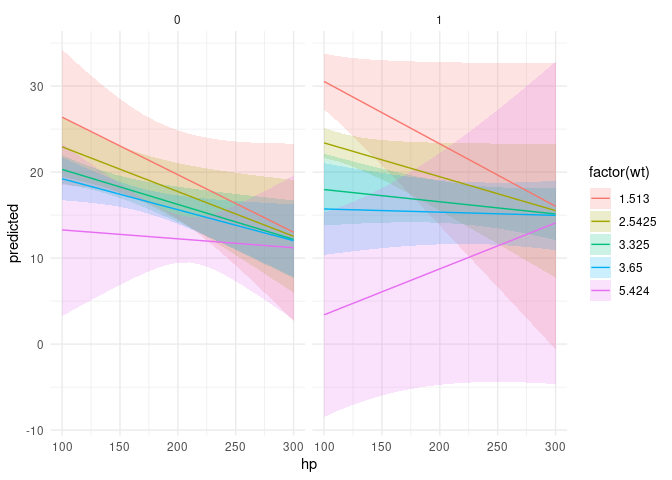
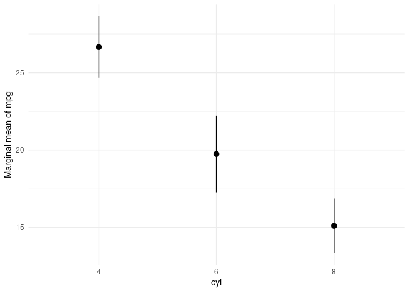

# The `marginaleffects` package for `R` 

<!-- badges: start -->

[](https://lifecycle.r-lib.org/articles/stages.html#experimental)
[](https://app.codecov.io/gh/vincentarelbundock/marginaleffects?branch=main)
[](https://github.com/vincentarelbundock/marginaleffects/actions)
[](https://CRAN.R-project.org/package=marginaleffects)
[](https://CRAN.R-project.org/package=marginaleffects)
<!-- badges: end -->

## What?

The `marginaleffects` package allows `R` users to compute and plot four
principal quantities of interest for [a very wide variety of
models:](https://vincentarelbundock.github.io/marginaleffects/articles/supported_models.html)

  - [*Marginal Effect*:
    Vignette](https://vincentarelbundock.github.io/marginaleffects/articles/mfx.html)
      - A partial derivative (slope) of the regression equation with
        respect to a regressor of interest.
      - [`marginaleffects(),`](https://vincentarelbundock.github.io/marginaleffects/reference/marginaleffects.html)
        [`plot(),`](https://vincentarelbundock.github.io/marginaleffects/reference/plot.marginaleffects.html)
        [`plot_cme()`](https://vincentarelbundock.github.io/marginaleffects/reference/plot_cme.html)
  - [*Adjusted Prediction:*
    Vignette](https://vincentarelbundock.github.io/marginaleffects/articles/predictions.html)
      - The outcome predicted by a model for some combination of the
        regressors’ values, such as their observed values, their means,
        or factor levels (a.k.a. “reference grid”).
      - [`predictions(),`](https://vincentarelbundock.github.io/marginaleffects/reference/predictions.html)
        [`plot_cap()`](https://vincentarelbundock.github.io/marginaleffects/reference/predictions.html)
  - [*Contrast:*
    Vignette](https://vincentarelbundock.github.io/marginaleffects/articles/contrasts.html)
      - The difference between two adjusted predictions, calculated for
        meaningfully different regressor values (e.g., College graduates
        vs. Others).
      - [`comparisons()`](https://vincentarelbundock.github.io/marginaleffects/reference/comparisons.html)
  - [*Marginal Mean:*
    Vignette](https://vincentarelbundock.github.io/marginaleffects/articles/marginalmeans.html)
      - Adjusted predictions of a model, averaged across a “reference
        grid” of categorical predictors.
      - [`marginalmeans()`](https://vincentarelbundock.github.io/marginaleffects/reference/marginalmeans.html)

The rest of this page includes a “Getting Started” tutorial with simple
examples. To go beyond these simple examples, please read the vignettes
linked above, for each of the four quantities. In addition, you can
consult these pages:

  - [List of supported
    models](https://vincentarelbundock.github.io/marginaleffects/articles/supported_models.html)
  - Case studies:
      - [Bayesian analyses with
        `brms`](https://vincentarelbundock.github.io/marginaleffects/articles/brms.html)
      - [Mixed effects
        models](https://vincentarelbundock.github.io/marginaleffects/articles/lme4.html)

## Why?

To calculate marginal effects we need to take derivatives of the
regression equation. This can be challenging to do manually, especially
when our models are non-linear, or when regressors are transformed or
interacted. Computing the variance of a marginal effect is even more
difficult.

The `marginaleffects` package hopes to do most of this hard work for
you.

Many `R` packages advertise their ability to compute “marginal effects.”
However, most of them do *not* actually compute marginal effects *as
defined above*. Instead, they compute “adjusted predictions” for
different regressor values, or differences in adjusted predictions
(i.e., “contrasts”). The rare packages that actually compute marginal
effects are typically limited in the model types they support, and in
the range of transformations they allow (interactions, polynomials,
etc.).

The main packages in the `R` ecosystem to compute marginal effects are
the trailblazing and powerful [`margins` by Thomas J.
Leeper](https://cran.r-project.org/package=margins), and [`emmeans` by
Russell V. Lenth and
contributors.](https://cran.r-project.org/package=emmeans) The
`marginaleffects` package is essentially a clone of `margins`, with some
additional features from `emmeans`.

So why did I write a clone?

  - *Powerful:* Marginal effects and contrasts can be computed for about
    40 different kinds of models. Adjusted predictions and marginal
    means can be computed for about 100 model types.
  - *Extensible:* Adding support for new models is very easy, often
    requiring less than 10 lines of new code. Please submit [feature
    requests on
    Github.](https://github.com/vincentarelbundock/marginaleffects/issues)
  - *Fast:* [In one
    benchmark,](https://vincentarelbundock.github.io/marginaleffects/articles/benchmark.html)
    computing unit-level standard errors is over 400x faster with
    `marginaleffects` (minutes vs. milliseconds).
  - *Efficient:* Smaller memory footprint (1.8GB vs 52MB in the same
    example).
  - *Valid:* When possible, numerical results are checked against
    alternative software like `Stata`, or other `R` packages.
  - *Beautiful:* `ggplot2` support for plotting (conditional) marginal
    effects and adjusted predictions.
  - *Tidy:* The results produced by `marginaleffects` follow “tidy”
    principles. They are easy to program with and feed to [other
    packages like
    `modelsummary`.](https://vincentarelbundock.github.io/marginaleffects/)
  - *Simple:* All functions share a simple, unified, and well-documented
    interface.
  - *Thin:* The package requires few dependencies.
  - *Safe:* User input is checked extensively before computation. When
    needed, functions fail gracefully with informative error messages.
  - *Active development*

Downsides of `marginaleffects` include:

  - Functions to estimate contrasts and marginal means are considerably
    less flexible than `emmeans`.
  - Simulation-based inference is not supported.
  - Newer package with a smaller (read: nonexistent) user base.

## How?

By using [the `numDeriv`
package](https://cran.r-project.org/package=numDeriv) to compute
gradients and jacobians, and [the `insight`
package](https://easystats.github.io/insight/) to extract information
from model objects. That’s it. That’s the secret sauce.

## Installation

You can install the released version of `marginaleffects` from CRAN:

``` r
install.packages("marginaleffects")
```

You can install the development version of `marginaleffects` from
Github:

``` r
remotes::install_github("vincentarelbundock/marginaleffects")
```

## Getting started

First, we estimate a linear regression model with multiplicative
interactions:

``` r
library(marginaleffects)

mod <- lm(mpg ~ hp * wt * am, data = mtcars)
```

#### Marginal effects

A “marginal effect” is a unit-specific measure of association between a
change in a regressor and a change in the regressand. The
`marginaleffects` function thus computes a distinct estimate of the
marginal effect and of the standard error for each regressor (“term”),
for each unit of observation (“rowid”). You can view and manipulate the
full results with functions like `head`, as you would with any other
`data.frame`:

``` r
mfx <- marginaleffects(mod)

head(mfx, 4)
#>   rowid     type term        dydx  std.error  mpg  hp    wt am
#> 1     1 response   hp -0.03690556 0.01850168 21.0 110 2.620  1
#> 2     2 response   hp -0.02868936 0.01562768 21.0 110 2.875  1
#> 3     3 response   hp -0.04657166 0.02259121 22.8  93 2.320  1
#> 4     4 response   hp -0.04227128 0.01328275 21.4 110 3.215  0
```

The function `summary` calculates the “Average Marginal Effect,” that
is, the average of all unit-specific marginal effects:

``` r
summary(mfx)
#> Average marginal effects 
#>   Term   Effect Std. Error  z value   Pr(>|z|)    2.5 %   97.5 %
#> 1   am -0.04811    1.85260 -0.02597 0.97928233 -3.67913  3.58291
#> 2   hp -0.03807    0.01279 -2.97717 0.00290923 -0.06314 -0.01301
#> 3   wt -3.93909    1.08596 -3.62728 0.00028642 -6.06754 -1.81065
#> 
#> Model type:  lm 
#> Prediction type:  response
```

The `plot_cme` plots “Conditional Marginal Effects,” that is, the
marginal effects estimated at different values of a regressor (often an
interaction):

``` r
plot_cme(mod, effect = "hp", condition = c("wt", "am"))
```



#### Adjusted predictions

Beyond marginal effects, we can also use the `predictions` function to
estimate – you guessed it – adjusted predicted values. We use the
`variables` argument to select the categorical variables that will form
a “grid” of predictor values over which to compute means/predictions:

``` r
predictions(mod, variables = c("am", "wt"))
#>    rowid     type predicted std.error  conf.low conf.high       hp am     wt
#> 1      1 response 23.259500 2.7059342 17.674726  28.84427 146.6875  0 1.5130
#> 2      2 response 27.148334 2.8518051 21.262498  33.03417 146.6875  1 1.5130
#> 3      3 response 20.504387 1.3244556 17.770845  23.23793 146.6875  0 2.5425
#> 4      4 response 21.555612 1.0723852 19.342318  23.76891 146.6875  1 2.5425
#> 5      5 response 18.410286 0.6151016 17.140779  19.67979 146.6875  0 3.3250
#> 6      6 response 17.304709 1.5528055 14.099876  20.50954 146.6875  1 3.3250
#> 7      7 response 17.540532 0.7293676 16.035192  19.04587 146.6875  0 3.6500
#> 8      8 response 15.539158 2.1453449 11.111383  19.96693 146.6875  1 3.6500
#> 9      9 response 12.793013 2.9784942  6.645703  18.94032 146.6875  0 5.4240
#> 10    10 response  5.901966 5.8149853 -6.099574  17.90351 146.6875  1 5.4240
```

The [`datagrid` function gives us an even more powerful
way](https://vincentarelbundock.github.io/marginaleffects/reference/datagrid.html)
to customize the grid:

``` r
predictions(mod, newdata = datagrid(am = 0, wt = c(2, 4)))
#>   rowid     type predicted std.error conf.low conf.high       hp am wt
#> 1     1 response  21.95621  2.038630 17.74868  26.16373 146.6875  0  2
#> 2     2 response  16.60387  1.083201 14.36826  18.83949 146.6875  0  4
```

We can plot the adjusted predictions with the `plot_cap` function:

``` r
plot_cap(mod, condition = c("hp", "wt"))
```


Or you can work with the output of the `predictions` or
`marginaleffects` directly to create your own plots. For example:

``` r
library(tidyverse)

predictions(mod,
            newdata = datagrid(am = 0:1,
                               wt = fivenum(mtcars$wt),
                               hp = seq(100, 300, 10))) %>%
    ggplot(aes(x = hp, y = predicted, ymin = conf.low, ymax = conf.high)) +
    geom_ribbon(aes(fill = factor(wt)), alpha = .2) +
    geom_line(aes(color = factor(wt))) +
    facet_wrap(~am)
```



And of course, categorical variables work too:

``` r
mod <- lm(mpg ~ factor(cyl), data = mtcars)
plot_cap(mod, condition = "cyl")
```



#### Marginal means

To compute marginal means, we first need to make sure that the
categorical variables of our model are coded as such in the dataset:

``` r
dat <- mtcars
dat$am <- as.logical(dat$am)
dat$cyl <- as.factor(dat$cyl)
```

Then, we estimate the model and call the `marginalmeans` function:

``` r
mod <- lm(mpg ~ am + cyl + hp, data = dat)
mm <- marginalmeans(mod)
summary(mm)
#> Estimated marginal means 
#>   Term Value  Mean Std. Error z value   Pr(>|z|) 2.5 % 97.5 %
#> 1   am FALSE 18.32     0.7854   23.33 < 2.22e-16 16.78  19.86
#> 2   am  TRUE 22.48     0.8343   26.94 < 2.22e-16 20.84  24.11
#> 3  cyl     4 22.88     1.3566   16.87 < 2.22e-16 20.23  25.54
#> 4  cyl     6 18.96     1.0729   17.67 < 2.22e-16 16.86  21.06
#> 5  cyl     8 19.35     1.3771   14.05 < 2.22e-16 16.65  22.05
#> 
#> Model type:  lm 
#> Prediction type:  response
```

#### More

There is *much* more you can do with `marginaleffects`. Please read the
other articles on this website to learn how to report marginal effects
and means in [nice tables with the `modelsummary`
package](https://vincentarelbundock.github.io/modelsummary/), how to
define your own prediction “grid”, and more:

  - [*Marginal Effect*
    (Vignette)](https://vincentarelbundock.github.io/marginaleffects/articles/mfx.html)
  - [*Adjusted Prediction*
    (Vignette)](https://vincentarelbundock.github.io/marginaleffects/articles/predictions.html)
  - [*Contrast*
    (Vignette)](https://vincentarelbundock.github.io/marginaleffects/articles/contrasts.html)
  - [*Marginal Mean*
    (Vignette)](https://vincentarelbundock.github.io/marginaleffects/articles/marginalmeans.html)
