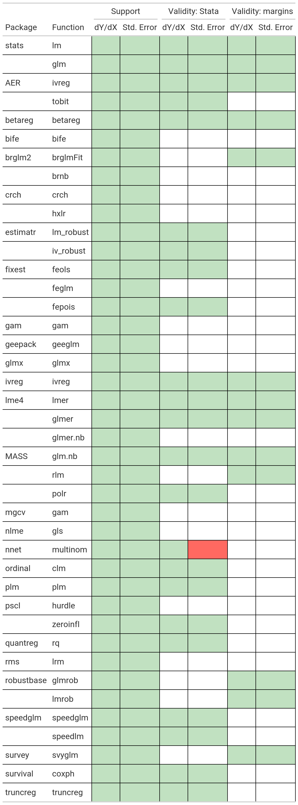

# The `marginaleffects` package for `R`

<!-- badges: start -->

[](https://www.tidyverse.org/lifecycle/#experimental)
[](https://codecov.io/gh/vincentarelbundock/marginaleffects?branch=main)
[](https://github.com/vincentarelbundock/marginaleffects/actions)
<!-- badges: end -->

This package is still experimental. *Use with caution\!*

## What?

The `marginaleffects` package allows `R` users to compute and plot three
principal quantities of interest for a *wide* variety of models:

  - [*Marginal Effect*
    (Vignette)](https://vincentarelbundock.github.io/marginaleffects/articles/mfx.html)
      - A partial derivative (slope) of the regression equation with
        respect to a regressor of interest.
  - [*Marginal Mean*
    (Vignette)](https://vincentarelbundock.github.io/marginaleffects/articles/marginalmeans.html)
      - Response predicted by a model for some combination of the
        regressors’ values (a.k.a. “reference grid”), typically their
        means or factor levels.
  - [*Contrast*
    (Vignette)](https://vincentarelbundock.github.io/marginaleffects/articles/contrasts.html)
      - The difference between two Marginal Means, calculated for
        meaningfully different regressor values (e.g., College graduates
        vs. Others).

## Why?

To calculate marginal effects we need to take derivatives of the
regression equation. This can be challenging to do manually, especially
when our models are non-linear, or when regressors are transformed or
interacted. Computing the variance of a marginal effect is even more
difficult.

The `marginaleffects` package hopes to do most of this hard work for
you.

Many `R` packages advertise their ability to compute “marginal effects.”
However, most of them do *not* actually compute marginal effects *as
defined above*. Instead, they compute fitted values for different
predictor values (i.e., “Marginal Means”), or differences in fitted
values (i.e., “contrasts”). The rare packages that actually compute
marginal effects are typically limited in the model types they support,
and in the range of transformations they allow (interactions,
polynomials, etc.).

The main package in the `R` ecosystem to compute marginal effects is the
trailblazing and powerful [`margins` and `prediction` packages by Thomas
J. Leeper](https://cran.r-project.org/web/packages/margins/index.html),
and the [`emmeans` package by Russell V. Lenth and
contributors.](https://cran.r-project.org/web/packages/emmeans/index.html)
The `marginaleffects` package is (essentially) a clone of Leeper’s
`margins` and `prediction` packages.

So why did I write a clone?

  - *Speed:* [In one
    benchmark,](https://vincentarelbundock.github.io/marginaleffects/articles/benchmark.html)
    computing unit-level standard errors is over 400x faster with
    `marginaleffects` (minutes vs. milliseconds).
  - *Efficiency:* Smaller memory footprint (1.8GB vs 52MB in the same
    example).
  - *Extensibility:* Adding support for new models is very easy, often
    requiring less than 10 lines of new code. In the medium run, the
    goal is to add support for *several* more model types.
  - `ggplot2` support for plotting (conditional) marginal effects.
  - *Tidy:* The results produced by `marginaleffects` follow “tidy”
    principles. They are easy to process and program with.
  - *User interface:* All functions share an extremely simple, unified,
    and well-documented interface.
  - *Dependencies*: The package is built on very few dependencies. The
    only “true” dependencies are `numDeriv` which has been on the CRAN
    archive since 2006, and `insight` which is itself dependency-free.
  - *Safe:* User input is checked extensively before computation. When
    needed, functions fail gracefully with informative error messages.
  - *Active development*

Downsides of `marginaleffects` include:

  - Simultation-based inference is not supported.
  - Newer package with a smaller (read: nonexistent) user base.

## How?

By using [the `numDeriv`
package](https://cran.r-project.org/web/packages/numDeriv/index.html) to
compute gradients and jacobians, and [the `insight`
package](https://easystats.github.io/insight/) to extract information
from model objects. That’s it. That’s the secret sauce.

## Supported models

This table shows the list of models supported by `marginaleffects`, and
shows which numerical results – marginal effects (dY/dX) or standard
errors (Std. Error) – have been checked against alternative software
packages: Stata’s `margins` command and R’s `margins` package. Empty
cells mean that the results of a model have not yet been validated
against external software. Green cells indicate that the results of [at
least one model from the test
suite](https://github.com/vincentarelbundock/marginaleffects/tree/main/tests/testthat)
match to a reasonable tolerance. Red cells mean that `marginaleffects`
results do *not* match those produced by alternative software packages.
Obviously, caution is especially warranted when working with estimates
from red cells.

I am *very* eager to add support for new models. Feel free to file a
request on Github or – even better – submit some code.

Warning: When using `marginaleffects` with different models, you will
probably have to adjust the `type` argument. Refer to the documentation
of your modeling package to see what `type` argument is allowed in the
`predict` function.



## Installation

You can install the latest version of `marginaleffects` from Github:

``` r
remotes::install_github("vincentarelbundock/marginaleffects")
```

## Getting started

First, we estimate a linear regression model with multiplicative
interactions:

``` r
library(marginaleffects)

mod <- lm(mpg ~ hp * wt * am, data = mtcars)
```

A “marginal effect” is a unit-specific measure of association between a
change in a regressor and a change in the regressand. The
`marginaleffects` function thus computes a distinct estimate of the
marginal effect and of the standard error for each regressor (“term”),
for each unit of observation (“rowid”). You can view and manipulate the
full results with functions like `head`, as you would with any other
`data.frame`:

``` r
mfx <- marginaleffects(mod)

head(mfx, 4)
#>   rowid     type term    dydx std.error  mpg  hp    wt am predicted
#> 1     1 response   am  0.3252     1.682 21.0 110 2.620  1     22.49
#> 2     2 response   am -0.5439     1.568 21.0 110 2.875  1     20.80
#> 3     3 response   am  1.2007     2.348 22.8  93 2.320  1     25.26
#> 4     4 response   am -1.7026     1.867 21.4 110 3.215  0     20.26
```

The function `summary` calculates the “Average Marginal Effect,” that
is, the average of all unit-specific marginal effects:

``` r
summary(mfx)
#> Average marginal effects 
#>       type Term  Effect Std. Error z value Pr(>|z|)   2.5 % 97.5 %
#> 1 response   am -0.0481     1.8526  -0.026  0.97928 -3.6791  3.583
#> 2 response   hp -0.0381     0.0128  -2.977  0.00291 -0.0631 -0.013
#> 3 response   wt -3.9391     1.0860  -3.627  0.00029 -6.0675 -1.811
#> 
#> Model type:  lm 
#> Prediction type:  response
```

The `plot_cme` plots “Conditional Marginal Effects,” that is, the
marginal effects estimated at different values of a regressor (often an
interaction):

``` r
plot_cme(mod, effect = "hp", condition = c("wt", "am"))
```


Beyond marginal effects, we can also use the `marginalmeans` function to
estimate – you guessed it – marginal means. We use the `variables`
argument to select the categorical variables that will form a “grid” of
predictor values over which to compute means/predictions:

``` r
marginalmeans(mod, variables = c("am", "wt"))
#>        type predicted std.error conf.low conf.high    hp am    wt
#> 1  response    23.259    2.7059   17.675     28.84 146.7  0 1.513
#> 2  response    27.148    2.8518   21.262     33.03 146.7  1 1.513
#> 3  response    20.504    1.3245   17.771     23.24 146.7  0 2.542
#> 4  response    21.556    1.0724   19.342     23.77 146.7  1 2.542
#> 5  response    18.410    0.6151   17.141     19.68 146.7  0 3.325
#> 6  response    17.305    1.5528   14.100     20.51 146.7  1 3.325
#> 7  response    17.541    0.7294   16.035     19.05 146.7  0 3.650
#> 8  response    15.539    2.1453   11.111     19.97 146.7  1 3.650
#> 9  response    12.793    2.9785    6.646     18.94 146.7  0 5.424
#> 10 response     5.902    5.8150   -6.100     17.90 146.7  1 5.424
```

The [`typical` function gives us an even more powerful
way](https://vincentarelbundock.github.io/marginaleffects/reference/typical.html)
to customize the grid:

``` r
marginalmeans(mod, newdata = typical(am = 0, wt = c(2, 4)))
#>       type predicted std.error conf.low conf.high    hp am wt
#> 1 response     21.96     2.039    17.75     26.16 146.7  0  2
#> 2 response     16.60     1.083    14.37     18.84 146.7  0  4
```

We can plot the estimated means (a.k.a. regression-adjusted predictions)
with the `plot_cmm` function:

``` r
plot_cmm(mod, condition = c("hp", "wt"))
```


Or you can work with the output of the `marginalmeans` or
`marginaleffects` directly to create your own plots. For example:

``` r
library(ggplot2)

marginalmeans(mod, 
              newdata = typical(am = 0:1, 
                                wt = fivenum(mtcars$wt), 
                                hp = seq(100, 300, 10))) %>%
    ggplot(aes(x = hp, y = predicted, ymin = conf.low, ymax = conf.high)) +
    geom_ribbon(aes(fill = factor(wt)), alpha = .2) +
    geom_line(aes(color = factor(wt))) +
    facet_wrap(~am)
```


And of course, categorical variables work too:

``` r
mod <- lm(mpg ~ factor(cyl), data = mtcars)
plot_cmm(mod, condition = "cyl")
```


There is *much* more you can do with `marginaleffects`. Please read the
other articles on this website to learn more:

  - [*Marginal Effect*
    (Vignette)](https://vincentarelbundock.github.io/marginaleffects/articles/mfx.html)
  - [*Marginal Mean*
    (Vignette)](https://vincentarelbundock.github.io/marginaleffects/articles/marginalmeans.html)
  - [*Contrast*
    (Vignette)](https://vincentarelbundock.github.io/marginaleffects/articles/contrasts.html)
