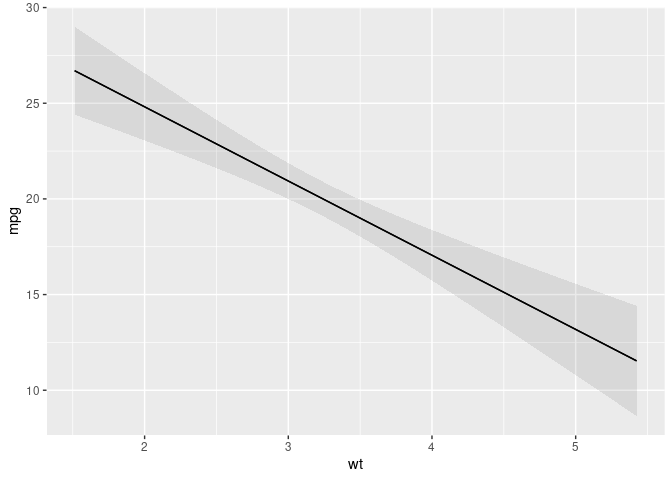
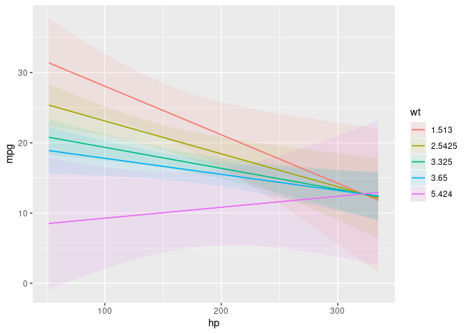
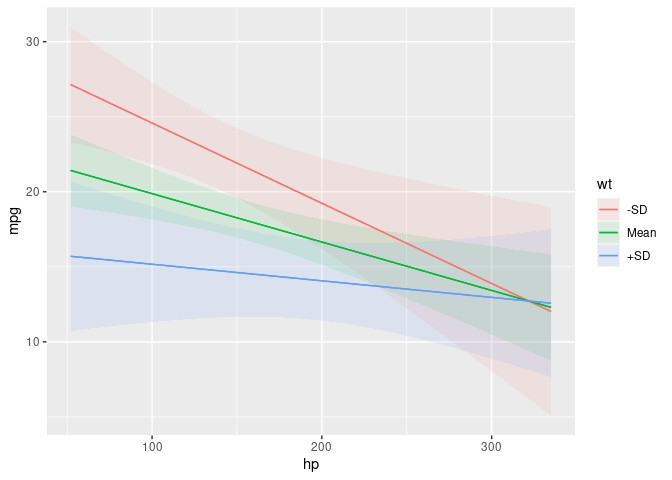
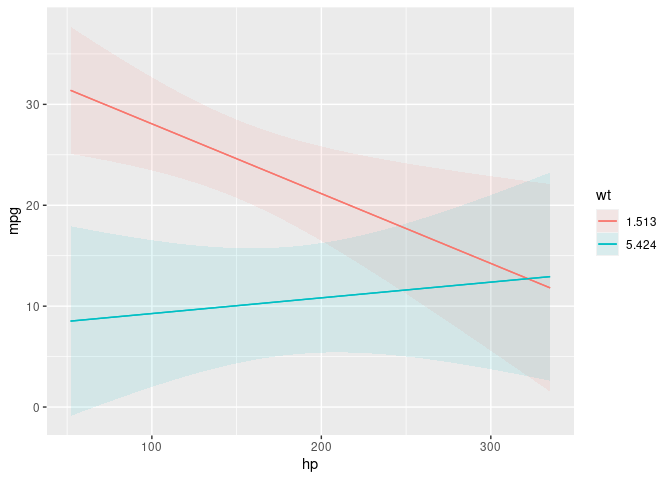

# plot_predictions

Plot Conditional or Marginal Predictions

## Description

Plot predictions on the y-axis against values of one or more predictors
(x-axis, colors/shapes, and facets).

The <code>by</code> argument is used to plot marginal predictions, that
is, predictions made on the original data, but averaged by subgroups.
This is analogous to using the <code>by</code> argument in the
<code>predictions()</code> function.

The <code>condition</code> argument is used to plot conditional
predictions, that is, predictions made on a user-specified grid. This is
analogous to using the <code>newdata</code> argument and
<code>datagrid()</code> function in a <code>predictions()</code> call.

All unspecified variables are held at their mean or mode. This includes
grouping variables in mixed-effects models, so analysts who fit such
models may want to specify the groups of interest using the
<code>variables</code> argument, or supply model-specific arguments to
compute population-level estimates. See details below.

See the "Plots" vignette and website for tutorials and information on
how to customize plots:

<ul>
<li>

https://marginaleffects.com/articles/plot.html

</li>
<li>

https://marginaleffects.com

</li>
</ul>

## Usage

<pre><code class='language-R'>plot_predictions(
  model,
  condition = NULL,
  by = NULL,
  newdata = NULL,
  type = NULL,
  vcov = NULL,
  conf_level = 0.95,
  wts = NULL,
  transform = NULL,
  points = 0,
  rug = FALSE,
  gray = FALSE,
  draw = TRUE,
  ...
)
</code></pre>

## Arguments

<table>
<tr>
<td style="white-space: nowrap; font-family: monospace; vertical-align: top">
<code id="plot_predictions_:_model">model</code>
</td>
<td>
Model object
</td>
</tr>
<tr>
<td style="white-space: nowrap; font-family: monospace; vertical-align: top">
<code id="plot_predictions_:_condition">condition</code>
</td>
<td>

Conditional predictions

<ul>
<li>

Character vector (max length 4): Names of the predictors to display.

</li>
<li>

Named list (max length 4): List names correspond to predictors. List
elements can be:

<ul>
<li>

Numeric vector

</li>
<li>

Function which returns a numeric vector or a set of unique categorical
values

</li>
<li>

Shortcut strings for common reference values: "minmax", "quartile",
"threenum"

</li>
</ul>
</li>
<li>

1: x-axis. 2: color/shape. 3: facet (wrap if no fourth variable,
otherwise cols of grid). 4: facet (rows of grid).

</li>
<li>

Numeric variables in positions 2 and 3 are summarized by Tukey’s five
numbers <code>?stats::fivenum</code>

</li>
</ul>
</td>
</tr>
<tr>
<td style="white-space: nowrap; font-family: monospace; vertical-align: top">
<code id="plot_predictions_:_by">by</code>
</td>
<td>

Marginal predictions

<ul>
<li>

Character vector (max length 3): Names of the categorical predictors to
marginalize across.

</li>
<li>

1: x-axis. 2: color. 3: facets.

</li>
</ul>
</td>
</tr>
<tr>
<td style="white-space: nowrap; font-family: monospace; vertical-align: top">
<code id="plot_predictions_:_newdata">newdata</code>
</td>
<td>
When <code>newdata</code> is <code>NULL</code>, the grid is determined
by the <code>condition</code> argument. When <code>newdata</code> is not
<code>NULL</code>, the argument behaves in the same way as in the
<code>predictions()</code> function.
</td>
</tr>
<tr>
<td style="white-space: nowrap; font-family: monospace; vertical-align: top">
<code id="plot_predictions_:_type">type</code>
</td>
<td>
string indicates the type (scale) of the predictions used to compute
contrasts or slopes. This can differ based on the model type, but will
typically be a string such as: "response", "link", "probs", or "zero".
When an unsupported string is entered, the model-specific list of
acceptable values is returned in an error message. When
<code>type</code> is <code>NULL</code>, the first entry in the error
message is used by default.
</td>
</tr>
<tr>
<td style="white-space: nowrap; font-family: monospace; vertical-align: top">
<code id="plot_predictions_:_vcov">vcov</code>
</td>
<td>

Type of uncertainty estimates to report (e.g., for robust standard
errors). Acceptable values:

<ul>
<li>

FALSE: Do not compute standard errors. This can speed up computation
considerably.

</li>
<li>

TRUE: Unit-level standard errors using the default
<code>vcov(model)</code> variance-covariance matrix.

</li>
<li>

String which indicates the kind of uncertainty estimates to return.

<ul>
<li>

Heteroskedasticity-consistent: <code>“HC”</code>, <code>“HC0”</code>,
<code>“HC1”</code>, <code>“HC2”</code>, <code>“HC3”</code>,
<code>“HC4”</code>, <code>“HC4m”</code>, <code>“HC5”</code>. See
<code>?sandwich::vcovHC</code>

</li>
<li>

Heteroskedasticity and autocorrelation consistent: <code>“HAC”</code>

</li>
<li>

Mixed-Models degrees of freedom: "satterthwaite", "kenward-roger"

</li>
<li>

Other: <code>“NeweyWest”</code>, <code>“KernHAC”</code>,
<code>“OPG”</code>. See the <code>sandwich</code> package documentation.

</li>
</ul>
</li>
<li>

One-sided formula which indicates the name of cluster variables (e.g.,
<code>~unit_id</code>). This formula is passed to the
<code>cluster</code> argument of the <code>sandwich::vcovCL</code>
function.

</li>
<li>

Square covariance matrix

</li>
<li>

Function which returns a covariance matrix (e.g.,
<code>stats::vcov(model)</code>)

</li>
</ul>
</td>
</tr>
<tr>
<td style="white-space: nowrap; font-family: monospace; vertical-align: top">
<code id="plot_predictions_:_conf_level">conf_level</code>
</td>
<td>
numeric value between 0 and 1. Confidence level to use to build a
confidence interval.
</td>
</tr>
<tr>
<td style="white-space: nowrap; font-family: monospace; vertical-align: top">
<code id="plot_predictions_:_wts">wts</code>
</td>
<td>

string or numeric: weights to use when computing average contrasts or
slopes. These weights only affect the averaging in
<code style="white-space: pre;">⁠avg\_\*()⁠</code> or with the
<code>by</code> argument, and not the unit-level estimates themselves.
Internally, estimates and weights are passed to the
<code>weighted.mean()</code> function.

<ul>
<li>

string: column name of the weights variable in <code>newdata</code>.
When supplying a column name to <code>wts</code>, it is recommended to
supply the original data (including the weights variable) explicitly to
<code>newdata</code>.

</li>
<li>

numeric: vector of length equal to the number of rows in the original
data or in <code>newdata</code> (if supplied).

</li>
</ul>
</td>
</tr>
<tr>
<td style="white-space: nowrap; font-family: monospace; vertical-align: top">
<code id="plot_predictions_:_transform">transform</code>
</td>
<td>
A function applied to unit-level adjusted predictions and confidence
intervals just before the function returns results. For bayesian models,
this function is applied to individual draws from the posterior
distribution, before computing summaries.
</td>
</tr>
<tr>
<td style="white-space: nowrap; font-family: monospace; vertical-align: top">
<code id="plot_predictions_:_points">points</code>
</td>
<td>
Number between 0 and 1 which controls the transparency of raw data
points. 0 (default) does not display any points.
</td>
</tr>
<tr>
<td style="white-space: nowrap; font-family: monospace; vertical-align: top">
<code id="plot_predictions_:_rug">rug</code>
</td>
<td>
TRUE displays tick marks on the axes to mark the distribution of raw
data.
</td>
</tr>
<tr>
<td style="white-space: nowrap; font-family: monospace; vertical-align: top">
<code id="plot_predictions_:_gray">gray</code>
</td>
<td>
FALSE grayscale or color plot
</td>
</tr>
<tr>
<td style="white-space: nowrap; font-family: monospace; vertical-align: top">
<code id="plot_predictions_:_draw">draw</code>
</td>
<td>
<code>TRUE</code> returns a <code>ggplot2</code> plot.
<code>FALSE</code> returns a <code>data.frame</code> of the underlying
data.
</td>
</tr>
<tr>
<td style="white-space: nowrap; font-family: monospace; vertical-align: top">
<code id="plot_predictions_:_...">…</code>
</td>
<td>
Additional arguments are passed to the <code>predict()</code> method
supplied by the modeling package.These arguments are particularly useful
for mixed-effects or bayesian models (see the online vignettes on the
<code>marginaleffects</code> website). Available arguments can vary from
model to model, depending on the range of supported arguments by each
modeling package. See the "Model-Specific Arguments" section of the
<code>?marginaleffects</code> documentation for a non-exhaustive list of
available arguments.
</td>
</tr>
</table>

## Value

A <code>ggplot2</code> object or data frame (if <code>draw=FALSE</code>)

## Model-Specific Arguments

Some model types allow model-specific arguments to modify the nature of
marginal effects, predictions, marginal means, and contrasts. Please
report other package-specific <code>predict()</code> arguments on Github
so we can add them to the table below.

https://github.com/vincentarelbundock/marginaleffects/issues

<table>
<tr>
<td style="text-align: left;">
Package
</td>
<td style="text-align: left;">
Class
</td>
<td style="text-align: left;">
Argument
</td>
<td style="text-align: left;">
Documentation
</td>
</tr>
<tr>
<td style="text-align: left;">
<code>brms</code>
</td>
<td style="text-align: left;">
<code>brmsfit</code>
</td>
<td style="text-align: left;">
<code>ndraws</code>
</td>
<td style="text-align: left;">
brms::posterior_predict
</td>
</tr>
<tr>
<td style="text-align: left;">
</td>
<td style="text-align: left;">
</td>
<td style="text-align: left;">
<code>re_formula</code>
</td>
<td style="text-align: left;">
brms::posterior_predict
</td>
</tr>
<tr>
<td style="text-align: left;">
<code>lme4</code>
</td>
<td style="text-align: left;">
<code>merMod</code>
</td>
<td style="text-align: left;">
<code>re.form</code>
</td>
<td style="text-align: left;">
lme4::predict.merMod
</td>
</tr>
<tr>
<td style="text-align: left;">
</td>
<td style="text-align: left;">
</td>
<td style="text-align: left;">
<code>allow.new.levels</code>
</td>
<td style="text-align: left;">
lme4::predict.merMod
</td>
</tr>
<tr>
<td style="text-align: left;">
<code>glmmTMB</code>
</td>
<td style="text-align: left;">
<code>glmmTMB</code>
</td>
<td style="text-align: left;">
<code>re.form</code>
</td>
<td style="text-align: left;">
glmmTMB::predict.glmmTMB
</td>
</tr>
<tr>
<td style="text-align: left;">
</td>
<td style="text-align: left;">
</td>
<td style="text-align: left;">
<code>allow.new.levels</code>
</td>
<td style="text-align: left;">
glmmTMB::predict.glmmTMB
</td>
</tr>
<tr>
<td style="text-align: left;">
</td>
<td style="text-align: left;">
</td>
<td style="text-align: left;">
<code>zitype</code>
</td>
<td style="text-align: left;">
glmmTMB::predict.glmmTMB
</td>
</tr>
<tr>
<td style="text-align: left;">
<code>mgcv</code>
</td>
<td style="text-align: left;">
<code>bam</code>
</td>
<td style="text-align: left;">
<code>exclude</code>
</td>
<td style="text-align: left;">
mgcv::predict.bam
</td>
</tr>
<tr>
<td style="text-align: left;">
<code>robustlmm</code>
</td>
<td style="text-align: left;">
<code>rlmerMod</code>
</td>
<td style="text-align: left;">
<code>re.form</code>
</td>
<td style="text-align: left;">
robustlmm::predict.rlmerMod
</td>
</tr>
<tr>
<td style="text-align: left;">
</td>
<td style="text-align: left;">
</td>
<td style="text-align: left;">
<code>allow.new.levels</code>
</td>
<td style="text-align: left;">
robustlmm::predict.rlmerMod
</td>
</tr>
<tr>
<td style="text-align: left;">
<code>MCMCglmm</code>
</td>
<td style="text-align: left;">
<code>MCMCglmm</code>
</td>
<td style="text-align: left;">
<code>ndraws</code>
</td>
<td style="text-align: left;">
</td>
</tr>
<tr>
<td style="text-align: left;">
</td>
</tr>
</table>

## Examples

``` r
library(marginaleffects)

mod <- lm(mpg ~ hp + wt, data = mtcars)
plot_predictions(mod, condition = "wt")
```



``` r
mod <- lm(mpg ~ hp * wt * am, data = mtcars)
plot_predictions(mod, condition = c("hp", "wt"))
```



``` r
plot_predictions(mod, condition = list("hp", wt = "threenum"))
```



``` r
plot_predictions(mod, condition = list("hp", wt = range))
```


