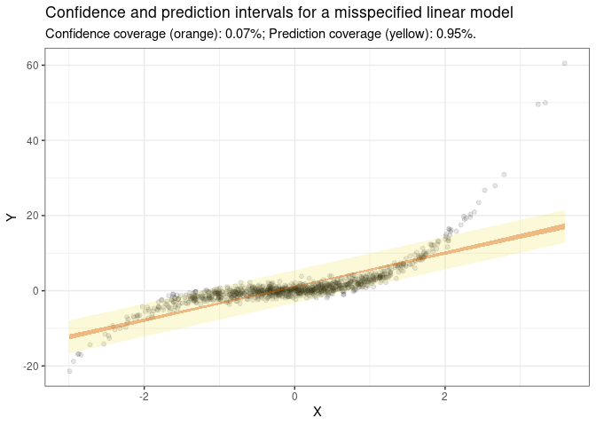

# Conformal prediction

execute: cache: true

This notebook shows how to estimate conformal prediction intervals with
the `marginaleffects` package for `R`.

## Confidence vs. prediction intervals

The `predictions()` function from the `marginaleffects()` package can
compute confidence intervals for fitted values in over 80 model classes
in `R`. These intervals quantify the uncertainty about the expected
value of the response. A common misunderstanding is that these
confidence intervals should be calibrated to cover a certain percentage
of unseen data points. This is not the case. In fact, a 95% confidence
interval reported by `predictions()` will typically cover a much smaller
share of out-of-sample outcomes.

Consider this simulation where *Y*<sub>*t**r**a**i**n*</sub> and
*Y*<sub>*t**e**s**t*</sub> are drawn from a normal distribution with
mean *π* and standard deviation 1. We estimate a linear model with an
intercept only, and compute a 90% confidence interval for the expected
value of the response:

``` r
library(marginaleffects)
library(data.table)
library(ggplot2)
library(nnet)
library(MASS)

set.seed(1024)

simulation <- function(...) {
    Y_train <- rnorm(25, mean = pi)
    Y_test <- rnorm(25, mean = pi)
    m <- lm(Y_train ~ 1)
    p <- predictions(m, conf_level = .90)
    out <- data.table(
        `Test set coverage` = mean(Y_test >= p$conf.low & Y_test <= p$conf.high),
        `True mean coverage` = pi >= p$conf.low[1] & pi <= p$conf.high[1]
    )
    return(out)
}
results <- rbindlist(lapply(1:1000, simulation))

colMeans(results)
```

     Test set coverage True mean coverage 
                0.2498             0.8770 

We see that the confidence interval around predictions covers the true
mean of *π* about 90% of the time, whereas coverage of individual
observations in the test set is much lower.

If we care about out of sample predictions, that is, if we want our
interval to cover a specific share of the actual outcome for unobserved
individuals, we must compute “prediction intervals” instead of
“confidence intervals.” How do we do this? Conformal prediction is very
flexible and powerful approach.

## Conformal prediction

In their excellent tutorial, @AngBat2022 write that conformal prediction
is

> “a user-friendly paradigm for creating statistically rigorous
> uncertainty sets/intervals for the predictions of such models.
> Critically, the sets are valid in a distribution-free sense: they
> possess explicit, non-asymptotic guarantees even without
> distributional assumptions or model assumptions.

These are extraordinary claims which deserve to be underlined: In
principle, conformal prediction should offer well-calibrated intervals,
regardless of the prediction model we use, and even if that model is
misspecified.

The main caveats are:

1.  The conformal prediction algorithms implemented in `marginaleffects`
    are designed for exchangeable data.[1] They do not offer coverage
    guarantees in contexts where exchangeability is violated, such as in
    time series data, when there is spatial dependence between
    observations, or when there is distribution drift between the
    training and test data.
2.  The conformal prediction algorithms implemented in `marginaleffects`
    offer marginal coverage guarantees, that is, they guarantee that a
    random test point will fall within the interval with a given
    probability. Below, we show an example where the prediction interval
    covers the right number of test points overall, but is not well
    calibrated locally, in different strata of the predictors. Different
    algorithms have recently been proposed to offer class-conditional
    coverage guarantees (see @Din2023 for an example).
3.  The width of the conformal prediction interval will typically depend
    on the quality of the prediction model and of the score function.
4.  The score functions implemented in `marginaleffects` simply take the
    residual—or difference between the observed outcome and predicted
    value. This means that the `type` argument must ensure that
    observations and predictions are on commensurable scales (usually
    `type="response"` or `type="prob"`).

## Data and models: Linear, Logit, Multinomial Logit

Download data, split it into training and testing sets, and estimate a
few different models:

``` r
# download data
dat <- read.csv("https://vincentarelbundock.github.io/Rdatasets/csv/openintro/military.csv")

# create a binary outcome variable
dat <- transform(dat, officer = as.numeric(grepl("officer", grade)))

# train/test split
idx <- sample(seq_len(nrow(dat)), 60000)
test <- dat[idx[1:10000], ]
train <- dat[idx[10001:length(idx)], ]

# linear regression
m_lm <- lm(rank ~ gender * race, data = train)
p_lm <- predictions(m_lm, newdata = train)

# logit regression
m_glm <- glm(officer ~ gender * race, data = train, family = binomial)
p_glm <- predictions(m_glm, newdata = train)

# multinomial logit regression
m_mult <- multinom(branch ~ gender * race, data = train, trace = FALSE)
p_mult <- predictions(m_mult, newdata = train)
```

For LM and GLM models, `predictions()` returns a data frame with one
prediction for each row of the original data. This data frame includes
confidence intervals:

``` r
p_glm
```


     Estimate Pr(>|z|)     S  2.5 % 97.5 %
       0.0859   <0.001   Inf 0.0793  0.093
       0.1775   <0.001   Inf 0.1733  0.182
       0.1775   <0.001   Inf 0.1733  0.182
       0.1775   <0.001   Inf 0.1733  0.182
       0.1006   <0.001 668.6 0.0885  0.114
    --- 49990 rows omitted. See ?avg_predictions and ?print.marginaleffects --- 
       0.0859   <0.001   Inf 0.0793  0.093
       0.0859   <0.001   Inf 0.0793  0.093
       0.1775   <0.001   Inf 0.1733  0.182
       0.0859   <0.001   Inf 0.0793  0.093
       0.2080   <0.001 837.6 0.1956  0.221
    Columns: rowid, estimate, p.value, s.value, conf.low, conf.high, rownames, grade, branch, gender, race, hisp, rank, officer 
    Type:  invlink(link) 

For multinomial models, `predictions()` returns a data frame with one
prediction for each row and for each outcome level. We can see the
predicted probabilities of each outcome level for the first observation
in the original data:

``` r
p_mult |> subset(rowid == 1)
```


            Group Estimate Std. Error    z Pr(>|z|)     S CI low CI high
     air force       0.181    0.00479 37.8   <0.001   Inf  0.171   0.190
     army            0.473    0.00621 76.2   <0.001   Inf  0.461   0.485
     marine corps    0.101    0.00376 27.0   <0.001 530.9  0.094   0.109
     navy            0.245    0.00535 45.7   <0.001   Inf  0.234   0.255

    Columns: rowid, group, estimate, std.error, statistic, p.value, s.value, conf.low, conf.high, rownames, grade, branch, gender, race, hisp, rank, officer 

## Conformal predictions with `inferences()`

In the “Bootstrap and Simultation” vignette, we saw that the
`inferences()` function can be used to compute confidence intervals for
any `marginaleffects` package estimates. The workflow is simple:

1.  Generate estimates with `predictions()`.
2.  Pass the resulting object to `inferences()`, along with arguments to
    specify how to perform inference to obtain uncertainty estimates.

`inferences()` supports two strategies for conformal prediction: split
or CV+ \[@AngBat2022,@Din2023\]. The former is faster but less
efficient. In the rest of this vignette, we illustrate how to use this
same workflow to compute conformal prediction intervals.

### Cross-validation +

The `p_lm`, `p_glm`, and `p_mult` objects are `predictions` objects.
They contain the point predictions and confidence intervals for each
observation in the training set. Now, we use the `inferences()` function
to compute predictions and *prediction* intervals for every observation
in the test set:

``` r
p <- predictions(m_lm, conf_level = .9) |> 
    inferences(
        R = 5,
        method = "conformal_cv+",
        conformal_test = test)
p
```


     Estimate Std. Error   z Pr(>|z|)   S 5.0 % 95.0 % Pred. 5.0 % Pred. 95.0 %
         6.15     0.0100 612   <0.001 Inf  6.13   6.17        3.29         9.01
         5.86     0.0283 207   <0.001 Inf  5.82   5.91        3.00         8.73
         6.15     0.0100 612   <0.001 Inf  6.13   6.17        3.29         9.01
         6.51     0.0220 296   <0.001 Inf  6.48   6.55        3.65         9.38
         6.15     0.0100 612   <0.001 Inf  6.13   6.17        3.29         9.01
    --- 9990 rows omitted. See ?avg_predictions and ?print.marginaleffects --- 
         6.15     0.0100 612   <0.001 Inf  6.13   6.17        3.29         9.01
         6.15     0.0100 612   <0.001 Inf  6.13   6.17        3.29         9.01
         6.51     0.0220 296   <0.001 Inf  6.48   6.55        3.65         9.38
         6.51     0.0220 296   <0.001 Inf  6.48   6.55        3.65         9.38
         6.15     0.0100 612   <0.001 Inf  6.13   6.17        3.29         9.01
    Columns: rowid, estimate, std.error, statistic, p.value, s.value, conf.low, conf.high, rownames, grade, branch, gender, race, hisp, rank, officer, pred.low, pred.high 
    Type:  response 

The prediction interval is expected to cover the (known) true value
about 90% of the time:

``` r
mean(p$rank <= p$pred.high & p$rank >= p$pred.low)
```

    [1] 0.9082

The coverage also seems adequate (about 80%) for the logit model:

``` r
p <- predictions(m_glm, conf_level = .8) |>
    inferences(
        R = 5,
        method = "conformal_cv+",
        conformal_test = test)
mean(p$officer <= p$pred.high & p$officer >= p$pred.low)
```

    [1] 0.7998

When the outcome is categorical, we use `conformal_score="softmax"`.
With this argument, `inferences()` generates “conformal prediction
sets,” that is, sets of possible outcome classes with coverage
guarantees. `inferences()` returns a list column of sets for each
observation. On average, those sets should cover the true value about
70% of the time:

``` r
p <- predictions(m_mult, conf_level = .7) |>
    inferences(
        R = 5,
        method = "conformal_cv+",
        conformal_score = "softmax",
        conformal_test = test)
head(p)
```


        branch                        Pred Set
     army                 air force, army     
     navy      air force, army     , navy     
     navy                 air force, army     
     army                           army, navy
     air force            air force, army     
     army                           army, navy

    Columns: rowid, branch, pred.set 

For example, for the first observation in the dataset, the conformal
prediction is {air force, army} and the true value is army. The
conformal prediction set thus covers the true value. The coverage rate
is:

``` r
mean(sapply(seq_len(nrow(p)), \(i) p$branch[i] %in% p$pred.set[[i]]))
```

    [1] 0.6928

### Split conformal prediction

For split conformal prediction, we must first split the training set
into a training and a calibration set (see @AngBat2022). Then, we pass
the calibration set to the `inferences()` function:

``` r
calibration <- train[1:1000,]
train <- train[1001:nrow(train),]
p <- predictions(m_lm, conf_level = .9) |>
    inferences(
        method = "conformal_split",
        conformal_calibration = calibration,
        conformal_test = test)
mean(p$rank <= p$pred.high & p$rank >= p$pred.low)
```

    [1] 0.9112

## Misspecification

### Polynomials

As noted above, the conformal prediction interval should be valid even
if the model is misspecified. To illustrate this, we generate data from
a linear model with polynomials, but estimate a linear model without
polynomials. Then, we plot the results and compute the coverage of the
prediction interval:

``` r
N <- 1000
X <- rnorm(N * 2)
dat <- data.frame(
    X = X,
    Y = X + X^2 + X^3 + rnorm(N * 2))
train <- dat[1:N,]
test <- dat[(N + 1):nrow(dat),]

m <- lm(Y ~ X, data = train)
p <- predictions(m) |>
    inferences(
        R = 5,
        method = "conformal_cv+",
        conformal_test = test)

mean(p$Y <= p$pred.high & p$Y >= p$pred.low)
```

    [1] 0.953

``` r
ggplot(p, aes(X, Y)) +
    geom_point(alpha = .1) +
    geom_ribbon(aes(X, ymin = pred.low, ymax = pred.high), alpha = .2, fill = "#F0E442") +
    geom_ribbon(aes(X, ymin = conf.low, ymax = conf.high), alpha = .4, fill = "#D55E00") +
    theme_bw() +
    labs(
        title = "Confidence and prediction intervals for a misspecified linear model",
        subtitle = sprintf(
            "Confidence coverage (orange): %.2f%%; Prediction coverage (yellow): %.2f%%.",
            mean(p$Y <= p$conf.high & p$Y >= p$conf.low),
            mean(p$Y <= p$pred.high & p$Y >= p$pred.low)))
```



This example is interesting, because it shows that the prediction
interval has adquate marginal coverage. However, the intervals are not
necessarily well calibrated “locally”, in different strata of *X*. In
the figure above, our model is misspecified, so we make more mistakes in
the tails, where predictions are bad. In contrast, the interval catches
more observations in the middle of the distribution, which ensures that
the overall error rate is adequate.

### Poisson vs Negative Binomial

Here is a second example of model misspecification. We generate data
from a negative binomial model, but estimate a Poisson model.
Nevertheless, the conformal prediction interval has good coverage:

``` r
n <- 10000
X <- rnorm(n)
eta <- -1 + 2*X
mu <- exp(eta)
Y <- rnegbin(n, mu = mu, theta = 1)
dat <- data.frame(X = X, Y = Y)
train <- dat[1:5000,]
test <- dat[5001:nrow(dat),]

mod <- glm(Y ~ X, data = train, family = poisson)

p <- predictions(mod, conf_level = .9) |>
    inferences(
        method = "conformal_cv+",
        R = 10,
        conformal_test = test)

mean(p$Y >= p$pred.low & p$Y <= p$pred.high)
```

    [1] 0.8968

[1] The usual “independent and identically distributed” assumption is a
special case of exchangeability.
