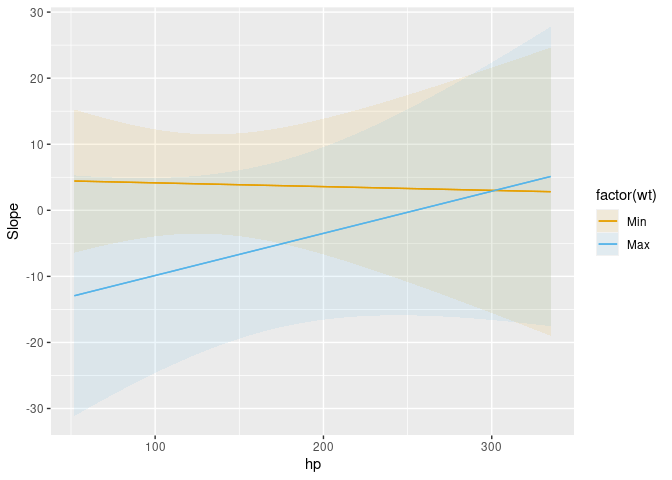

# Get Started

## Installation

Install the latest CRAN release:

``` r
install.packages("marginaleffects")
```

Install the development version:

``` r
install.packages(
    c("marginaleffects", "insight"),
    repos = c("https://vincentarelbundock.r-universe.dev", "https://easystats.r-universe.dev"))
```

*Restart `R` completely before moving on.*

## Estimands: Predictions, Comparisons, and Slopes

The `marginaleffects` package allows `R` users to compute and plot three
principal quantities of interest: (1) predictions, (2) comparisons, and
(3) slopes. In addition, the package includes a convenience function to
compute a fourth estimand, “marginal means”, which is a special case of
averaged predictions. `marginaleffects` can also average (or
“marginalize”) unit-level (or “conditional”) estimates of all those
quantities, and conduct hypothesis tests on them.

[*Predictions*:](predictions.html)

> The outcome predicted by a fitted model on a specified scale for a
> given combination of values of the predictor variables, such as their
> observed values, their means, or factor levels. a.k.a. Fitted values,
> adjusted predictions. `predictions()`, `avg_predictions()`,
> `plot_predictions()`.

[*Comparisons*:](comparisons.html)

> Compare the predictions made by a model for different regressor values
> (e.g., college graduates vs. others): contrasts, differences, risk
> ratios, odds, etc. `comparisons()`, `avg_comparisons()`,
> `plot_comparisons()`.

[*Slopes*:](slopes.html)

> Partial derivative of the regression equation with respect to a
> regressor of interest. a.k.a. Marginal effects, trends. `slopes()`,
> `avg_slopes()`, `plot_slopes()`.

[*Marginal Means*:](marginalmeans.html)

> Predictions of a model, averaged across a “reference grid” of
> categorical predictors. `marginalmeans()`.

[Hypothesis and Equivalence Tests:](hypothesis.html)

> Hypothesis and equivalence tests can be conducted on linear or
> non-linear functions of model coefficients, or on any of the
> quantities computed by the `marginaleffects` packages (predictions,
> slopes, comparisons, marginal means, etc.). Uncertainy estimates can
> be obtained via the delta method (with or without robust standard
> errors), bootstrap, or simulation.

Predictions, comparisons, and slopes are fundamentally unit-level (or
“conditional”) quantities. Except in the simplest linear case, estimates
will typically vary based on the values of all the regressors in a
model. Each of the observations in a dataset is thus associated with its
own prediction, comparison, and slope estimates. Below, we will see that
it can be useful to marginalize (or “average over”) unit-level estimates
to report an “average prediction”, “average comparison”, or “average
slope”.

One ambiguous aspect of the definitions above is that the word
“marginal” comes up in two different and *opposite* ways:

1.  In “marginal effects,” we refer to the effect of a tiny (marginal)
    change in the regressor on the outcome. This is a slope, or
    derivative.
2.  In “marginal means,” we refer to the process of marginalizing across
    rows of a prediction grid. This is an average, or integral.

On this website and in this package, we reserve the expression “marginal
effect” to mean a “slope” or “partial derivative”.

The `marginaleffects` package includes functions to estimate, average,
plot, and summarize all of the estimands described above. The objects
produced by `marginaleffects` are “tidy”: they produce simple data
frames in “long” format. They are also “standards-compliant” and work
seamlessly with standard functions like `summary()`, `head()`, `tidy()`,
and `glance()`, as well with [external packages like
`modelsummary`](https://vincentarelbundock.github.io/modelsummary/) or
`ggplot2`.

We now apply `marginaleffects` functions to compute each of the
estimands described above. First, we fit a linear regression model with
multiplicative interactions:

``` r
library(marginaleffects)

mod <- lm(mpg ~ hp * wt * am, data = mtcars)
```

Then, we call the `predictions()` function. As noted above, predictions
are unit-level estimates, so there is one specific prediction per
observation. By default, the `predictions()` function makes one
prediction per observation in the dataset that was used to fit the
original model. Since `mtcars` has 32 rows, the `predictions()` outcome
also has 32 rows:

``` r
pre <- predictions(mod)

nrow(mtcars)
```

    [1] 32

``` r
nrow(pre)
```

    [1] 32

``` r
pre
```


     Estimate Std. Error     z Pr(>|z|)     S 2.5 % 97.5 %
         22.5      0.884 25.44   <0.001 471.7  20.8   24.2
         20.8      1.194 17.42   <0.001 223.3  18.5   23.1
         25.3      0.709 35.66   <0.001 922.7  23.9   26.7
         20.3      0.704 28.75   <0.001 601.5  18.9   21.6
         17.0      0.712 23.88   <0.001 416.2  15.6   18.4
    --- 22 rows omitted. See ?avg_predictions and ?print.marginaleffects --- 
         29.6      1.874 15.80   <0.001 184.3  25.9   33.3
         15.9      1.311 12.13   <0.001 110.0  13.3   18.5
         19.4      1.145 16.95   <0.001 211.6  17.2   21.7
         14.8      2.017  7.33   <0.001  42.0  10.8   18.7
         21.5      1.072 20.02   <0.001 293.8  19.4   23.6
    Columns: rowid, estimate, std.error, statistic, p.value, s.value, conf.low, conf.high, mpg, hp, wt, am 
    Type:  response 

Now, we use the `comparisons()` function to compute the difference in
predicted outcome when each of the predictors is incremented by 1 unit
(one predictor at a time, holding all others constant). Once again,
comparisons are unit-level quantities. And since there are 3 predictors
in the model and our data has 32 rows, we obtain 96 comparisons:

``` r
cmp <- comparisons(mod)

nrow(cmp)
```

    [1] 96

``` r
cmp
```


     Term Contrast Estimate Std. Error      z Pr(>|z|)   S  2.5 % 97.5 %
       am    1 - 0    0.325       1.68  0.193   0.8467 0.2  -2.97  3.622
       am    1 - 0   -0.544       1.57 -0.347   0.7287 0.5  -3.62  2.530
       am    1 - 0    1.201       2.35  0.511   0.6090 0.7  -3.40  5.802
       am    1 - 0   -1.703       1.87 -0.912   0.3618 1.5  -5.36  1.957
       am    1 - 0   -0.615       1.68 -0.366   0.7146 0.5  -3.91  2.680
    --- 86 rows omitted. See ?avg_comparisons and ?print.marginaleffects --- 
       wt    +1      -6.518       1.88 -3.462   <0.001 10.9 -10.21 -2.828
       wt    +1      -1.653       3.74 -0.442   0.6588  0.6  -8.99  5.683
       wt    +1      -4.520       2.47 -1.830   0.0672  3.9  -9.36  0.321
       wt    +1       0.635       4.89  0.130   0.8966  0.2  -8.95 10.216
       wt    +1      -6.647       1.86 -3.572   <0.001 11.5 -10.29 -2.999
    Columns: rowid, term, contrast, estimate, std.error, statistic, p.value, s.value, conf.low, conf.high, predicted_lo, predicted_hi, predicted, mpg, hp, wt, am 
    Type:  response 

The `comparisons()` function allows customized queries. For example,
what happens to the predicted outcome when the `hp` variable increases
from 100 to 120?

``` r
comparisons(mod, variables = list(hp = c(120, 100)))
```


     Term  Contrast Estimate Std. Error      z Pr(>|z|)   S  2.5 %  97.5 %
       hp 120 - 100   -0.738      0.370 -1.995  0.04607 4.4 -1.463 -0.0129
       hp 120 - 100   -0.574      0.313 -1.836  0.06640 3.9 -1.186  0.0388
       hp 120 - 100   -0.931      0.452 -2.062  0.03922 4.7 -1.817 -0.0460
       hp 120 - 100   -0.845      0.266 -3.182  0.00146 9.4 -1.366 -0.3248
       hp 120 - 100   -0.780      0.268 -2.909  0.00362 8.1 -1.306 -0.2547
    --- 22 rows omitted. See ?avg_comparisons and ?print.marginaleffects --- 
       hp 120 - 100   -1.451      0.705 -2.058  0.03958 4.7 -2.834 -0.0692
       hp 120 - 100   -0.384      0.270 -1.422  0.15498 2.7 -0.912  0.1451
       hp 120 - 100   -0.641      0.334 -1.918  0.05513 4.2 -1.297  0.0141
       hp 120 - 100   -0.126      0.272 -0.463  0.64360 0.6 -0.659  0.4075
       hp 120 - 100   -0.635      0.332 -1.911  0.05598 4.2 -1.286  0.0162
    Columns: rowid, term, contrast, estimate, std.error, statistic, p.value, s.value, conf.low, conf.high, predicted_lo, predicted_hi, predicted, mpg, hp, wt, am 
    Type:  response 

What happens to the predicted outcome when the `wt` variable increases
by 1 standard deviation about its mean?

``` r
comparisons(mod, variables = list(hp = "sd"))
```


     Term                Contrast Estimate Std. Error      z Pr(>|z|)   S 2.5 %  97.5 %
       hp (x + sd/2) - (x - sd/2)   -2.530      1.269 -1.995  0.04607 4.4 -5.02 -0.0441
       hp (x + sd/2) - (x - sd/2)   -1.967      1.072 -1.836  0.06640 3.9 -4.07  0.1332
       hp (x + sd/2) - (x - sd/2)   -3.193      1.549 -2.062  0.03922 4.7 -6.23 -0.1578
       hp (x + sd/2) - (x - sd/2)   -2.898      0.911 -3.182  0.00146 9.4 -4.68 -1.1133
       hp (x + sd/2) - (x - sd/2)   -2.675      0.919 -2.909  0.00362 8.1 -4.48 -0.8731
    --- 22 rows omitted. See ?avg_comparisons and ?print.marginaleffects --- 
       hp (x + sd/2) - (x - sd/2)   -4.976      2.418 -2.058  0.03958 4.7 -9.71 -0.2373
       hp (x + sd/2) - (x - sd/2)   -1.315      0.925 -1.422  0.15498 2.7 -3.13  0.4974
       hp (x + sd/2) - (x - sd/2)   -2.199      1.147 -1.918  0.05513 4.2 -4.45  0.0483
       hp (x + sd/2) - (x - sd/2)   -0.432      0.933 -0.463  0.64360 0.6 -2.26  1.3970
       hp (x + sd/2) - (x - sd/2)   -2.177      1.139 -1.911  0.05598 4.2 -4.41  0.0556
    Columns: rowid, term, contrast, estimate, std.error, statistic, p.value, s.value, conf.low, conf.high, predicted_lo, predicted_hi, predicted, mpg, hp, wt, am 
    Type:  response 

The `comparisons()` function also allows users to specify arbitrary
functions of predictions, with the `comparison` argument. For example,
what is the average ratio between predicted Miles per Gallon after an
increase of 50 units in Horsepower?

``` r
comparisons(
  mod,
  variables = list(hp = 50),
  comparison = "ratioavg")
```


     Term  Contrast Estimate Std. Error    z Pr(>|z|)     S 2.5 % 97.5 %
       hp mean(+50)    0.905     0.0319 28.4   <0.001 586.8 0.843  0.968

    Columns: term, contrast, estimate, std.error, statistic, p.value, s.value, conf.low, conf.high, predicted_lo, predicted_hi, predicted 
    Type:  response 

See the [Comparisons vignette for detailed explanations and more
options.](comparisons.html)

The `slopes()` function allows us to compute the partial derivative of
the outcome equation with respect to each of the predictors. Once again,
we obtain a data frame with 96 rows:

``` r
mfx <- slopes(mod)

nrow(mfx)
```

    [1] 96

``` r
mfx
```


     Term Contrast Estimate Std. Error      z Pr(>|z|)   S  2.5 % 97.5 %
       am    1 - 0    0.325       1.68  0.193   0.8467 0.2  -2.97  3.622
       am    1 - 0   -0.544       1.57 -0.347   0.7287 0.5  -3.62  2.530
       am    1 - 0    1.201       2.35  0.511   0.6090 0.7  -3.40  5.802
       am    1 - 0   -1.703       1.87 -0.912   0.3618 1.5  -5.36  1.957
       am    1 - 0   -0.615       1.68 -0.366   0.7146 0.5  -3.91  2.680
    --- 86 rows omitted. See ?avg_slopes and ?print.marginaleffects --- 
       wt    dY/dX   -6.518       1.88 -3.462   <0.001 10.9 -10.21 -2.828
       wt    dY/dX   -1.653       3.74 -0.442   0.6588  0.6  -8.99  5.682
       wt    dY/dX   -4.520       2.47 -1.830   0.0673  3.9  -9.36  0.322
       wt    dY/dX    0.635       4.89  0.130   0.8966  0.2  -8.95 10.215
       wt    dY/dX   -6.647       1.86 -3.572   <0.001 11.5 -10.29 -3.000
    Columns: rowid, term, contrast, estimate, std.error, statistic, p.value, s.value, conf.low, conf.high, predicted_lo, predicted_hi, predicted, mpg, hp, wt, am 
    Type:  response 

## Grid

Predictions, comparisons, and slopes are typically “conditional”
quantities which depend on the values of all the predictors in the
model. By default, `marginaleffects` functions estimate quantities of
interest for the empirical distribution of the data (i.e., for each row
of the original dataset). However, users can specify the exact values of
the predictors they want to investigate by using the `newdata` argument.

`newdata` accepts data frames, shortcut strings, or a call to the
`datagrid()` function. For example, to compute the predicted outcome for
a hypothetical car with all predictors equal to the sample mean or
median, we can do:

``` r
predictions(mod, newdata = "mean")
```


     Estimate Std. Error  z Pr(>|z|)     S 2.5 % 97.5 %  hp   wt    am
         18.4       0.68 27   <0.001 531.7    17   19.7 147 3.22 0.406

    Columns: rowid, estimate, std.error, statistic, p.value, s.value, conf.low, conf.high, mpg, hp, wt, am 
    Type:  response 

``` r
predictions(mod, newdata = "median")
```


     Estimate Std. Error  z Pr(>|z|)     S 2.5 % 97.5 %  hp   wt am
         19.4      0.646 30   <0.001 653.2  18.1   20.6 123 3.33  0

    Columns: rowid, estimate, std.error, statistic, p.value, s.value, conf.low, conf.high, mpg, hp, wt, am 
    Type:  response 

The [`datagrid` function gives us a powerful way to define a grid of
predictors.](https://marginaleffects.com/reference/datagrid.html) All
the variables not mentioned explicitly in `datagrid()` are fixed to
their mean or mode:

``` r
predictions(
  mod,
  newdata = datagrid(
    am = c(0, 1),
    wt = range))
```


     am   wt Estimate Std. Error    z Pr(>|z|)    S 2.5 % 97.5 %  hp
      0 1.51     23.3       2.71 8.60   <0.001 56.7 17.96   28.6 147
      0 5.42     12.8       2.98 4.30   <0.001 15.8  6.96   18.6 147
      1 1.51     27.1       2.85 9.52   <0.001 69.0 21.56   32.7 147
      1 5.42      5.9       5.81 1.01     0.31  1.7 -5.50   17.3 147

    Columns: rowid, estimate, std.error, statistic, p.value, s.value, conf.low, conf.high, mpg, hp, am, wt 
    Type:  response 

The same mechanism is available in `comparisons()` and `slopes()`. To
estimate the partial derivative of `mpg` with respect to `wt`, when `am`
is equal to 0 and 1, while other predictors are held at their means:

``` r
slopes(
  mod,
  variables = "wt",
  newdata = datagrid(am = 0:1))
```


     Term am Estimate Std. Error     z Pr(>|z|)   S 2.5 % 97.5 %
       wt  0    -2.68       1.42 -1.89   0.0593 4.1 -5.46  0.106
       wt  1    -5.43       2.15 -2.52   0.0116 6.4 -9.65 -1.214

    Columns: rowid, term, estimate, std.error, statistic, p.value, s.value, conf.low, conf.high, am, predicted_lo, predicted_hi, predicted, mpg, hp, wt 
    Type:  response 

We can also plot how predictions, comparisons, or slopes change across
different values of the predictors using [three powerful plotting
functions:](plot.html)

-   `plot_predictions`: Conditional Adjusted Predictions
-   `plot_comparisons`: Conditional Comparisons
-   `plot_slopes`: Conditional Marginal Effects

For example, this plot shows the outcomes predicted by our model for
different values of the `wt` and `am` variables:

``` r
plot_predictions(mod, condition = list("hp", "wt" = "threenum", "am"))
```


This plot shows how the derivative of `mpg` with respect to `am` varies
as a function of `wt` and `hp`:

``` r
plot_slopes(mod, variables = "am", condition = list("hp", "wt" = "minmax"))
```



See this vignette for more information: [Plots, interactions,
predictions, contrasts, and slopes](plot.html)

## Averaging

Since predictions, comparisons, and slopes are conditional quantities,
they can be a bit unwieldy. Often, it can be useful to report a
one-number summary instead of one estimate per observation. Instead of
presenting “conditional” estimates, some methodologists recommend
reporting “marginal” estimates, that is, an average of unit-level
estimates.

(This use of the word “marginal” as “averaging” should not be confused
with the term “marginal effect” which, in the econometrics tradition,
corresponds to a partial derivative, or the effect of a “small/marginal”
change.)

To marginalize (average over) our unit-level estimates, we can use the
`by` argument or the one of the convenience functions:
`avg_predictions()`, `avg_comparisons()`, or `avg_slopes()`. For
example, both of these commands give us the same result: the average
predicted outcome in the `mtcars` dataset:

``` r
avg_predictions(mod)
```


     Estimate Std. Error    z Pr(>|z|)   S 2.5 % 97.5 %
         20.1       0.39 51.5   <0.001 Inf  19.3   20.9

    Columns: estimate, std.error, statistic, p.value, s.value, conf.low, conf.high 
    Type:  response 

This is equivalent to manual computation by:

``` r
mean(predict(mod))
```

    [1] 20.09062

The main `marginaleffects` functions all include a `by` argument, which
allows us to marginalize within sub-groups of the data. For example,

``` r
avg_comparisons(mod, by = "am")
```


     Term          Contrast am Estimate Std. Error      z Pr(>|z|)   S   2.5 %   97.5 %
       am mean(1) - mean(0)  0  -1.3830     2.5250 -0.548  0.58388 0.8 -6.3319  3.56589
       am mean(1) - mean(0)  1   1.9029     2.3086  0.824  0.40980 1.3 -2.6219  6.42773
       hp mean(+1)           0  -0.0343     0.0159 -2.160  0.03079 5.0 -0.0654 -0.00317
       hp mean(+1)           1  -0.0436     0.0213 -2.050  0.04039 4.6 -0.0854 -0.00191
       wt mean(+1)           0  -2.4799     1.2316 -2.014  0.04406 4.5 -4.8939 -0.06595
       wt mean(+1)           1  -6.0718     1.9762 -3.072  0.00212 8.9 -9.9451 -2.19846

    Columns: term, contrast, am, estimate, std.error, statistic, p.value, s.value, conf.low, conf.high, predicted_lo, predicted_hi, predicted 
    Type:  response 

Marginal Means are a special case of predictions, which are marginalized
(or averaged) across a balanced grid of categorical predictors. To
illustrate, we estimate a new model with categorical predictors:

``` r
dat <- mtcars
dat$am <- as.logical(dat$am)
dat$cyl <- as.factor(dat$cyl)
mod_cat <- lm(mpg ~ am + cyl + hp, data = dat)
```

We can compute marginal means manually using the functions already
described:

``` r
avg_predictions(
  mod_cat,
  newdata = datagrid(cyl = unique, am = unique),
  by = "am")
```


        am Estimate Std. Error    z Pr(>|z|)     S 2.5 % 97.5 %
     FALSE     18.3      0.785 23.3   <0.001 397.4  16.8   19.9
      TRUE     22.5      0.834 26.9   <0.001 528.6  20.8   24.1

    Columns: am, estimate, std.error, statistic, p.value, s.value, conf.low, conf.high 
    Type:  response 

For convenience, the `marginaleffects` package for `R` also includes a
`marginal_means()` function:

``` r
marginal_means(mod_cat, variables = "am")
```


     Term Value Mean Std. Error    z Pr(>|z|)     S 2.5 % 97.5 %
       am FALSE 18.3      0.785 23.3   <0.001 397.4  16.8   19.9
       am  TRUE 22.5      0.834 26.9   <0.001 528.6  20.8   24.1

    Results averaged over levels of: cyl, am 
    Columns: term, value, am, estimate, std.error, statistic, p.value, s.value, conf.low, conf.high 
    Type:  response 

[The Marginal Means vignette](marginalmeans.html) offers more detail.

## Hypothesis and equivalence tests

The `hypotheses()` function and the `hypothesis` argument can be used to
conduct linear and non-linear hypothesis tests on model coefficients, or
on any of the quantities computed by the functions introduced above.

Consider this model:

``` r
mod <- lm(mpg ~ qsec * drat, data = mtcars)
coef(mod)
```

    (Intercept)        qsec        drat   qsec:drat 
     12.3371987  -1.0241183  -3.4371461   0.5973153 

Can we reject the null hypothesis that the `drat` coefficient is 2 times
the size of the `qsec` coefficient?

``` r
hypotheses(mod, "drat = 2 * qsec")
```


                Term Estimate Std. Error      z Pr(>|z|)   S 2.5 % 97.5 %
     drat = 2 * qsec    -1.39       10.8 -0.129    0.897 0.2 -22.5   19.7

    Columns: term, estimate, std.error, statistic, p.value, s.value, conf.low, conf.high 

We can ask the same question but refer to parameters by position, with
indices `b1`, `b2`, `b3`, etc.:

``` r
hypotheses(mod, "b3 = 2 * b2")
```


            Term Estimate Std. Error      z Pr(>|z|)   S 2.5 % 97.5 %
     b3 = 2 * b2    -1.39       10.8 -0.129    0.897 0.2 -22.5   19.7

    Columns: term, estimate, std.error, statistic, p.value, s.value, conf.low, conf.high 

The main functions in `marginaleffects` all have a `hypothesis`
argument, which means that we can do complex model testing. For example,
consider two slope estimates:

``` r
slopes(
  mod,
  variables = "drat",
  newdata = datagrid(qsec = range))
```


     Term qsec Estimate Std. Error    z Pr(>|z|)   S  2.5 % 97.5 %
     drat 14.5     5.22       3.79 1.38   0.1682 2.6 -2.206   12.7
     drat 22.9    10.24       5.16 1.98   0.0472 4.4  0.127   20.4

    Columns: rowid, term, estimate, std.error, statistic, p.value, s.value, conf.low, conf.high, qsec, predicted_lo, predicted_hi, predicted, mpg, drat 
    Type:  response 

Are these two slopes significantly different from one another? To test
this, we can use the `hypothesis` argument:

``` r
slopes(
  mod,
  hypothesis = "b1 = b2",
  variables = "drat",
  newdata = datagrid(qsec = range))
```


      Term Estimate Std. Error      z Pr(>|z|)   S 2.5 % 97.5 %
     b1=b2    -5.02       8.52 -0.589    0.556 0.8 -21.7   11.7

    Columns: term, estimate, std.error, statistic, p.value, s.value, conf.low, conf.high 
    Type:  response 

Alternatively, we can also refer to values with term names (when they
are unique):

``` r
avg_slopes(mod)
```


     Term Estimate Std. Error    z Pr(>|z|)    S 2.5 % 97.5 %
     drat     7.22      1.365 5.29  < 0.001 23.0 4.549   9.90
     qsec     1.12      0.433 2.60  0.00944  6.7 0.275   1.97

    Columns: term, estimate, std.error, statistic, p.value, s.value, conf.low, conf.high 
    Type:  response 

``` r
avg_slopes(mod, hypothesis = "drat = qsec")
```


          Term Estimate Std. Error   z Pr(>|z|)    S 2.5 % 97.5 %
     drat=qsec      6.1       1.45 4.2   <0.001 15.2  3.25   8.95

    Columns: term, estimate, std.error, statistic, p.value, s.value, conf.low, conf.high 
    Type:  response 

Now, imagine that for theoretical (or substantive or clinical) reasons,
we only care about slopes larger than 2. We can use the `equivalence`
argument to conduct an equivalence test:

``` r
avg_slopes(mod, equivalence = c(-2, 2))
```


     Term Estimate Std. Error    z Pr(>|z|)    S 2.5 % 97.5 % p (NonSup) p (NonInf) p (Equiv)
     drat     7.22      1.365 5.29  < 0.001 23.0 4.549   9.90     0.9999     <0.001    0.9999
     qsec     1.12      0.433 2.60  0.00944  6.7 0.275   1.97     0.0216     <0.001    0.0216

    Columns: term, estimate, std.error, statistic, p.value, s.value, conf.low, conf.high, statistic.noninf, statistic.nonsup, p.value.noninf, p.value.nonsup, p.value.equiv 
    Type:  response 

See the [Hypothesis Tests and Custom Contrasts
vignette](hypothesis.html) for background, details, and for instructions
on how to conduct hypothesis tests in more complex situations.

## Next steps

There is *much* more you can do with `marginaleffects`. Click through he
table of contents to read the many vignettes, starting with:

-   [Predictions](/vignettes/predictions/)
-   [Comparisons](/vignettes/comparisons/)
-   [Slopes](/vignettes/slopes/)
-   [Hypothesis and equivalence tests](/vignettes/hypothesis/)
-   [Plots](/vignettes/plots/)

Then, move on to read the case studies and technical notes (see
sidebar).
