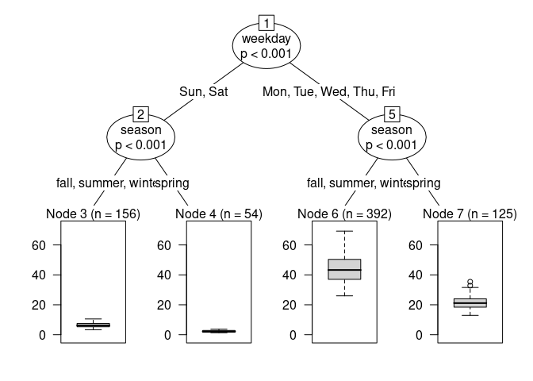

# Heterogeneity

author: “Vincent Arel-Bundock”

This short vignette illustrates how to use recursive partitioning to
explore treatment effect heterogeneity. This exercise inspired by
[Scholbeck et al. 2022](https://arxiv.org/abs/2201.08837) and their
concept of “cATE”.

As pointed out in other vignettes, most of the quantities estimated by
the `marginaleffects` package are “conditional”, in the sense that they
vary based on the values of all the predictors in our model. For
instance, consider a Poisson regression that models the number of hourly
bike rentals in Washington, DC:

``` r
library(marginaleffects)
library(partykit)
data(bikes, package = "fmeffects")

mod <- glm(
    count ~ season * weekday + weather * temp,
    data = bikes, family = quasipoisson)
```

We can use the `comparisons()` function to estimate how the predicted
outcome changes for a 5 celsius increase in temperature:

``` r
cmp <- comparisons(mod, variables = list(temp = 5))
cmp
```


     Term Contrast Estimate Std. Error    z Pr(>|z|)    S  2.5 % 97.5 %
     temp       +5     2.96      0.827 3.58  < 0.001 11.5  1.343   4.58
     temp       +5     1.63      0.645 2.53  0.01155  6.4  0.365   2.90
     temp       +5    15.97      2.716 5.88  < 0.001 27.9 10.645  21.29
     temp       +5    22.10      3.546 6.23  < 0.001 31.0 15.145  29.05
     temp       +5    24.98      4.120 6.06  < 0.001 29.5 16.909  33.06
    --- 717 rows omitted. See ?avg_comparisons and ?print.marginaleffects --- 
     temp       +5    25.61      4.373 5.86  < 0.001 27.7 17.036  34.18
     temp       +5    20.31      3.463 5.86  < 0.001 27.7 13.522  27.10
     temp       +5     2.47      0.794 3.10  0.00191  9.0  0.909   4.02
     temp       +5     1.80      0.621 2.91  0.00366  8.1  0.587   3.02
     temp       +5    16.31      2.813 5.80  < 0.001 27.1 10.792  21.82
    Columns: rowid, term, contrast, estimate, std.error, statistic, p.value, s.value, conf.low, conf.high, predicted_lo, predicted_hi, predicted, count, season, weekday, weather, temp 
    Type:  response 

The output printed above includes 727 rows: 1 for each of the rows in
the original `bikes` dataset. Indeed, since the “effect” of a 5 unit
increase depends on the values of covariates, different unit of
observation will typically be associated with different contrasts.

In such cases, a common strategy is to compute an average difference, as
described in the [G-Computation vignette:](vignettes/gcomputation/)

``` r
avg_comparisons(mod, variables = list(temp = 5))
```


     Term Contrast Estimate Std. Error    z Pr(>|z|)    S 2.5 % 97.5 %
     temp       +5       29       4.22 6.88   <0.001 37.2  20.7   37.3

    Columns: term, contrast, estimate, std.error, statistic, p.value, s.value, conf.low, conf.high 
    Type:  response 

Alternatively, one may be interested in exploring heterogeneity in
effect sizes in different subsets of the data. A convenient way to
achieve this is to use the `ctree` function of the `partykit` package.
This function allows us to use recursive partitioning (conditional
inference trees) to find subspaces with reasonably homogenous estimates,
and to report useful graphical and textual summaries.

Imagine that we are particularly interested in how the effect of
temperature on bike rentals varies based on day of the week and season:

``` r
tree <- ctree(
    estimate ~ weekday + season,
    data = cmp,
    control = ctree_control(maxdepth = 2)
)
```

Now we can use the `plot()` function to draw the distributions of
estimates for the effect of an increase of 5C on bike rentals, by week
day and season:

``` r
plot(tree)
```



To obtain conditional average estimates for each subspace, we first use
the `predict()` function in order to place each observation in the
dataset in its corresponding “bucket” or “node”. Then, we use the `by`
argument to indicate that `comparisons()` should compute average
estimates for each of the nodes in the tree:

``` r
dat <- transform(bikes, nodeid = predict(tree, type = "node"))
comparisons(mod,
    variables = list(temp = 5),
    newdata = dat,
    by = "nodeid")
```


     Term Contrast nodeid Estimate Std. Error    z Pr(>|z|)    S 2.5 % 97.5 %
     temp mean(+5)      3     6.42      1.024 6.26   <0.001 31.3  4.41   8.42
     temp mean(+5)      4     2.27      0.536 4.23   <0.001 15.4  1.22   3.32
     temp mean(+5)      6    44.11      6.416 6.87   <0.001 37.2 31.53  56.68
     temp mean(+5)      7    21.43      3.250 6.59   <0.001 34.4 15.06  27.80

    Columns: term, contrast, nodeid, estimate, std.error, statistic, p.value, s.value, conf.low, conf.high, predicted_lo, predicted_hi, predicted 
    Type:  response 

The four `nodeid` values correspond to the terminal nodes in this tree:

``` r
print(tree)
```


    Model formula:
    estimate ~ weekday + season

    Fitted party:
    [1] root
    |   [2] weekday in Sun, Sat
    |   |   [3] season in fall, summer, winter: 6.417 (n = 156, err = 341.3)
    |   |   [4] season in spring: 2.267 (n = 54, err = 24.4)
    |   [5] weekday in Mon, Tue, Wed, Thu, Fri
    |   |   [6] season in fall, summer, winter: 44.105 (n = 392, err = 31243.9)
    |   |   [7] season in spring: 21.431 (n = 125, err = 2434.0)

    Number of inner nodes:    3
    Number of terminal nodes: 4
