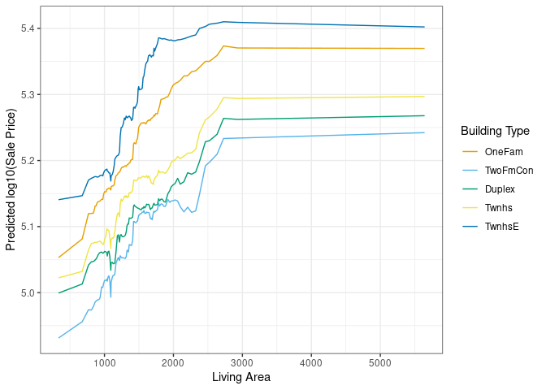
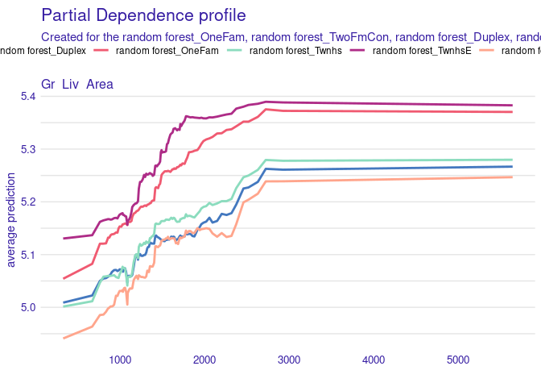
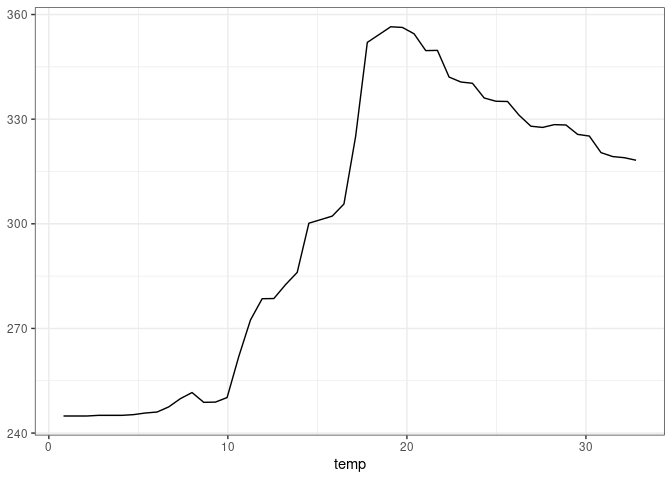
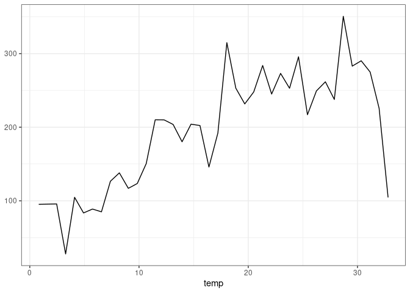
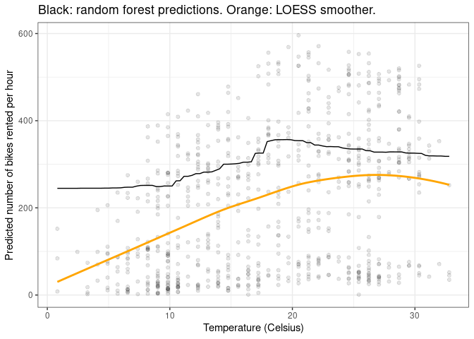

# Machine Learning

`marginaleffects` offers several “model-agnostic” functions to interpret
statistical and machine learning models. This vignette highlights how
the package can be used to extract meaningful insights from models
trained using the `mlr3` and `tidymodels` frameworks.

The features in this vignette require version 0.16.0 or
`marginaleffects`, or the development version which can be installed
from Github:

``` r
remotes::install_github("vincentarelbundock/marginaleffects")
```

Make sure to restart `R` after installation. Then, load a few libraries:

``` r
library("marginaleffects")
library("fmeffects")
library("ggplot2")
library("mlr3verse")
library("modelsummary")
library("ggokabeito")
library("tidymodels") |> suppressPackageStartupMessages()
theme_set(theme_bw())
options(ggplot2.discrete.colour = palette_okabe_ito())
options(width = 10000)
```

## `tidymodels`

`marginaleffects` also supports the `tidymodels` machine learning
framework. When the underlying engine used by `tidymodels` to train the
model is itself supported as a standalone package by `marginaleffects`,
we can obtain both estimates and their standard errors:

``` r
library(tidymodels)

penguins <- modeldata::penguins |> 
  na.omit() |>
  select(sex, island, species, bill_length_mm)

mod <- linear_reg(mode = "regression") |>
    set_engine("lm") |>
    fit(bill_length_mm ~ ., data = penguins)

avg_comparisons(mod, type = "numeric", newdata = penguins)
```


        Term           Contrast Estimate Std. Error     z Pr(>|z|)     S  2.5 % 97.5 %
     island  Dream - Biscoe       -0.489      0.470 -1.04    0.299   1.7 -1.410  0.433
     island  Torgersen - Biscoe    0.103      0.488  0.21    0.833   0.3 -0.853  1.059
     sex     male - female         3.697      0.255 14.51   <0.001 156.0  3.198  4.197
     species Chinstrap - Adelie   10.347      0.422 24.54   <0.001 439.4  9.521 11.174
     species Gentoo - Adelie       8.546      0.410 20.83   <0.001 317.8  7.742  9.350

    Columns: term, contrast, estimate, std.error, statistic, p.value, s.value, conf.low, conf.high 
    Type:  numeric 

``` r
avg_predictions(mod, type = "numeric", newdata = penguins, by = "island")
```


        island Estimate Std. Error   z Pr(>|z|)   S 2.5 % 97.5 %
     Biscoe        45.2      0.182 248   <0.001 Inf  44.9   45.6
     Dream         44.2      0.210 211   <0.001 Inf  43.8   44.6
     Torgersen     39.0      0.339 115   <0.001 Inf  38.4   39.7

    Columns: island, estimate, std.error, statistic, p.value, s.value, conf.low, conf.high 
    Type:  numeric 

When the underlying engine that `tidymodels` uses to fit the model is
not supported by `marginaleffects` as a standalone model, we can also
obtain correct results, but no uncertainy estimates. Here is a random
forest model:

``` r
library(modelsummary)

# pre-processing
pre <- penguins |>
    recipe(sex ~ ., data = _) |>
    step_ns(bill_length_mm, deg_free = 4) |>
    step_dummy(all_nominal_predictors())

# modelling strategies
models <- list(
  "Logit" = logistic_reg(mode = "classification", engine = "glm"),
  "Random Forest" = rand_forest(mode = "classification", engine = "ranger"),
  "XGBoost" = boost_tree(mode = "classification", engine = "xgboost")
)

# fit to data
fits <- lapply(models, \(x) {
  pre |>
  workflow(spec = x) |>
  fit(penguins)
})

# marginaleffects
cmp <- lapply(fits, avg_comparisons, newdata = penguins, type = "prob")

# summary table
modelsummary(
  cmp,
  shape = term + contrast + group ~ model,
  coef_omit = "sex",
  coef_rename = coef_rename)
```

<div id="fhihiqobdj" style="padding-left:0px;padding-right:0px;padding-top:10px;padding-bottom:10px;overflow-x:auto;overflow-y:auto;width:auto;height:auto;">
<style>#fhihiqobdj table {
  font-family: system-ui, 'Segoe UI', Roboto, Helvetica, Arial, sans-serif, 'Apple Color Emoji', 'Segoe UI Emoji', 'Segoe UI Symbol', 'Noto Color Emoji';
  -webkit-font-smoothing: antialiased;
  -moz-osx-font-smoothing: grayscale;
}

#fhihiqobdj thead, #fhihiqobdj tbody, #fhihiqobdj tfoot, #fhihiqobdj tr, #fhihiqobdj td, #fhihiqobdj th {
  border-style: none;
}

#fhihiqobdj p {
  margin: 0;
  padding: 0;
}

#fhihiqobdj .gt_table {
  display: table;
  border-collapse: collapse;
  line-height: normal;
  margin-left: auto;
  margin-right: auto;
  color: #333333;
  font-size: 16px;
  font-weight: normal;
  font-style: normal;
  background-color: #FFFFFF;
  width: auto;
  border-top-style: solid;
  border-top-width: 2px;
  border-top-color: #A8A8A8;
  border-right-style: none;
  border-right-width: 2px;
  border-right-color: #D3D3D3;
  border-bottom-style: solid;
  border-bottom-width: 2px;
  border-bottom-color: #A8A8A8;
  border-left-style: none;
  border-left-width: 2px;
  border-left-color: #D3D3D3;
}

#fhihiqobdj .gt_caption {
  padding-top: 4px;
  padding-bottom: 4px;
}

#fhihiqobdj .gt_title {
  color: #333333;
  font-size: 125%;
  font-weight: initial;
  padding-top: 4px;
  padding-bottom: 4px;
  padding-left: 5px;
  padding-right: 5px;
  border-bottom-color: #FFFFFF;
  border-bottom-width: 0;
}

#fhihiqobdj .gt_subtitle {
  color: #333333;
  font-size: 85%;
  font-weight: initial;
  padding-top: 3px;
  padding-bottom: 5px;
  padding-left: 5px;
  padding-right: 5px;
  border-top-color: #FFFFFF;
  border-top-width: 0;
}

#fhihiqobdj .gt_heading {
  background-color: #FFFFFF;
  text-align: center;
  border-bottom-color: #FFFFFF;
  border-left-style: none;
  border-left-width: 1px;
  border-left-color: #D3D3D3;
  border-right-style: none;
  border-right-width: 1px;
  border-right-color: #D3D3D3;
}

#fhihiqobdj .gt_bottom_border {
  border-bottom-style: solid;
  border-bottom-width: 2px;
  border-bottom-color: #D3D3D3;
}

#fhihiqobdj .gt_col_headings {
  border-top-style: solid;
  border-top-width: 2px;
  border-top-color: #D3D3D3;
  border-bottom-style: solid;
  border-bottom-width: 2px;
  border-bottom-color: #D3D3D3;
  border-left-style: none;
  border-left-width: 1px;
  border-left-color: #D3D3D3;
  border-right-style: none;
  border-right-width: 1px;
  border-right-color: #D3D3D3;
}

#fhihiqobdj .gt_col_heading {
  color: #333333;
  background-color: #FFFFFF;
  font-size: 100%;
  font-weight: normal;
  text-transform: inherit;
  border-left-style: none;
  border-left-width: 1px;
  border-left-color: #D3D3D3;
  border-right-style: none;
  border-right-width: 1px;
  border-right-color: #D3D3D3;
  vertical-align: bottom;
  padding-top: 5px;
  padding-bottom: 6px;
  padding-left: 5px;
  padding-right: 5px;
  overflow-x: hidden;
}

#fhihiqobdj .gt_column_spanner_outer {
  color: #333333;
  background-color: #FFFFFF;
  font-size: 100%;
  font-weight: normal;
  text-transform: inherit;
  padding-top: 0;
  padding-bottom: 0;
  padding-left: 4px;
  padding-right: 4px;
}

#fhihiqobdj .gt_column_spanner_outer:first-child {
  padding-left: 0;
}

#fhihiqobdj .gt_column_spanner_outer:last-child {
  padding-right: 0;
}

#fhihiqobdj .gt_column_spanner {
  border-bottom-style: solid;
  border-bottom-width: 2px;
  border-bottom-color: #D3D3D3;
  vertical-align: bottom;
  padding-top: 5px;
  padding-bottom: 5px;
  overflow-x: hidden;
  display: inline-block;
  width: 100%;
}

#fhihiqobdj .gt_spanner_row {
  border-bottom-style: hidden;
}

#fhihiqobdj .gt_group_heading {
  padding-top: 8px;
  padding-bottom: 8px;
  padding-left: 5px;
  padding-right: 5px;
  color: #333333;
  background-color: #FFFFFF;
  font-size: 100%;
  font-weight: initial;
  text-transform: inherit;
  border-top-style: solid;
  border-top-width: 2px;
  border-top-color: #D3D3D3;
  border-bottom-style: solid;
  border-bottom-width: 2px;
  border-bottom-color: #D3D3D3;
  border-left-style: none;
  border-left-width: 1px;
  border-left-color: #D3D3D3;
  border-right-style: none;
  border-right-width: 1px;
  border-right-color: #D3D3D3;
  vertical-align: middle;
  text-align: left;
}

#fhihiqobdj .gt_empty_group_heading {
  padding: 0.5px;
  color: #333333;
  background-color: #FFFFFF;
  font-size: 100%;
  font-weight: initial;
  border-top-style: solid;
  border-top-width: 2px;
  border-top-color: #D3D3D3;
  border-bottom-style: solid;
  border-bottom-width: 2px;
  border-bottom-color: #D3D3D3;
  vertical-align: middle;
}

#fhihiqobdj .gt_from_md > :first-child {
  margin-top: 0;
}

#fhihiqobdj .gt_from_md > :last-child {
  margin-bottom: 0;
}

#fhihiqobdj .gt_row {
  padding-top: 8px;
  padding-bottom: 8px;
  padding-left: 5px;
  padding-right: 5px;
  margin: 10px;
  border-top-style: solid;
  border-top-width: 1px;
  border-top-color: #D3D3D3;
  border-left-style: none;
  border-left-width: 1px;
  border-left-color: #D3D3D3;
  border-right-style: none;
  border-right-width: 1px;
  border-right-color: #D3D3D3;
  vertical-align: middle;
  overflow-x: hidden;
}

#fhihiqobdj .gt_stub {
  color: #333333;
  background-color: #FFFFFF;
  font-size: 100%;
  font-weight: initial;
  text-transform: inherit;
  border-right-style: solid;
  border-right-width: 2px;
  border-right-color: #D3D3D3;
  padding-left: 5px;
  padding-right: 5px;
}

#fhihiqobdj .gt_stub_row_group {
  color: #333333;
  background-color: #FFFFFF;
  font-size: 100%;
  font-weight: initial;
  text-transform: inherit;
  border-right-style: solid;
  border-right-width: 2px;
  border-right-color: #D3D3D3;
  padding-left: 5px;
  padding-right: 5px;
  vertical-align: top;
}

#fhihiqobdj .gt_row_group_first td {
  border-top-width: 2px;
}

#fhihiqobdj .gt_row_group_first th {
  border-top-width: 2px;
}

#fhihiqobdj .gt_summary_row {
  color: #333333;
  background-color: #FFFFFF;
  text-transform: inherit;
  padding-top: 8px;
  padding-bottom: 8px;
  padding-left: 5px;
  padding-right: 5px;
}

#fhihiqobdj .gt_first_summary_row {
  border-top-style: solid;
  border-top-color: #D3D3D3;
}

#fhihiqobdj .gt_first_summary_row.thick {
  border-top-width: 2px;
}

#fhihiqobdj .gt_last_summary_row {
  padding-top: 8px;
  padding-bottom: 8px;
  padding-left: 5px;
  padding-right: 5px;
  border-bottom-style: solid;
  border-bottom-width: 2px;
  border-bottom-color: #D3D3D3;
}

#fhihiqobdj .gt_grand_summary_row {
  color: #333333;
  background-color: #FFFFFF;
  text-transform: inherit;
  padding-top: 8px;
  padding-bottom: 8px;
  padding-left: 5px;
  padding-right: 5px;
}

#fhihiqobdj .gt_first_grand_summary_row {
  padding-top: 8px;
  padding-bottom: 8px;
  padding-left: 5px;
  padding-right: 5px;
  border-top-style: double;
  border-top-width: 6px;
  border-top-color: #D3D3D3;
}

#fhihiqobdj .gt_last_grand_summary_row_top {
  padding-top: 8px;
  padding-bottom: 8px;
  padding-left: 5px;
  padding-right: 5px;
  border-bottom-style: double;
  border-bottom-width: 6px;
  border-bottom-color: #D3D3D3;
}

#fhihiqobdj .gt_striped {
  background-color: rgba(128, 128, 128, 0.05);
}

#fhihiqobdj .gt_table_body {
  border-top-style: solid;
  border-top-width: 2px;
  border-top-color: #D3D3D3;
  border-bottom-style: solid;
  border-bottom-width: 2px;
  border-bottom-color: #D3D3D3;
}

#fhihiqobdj .gt_footnotes {
  color: #333333;
  background-color: #FFFFFF;
  border-bottom-style: none;
  border-bottom-width: 2px;
  border-bottom-color: #D3D3D3;
  border-left-style: none;
  border-left-width: 2px;
  border-left-color: #D3D3D3;
  border-right-style: none;
  border-right-width: 2px;
  border-right-color: #D3D3D3;
}

#fhihiqobdj .gt_footnote {
  margin: 0px;
  font-size: 90%;
  padding-top: 4px;
  padding-bottom: 4px;
  padding-left: 5px;
  padding-right: 5px;
}

#fhihiqobdj .gt_sourcenotes {
  color: #333333;
  background-color: #FFFFFF;
  border-bottom-style: none;
  border-bottom-width: 2px;
  border-bottom-color: #D3D3D3;
  border-left-style: none;
  border-left-width: 2px;
  border-left-color: #D3D3D3;
  border-right-style: none;
  border-right-width: 2px;
  border-right-color: #D3D3D3;
}

#fhihiqobdj .gt_sourcenote {
  font-size: 90%;
  padding-top: 4px;
  padding-bottom: 4px;
  padding-left: 5px;
  padding-right: 5px;
}

#fhihiqobdj .gt_left {
  text-align: left;
}

#fhihiqobdj .gt_center {
  text-align: center;
}

#fhihiqobdj .gt_right {
  text-align: right;
  font-variant-numeric: tabular-nums;
}

#fhihiqobdj .gt_font_normal {
  font-weight: normal;
}

#fhihiqobdj .gt_font_bold {
  font-weight: bold;
}

#fhihiqobdj .gt_font_italic {
  font-style: italic;
}

#fhihiqobdj .gt_super {
  font-size: 65%;
}

#fhihiqobdj .gt_footnote_marks {
  font-size: 75%;
  vertical-align: 0.4em;
  position: initial;
}

#fhihiqobdj .gt_asterisk {
  font-size: 100%;
  vertical-align: 0;
}

#fhihiqobdj .gt_indent_1 {
  text-indent: 5px;
}

#fhihiqobdj .gt_indent_2 {
  text-indent: 10px;
}

#fhihiqobdj .gt_indent_3 {
  text-indent: 15px;
}

#fhihiqobdj .gt_indent_4 {
  text-indent: 20px;
}

#fhihiqobdj .gt_indent_5 {
  text-indent: 25px;
}
</style>

<table class="gt_table" data-quarto-postprocess="true"
data-quarto-disable-processing="false" data-quarto-bootstrap="false">
<thead>
<tr class="header gt_col_headings">
<th id=" " class="gt_col_heading gt_columns_bottom_border gt_left"
data-quarto-table-cell-role="th" scope="col"></th>
<th id="  " class="gt_col_heading gt_columns_bottom_border gt_left"
data-quarto-table-cell-role="th" scope="col"></th>
<th id="   " class="gt_col_heading gt_columns_bottom_border gt_left"
data-quarto-table-cell-role="th" scope="col"></th>
<th id="Logit" class="gt_col_heading gt_columns_bottom_border gt_center"
data-quarto-table-cell-role="th" scope="col">Logit</th>
<th id="Random Forest"
class="gt_col_heading gt_columns_bottom_border gt_center"
data-quarto-table-cell-role="th" scope="col">Random Forest</th>
<th id="XGBoost"
class="gt_col_heading gt_columns_bottom_border gt_center"
data-quarto-table-cell-role="th" scope="col">XGBoost</th>
</tr>
</thead>
<tbody class="gt_table_body">
<tr class="odd">
<td class="gt_row gt_left" headers="">Bill Length Mm</td>
<td class="gt_row gt_left" headers="">+1</td>
<td class="gt_row gt_left" headers="">female</td>
<td class="gt_row gt_center" headers="Logit">-0.101</td>
<td class="gt_row gt_center" headers="Random Forest">-0.078</td>
<td class="gt_row gt_center" headers="XGBoost">-0.098</td>
</tr>
<tr class="even">
<td class="gt_row gt_left" headers=""></td>
<td class="gt_row gt_left" headers=""></td>
<td class="gt_row gt_left" headers=""></td>
<td class="gt_row gt_center" headers="Logit">(0.004)</td>
<td class="gt_row gt_center" headers="Random Forest"></td>
<td class="gt_row gt_center" headers="XGBoost"></td>
</tr>
<tr class="odd">
<td class="gt_row gt_left" headers=""></td>
<td class="gt_row gt_left" headers=""></td>
<td class="gt_row gt_left" headers="">male</td>
<td class="gt_row gt_center" headers="Logit">0.101</td>
<td class="gt_row gt_center" headers="Random Forest">0.078</td>
<td class="gt_row gt_center" headers="XGBoost">0.098</td>
</tr>
<tr class="even">
<td class="gt_row gt_left" headers=""></td>
<td class="gt_row gt_left" headers=""></td>
<td class="gt_row gt_left" headers=""></td>
<td class="gt_row gt_center" headers="Logit">(0.004)</td>
<td class="gt_row gt_center" headers="Random Forest"></td>
<td class="gt_row gt_center" headers="XGBoost"></td>
</tr>
<tr class="odd">
<td class="gt_row gt_left" headers="">Island</td>
<td class="gt_row gt_left" headers="">Dream - Biscoe</td>
<td class="gt_row gt_left" headers="">female</td>
<td class="gt_row gt_center" headers="Logit">-0.044</td>
<td class="gt_row gt_center" headers="Random Forest">0.005</td>
<td class="gt_row gt_center" headers="XGBoost">-0.004</td>
</tr>
<tr class="even">
<td class="gt_row gt_left" headers=""></td>
<td class="gt_row gt_left" headers=""></td>
<td class="gt_row gt_left" headers=""></td>
<td class="gt_row gt_center" headers="Logit">(0.069)</td>
<td class="gt_row gt_center" headers="Random Forest"></td>
<td class="gt_row gt_center" headers="XGBoost"></td>
</tr>
<tr class="odd">
<td class="gt_row gt_left" headers=""></td>
<td class="gt_row gt_left" headers=""></td>
<td class="gt_row gt_left" headers="">male</td>
<td class="gt_row gt_center" headers="Logit">0.044</td>
<td class="gt_row gt_center" headers="Random Forest">-0.005</td>
<td class="gt_row gt_center" headers="XGBoost">0.004</td>
</tr>
<tr class="even">
<td class="gt_row gt_left" headers=""></td>
<td class="gt_row gt_left" headers=""></td>
<td class="gt_row gt_left" headers=""></td>
<td class="gt_row gt_center" headers="Logit">(0.069)</td>
<td class="gt_row gt_center" headers="Random Forest"></td>
<td class="gt_row gt_center" headers="XGBoost"></td>
</tr>
<tr class="odd">
<td class="gt_row gt_left" headers=""></td>
<td class="gt_row gt_left" headers="">Torgersen - Biscoe</td>
<td class="gt_row gt_left" headers="">female</td>
<td class="gt_row gt_center" headers="Logit">0.015</td>
<td class="gt_row gt_center" headers="Random Forest">-0.061</td>
<td class="gt_row gt_center" headers="XGBoost">0.008</td>
</tr>
<tr class="even">
<td class="gt_row gt_left" headers=""></td>
<td class="gt_row gt_left" headers=""></td>
<td class="gt_row gt_left" headers=""></td>
<td class="gt_row gt_center" headers="Logit">(0.074)</td>
<td class="gt_row gt_center" headers="Random Forest"></td>
<td class="gt_row gt_center" headers="XGBoost"></td>
</tr>
<tr class="odd">
<td class="gt_row gt_left" headers=""></td>
<td class="gt_row gt_left" headers=""></td>
<td class="gt_row gt_left" headers="">male</td>
<td class="gt_row gt_center" headers="Logit">-0.015</td>
<td class="gt_row gt_center" headers="Random Forest">0.061</td>
<td class="gt_row gt_center" headers="XGBoost">-0.008</td>
</tr>
<tr class="even">
<td class="gt_row gt_left" headers=""></td>
<td class="gt_row gt_left" headers=""></td>
<td class="gt_row gt_left" headers=""></td>
<td class="gt_row gt_center" headers="Logit">(0.074)</td>
<td class="gt_row gt_center" headers="Random Forest"></td>
<td class="gt_row gt_center" headers="XGBoost"></td>
</tr>
<tr class="odd">
<td class="gt_row gt_left" headers="">Species</td>
<td class="gt_row gt_left" headers="">Chinstrap - Adelie</td>
<td class="gt_row gt_left" headers="">female</td>
<td class="gt_row gt_center" headers="Logit">0.562</td>
<td class="gt_row gt_center" headers="Random Forest">0.166</td>
<td class="gt_row gt_center" headers="XGBoost">0.441</td>
</tr>
<tr class="even">
<td class="gt_row gt_left" headers=""></td>
<td class="gt_row gt_left" headers=""></td>
<td class="gt_row gt_left" headers=""></td>
<td class="gt_row gt_center" headers="Logit">(0.036)</td>
<td class="gt_row gt_center" headers="Random Forest"></td>
<td class="gt_row gt_center" headers="XGBoost"></td>
</tr>
<tr class="odd">
<td class="gt_row gt_left" headers=""></td>
<td class="gt_row gt_left" headers=""></td>
<td class="gt_row gt_left" headers="">male</td>
<td class="gt_row gt_center" headers="Logit">-0.562</td>
<td class="gt_row gt_center" headers="Random Forest">-0.166</td>
<td class="gt_row gt_center" headers="XGBoost">-0.441</td>
</tr>
<tr class="even">
<td class="gt_row gt_left" headers=""></td>
<td class="gt_row gt_left" headers=""></td>
<td class="gt_row gt_left" headers=""></td>
<td class="gt_row gt_center" headers="Logit">(0.036)</td>
<td class="gt_row gt_center" headers="Random Forest"></td>
<td class="gt_row gt_center" headers="XGBoost"></td>
</tr>
<tr class="odd">
<td class="gt_row gt_left" headers=""></td>
<td class="gt_row gt_left" headers="">Gentoo - Adelie</td>
<td class="gt_row gt_left" headers="">female</td>
<td class="gt_row gt_center" headers="Logit">0.453</td>
<td class="gt_row gt_center" headers="Random Forest">0.117</td>
<td class="gt_row gt_center" headers="XGBoost">0.361</td>
</tr>
<tr class="even">
<td class="gt_row gt_left" headers=""></td>
<td class="gt_row gt_left" headers=""></td>
<td class="gt_row gt_left" headers=""></td>
<td class="gt_row gt_center" headers="Logit">(0.025)</td>
<td class="gt_row gt_center" headers="Random Forest"></td>
<td class="gt_row gt_center" headers="XGBoost"></td>
</tr>
<tr class="odd">
<td class="gt_row gt_left" headers=""></td>
<td class="gt_row gt_left" headers=""></td>
<td class="gt_row gt_left" headers="">male</td>
<td class="gt_row gt_center" headers="Logit">-0.453</td>
<td class="gt_row gt_center" headers="Random Forest">-0.117</td>
<td class="gt_row gt_center" headers="XGBoost">-0.361</td>
</tr>
<tr class="even">
<td class="gt_row gt_left" headers=""
style="border-bottom-width: 1px; border-bottom-style: solid; border-bottom-color: #000000"></td>
<td class="gt_row gt_left" headers=""
style="border-bottom-width: 1px; border-bottom-style: solid; border-bottom-color: #000000"></td>
<td class="gt_row gt_left" headers=""
style="border-bottom-width: 1px; border-bottom-style: solid; border-bottom-color: #000000"></td>
<td class="gt_row gt_center" headers="Logit"
style="border-bottom-width: 1px; border-bottom-style: solid; border-bottom-color: #000000">(0.025)</td>
<td class="gt_row gt_center" headers="Random Forest"
style="border-bottom-width: 1px; border-bottom-style: solid; border-bottom-color: #000000"></td>
<td class="gt_row gt_center" headers="XGBoost"
style="border-bottom-width: 1px; border-bottom-style: solid; border-bottom-color: #000000"></td>
</tr>
<tr class="odd">
<td class="gt_row gt_left" headers="">Num.Obs.</td>
<td class="gt_row gt_left" headers=""></td>
<td class="gt_row gt_left" headers=""></td>
<td class="gt_row gt_center" headers="Logit">333</td>
<td class="gt_row gt_center" headers="Random Forest"></td>
<td class="gt_row gt_center" headers="XGBoost"></td>
</tr>
<tr class="even">
<td class="gt_row gt_left" headers="">AIC</td>
<td class="gt_row gt_left" headers=""></td>
<td class="gt_row gt_left" headers=""></td>
<td class="gt_row gt_center" headers="Logit">302.2</td>
<td class="gt_row gt_center" headers="Random Forest"></td>
<td class="gt_row gt_center" headers="XGBoost"></td>
</tr>
<tr class="odd">
<td class="gt_row gt_left" headers="">BIC</td>
<td class="gt_row gt_left" headers=""></td>
<td class="gt_row gt_left" headers=""></td>
<td class="gt_row gt_center" headers="Logit">336.4</td>
<td class="gt_row gt_center" headers="Random Forest"></td>
<td class="gt_row gt_center" headers="XGBoost"></td>
</tr>
<tr class="even">
<td class="gt_row gt_left" headers="">Log.Lik.</td>
<td class="gt_row gt_left" headers=""></td>
<td class="gt_row gt_left" headers=""></td>
<td class="gt_row gt_center" headers="Logit">-142.082</td>
<td class="gt_row gt_center" headers="Random Forest"></td>
<td class="gt_row gt_center" headers="XGBoost"></td>
</tr>
</tbody>
</table>

</div>

## `mlr3`

`mlr3` is a machine learning framework for `R`. It makes it possible for
users to train a wide range of models, including linear models, random
forests, gradient boosting machines, and neural networks.

In this example, we use the `bikes` dataset supplied by the `fmeffects`
package to train a random forest model predicting the number of bikes
rented per hour. We then use `marginaleffects` to interpret the results
of the model.

``` r
data("bikes", package = "fmeffects")

task <- as_task_regr(x = bikes, id = "bikes", target = "count")
forest <- lrn("regr.ranger")$train(task)
```

As described in other vignettes, we can use the
[`avg_comparisons()`](reference/comparisons.html) function to compute
the average change in predicted outcome that is associated with a change
in each feature:

``` r
avg_comparisons(forest, newdata = bikes)
```


           Term      Contrast  Estimate
     count      +1               0.0000
     holiday    False - True    13.5072
     humidity   +1             -20.3032
     month      +1               4.1016
     season     spring - fall  -32.9716
     season     summer - fall   -9.1242
     season     winter - fall    1.3956
     temp       +1               2.4021
     weather    misty - clear   -7.7640
     weather    rain - clear   -59.6064
     weekday    Fri - Sun       65.3371
     weekday    Mon - Sun       73.8316
     weekday    Sat - Sun       16.6437
     weekday    Thu - Sun       81.4687
     weekday    Tue - Sun       79.9295
     weekday    Wed - Sun       81.8243
     windspeed  +1              -0.0167
     workingday False - True  -191.7872
     year       1 - 0           98.4039

    Columns: term, contrast, estimate 
    Type:  response 

These results are easy to interpret: An increase of 1 degree Celsius in
the temperature is associated with an increase of 2.402 bikes rented per
hour.

We could obtain the same result manually as follows:

``` r
lo <- transform(bikes, temp = temp - 0.5)
hi <- transform(bikes, temp = temp + 0.5)
mean(predict(forest, newdata = hi) - predict(forest, newdata = lo))
```

    [1] 3.405727

## Simultaneous changes

With `marginaleffects::avg_comparisons()`, we can also compute the
average effect of a simultaneous change in multiple predictors, using
the `variables` and `cross` arguments. In this example, we see what
happens (on average) to the predicted outcome when the `temp`, `season`,
and `weather` predictors all change together:

``` r
avg_comparisons(
    forest,
    variables = c("temp", "season", "weather"),
    cross = TRUE,
    newdata = bikes)
```


     Estimate     C: season C: temp    C: weather
        -37.5 spring - fall      +1 misty - clear
        -80.6 spring - fall      +1 rain - clear 
        -15.1 summer - fall      +1 misty - clear
        -64.9 summer - fall      +1 rain - clear 
         -4.5 winter - fall      +1 misty - clear
        -58.7 winter - fall      +1 rain - clear 

    Columns: term, contrast_season, contrast_temp, contrast_weather, estimate 
    Type:  response 

## Partial Dependence Plots

``` r
# https://stackoverflow.com/questions/67634344/r-partial-dependence-plots-from-workflow
library("tidymodels")
library("marginaleffects")
data(ames, package = "modeldata")

dat <- transform(ames,
    Sale_Price = log10(Sale_Price),
    Gr_Liv_Area = as.numeric(Gr_Liv_Area))

m <- dat |> 
    recipe(Sale_Price ~ Gr_Liv_Area + Year_Built + Bldg_Type, data = _) |>
    workflow(spec = rand_forest(mode = "regression", trees = 1000, engine = "ranger")) |>
    fit(data = dat)

# Percentiles of the x-axis variable
pctiles <- quantile(dat$Gr_Liv_Area, probs = seq(0, 1, length.out = 101))

# Select 1000 profiles at random, otherwise this is very memory-intensive
profiles <- dat[sample(nrow(dat), 1000), ]

# Use datagridcf() to replicate the full dataset 101 times. Each time, we
# replace the value of `Gr_Liv_Area` by one of the percentiles, but keep the
# other profile features as observed.
nd <- datagridcf(Gr_Liv_Area = pctiles, newdata = profiles)

# Partial dependence plot
plot_predictions(m,
  newdata = nd,
  by = c("Gr_Liv_Area", "Bldg_Type")) +
  labs(x = "Living Area", y = "Predicted log10(Sale Price)", color = "Building Type")
```



We can replicate this plot using the `DALEXtra` package:

``` r
library("DALEXtra")
pdp_rf <- explain_tidymodels(
    m,
    data = dplyr::select(dat, -Sale_Price),
    y = dat$Sale_Price,
    label = "random forest",
    verbose = FALSE)
pdp_rf <- model_profile(pdp_rf,
    N = 1000,
    variables = "Gr_Liv_Area",
    groups = "Bldg_Type")
plot(pdp_rf)
```



Note that `marginaleffects` and `DALEXtra` plots are not exactly
identical because the randomly sampled profiles are not the same. You
can try the same procedure without sampling — or equivalently with
`N=2930` — to see a perfect equivalence.

## Other Plots

We can plot the results using the standard `marginaleffects` helpers.
For example, to plot predictions, we can do:

``` r
library(mlr3verse)
data("bikes", package = "fmeffects")
task <- as_task_regr(x = bikes, id = "bikes", target = "count")
forest <- lrn("regr.ranger")$train(task)

plot_predictions(forest, condition = "temp", newdata = bikes)
```



As documented in `?plot_predictions`, using `condition="temp"` is
equivalent to creating an equally-spaced grid of `temp` values, and
holding all other predictors at their means or modes. In other words, it
is equivalent to:

``` r
d <- datagrid(temp = seq(min(bikes$temp), max(bikes$temp), length.out = 100), newdata = bikes)
p <- predict(forest, newdata = d)
plot(d$temp, p, type = "l")
```

Alternatively, we could plot “marginal” predictions, where replicate the
full dataset once for every value of `temp`, and then average the
predicted values over each value of the x-axis:

``` r
plot_predictions(forest, by = "temp", newdata = bikes)
```



Of course, we can customize the plot using all the standard `ggplot2`
functions:

``` r
plot_predictions(forest, by = "temp", newdata = d) +
    geom_point(data = bikes, aes(x = temp, y = count), alpha = 0.1) +
    geom_smooth(data = bikes, aes(x = temp, y = count), se = FALSE, color = "orange") +
    labs(x = "Temperature (Celsius)", y = "Predicted number of bikes rented per hour",
         title = "Black: random forest predictions. Orange: LOESS smoother.") +
    theme_bw()
```

    `geom_smooth()` using method = 'loess' and formula = 'y ~ x'


