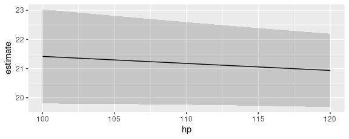

<script src="marginalmeans_files/libs/kePrint-0.0.1/kePrint.js"></script>
<link href="marginalmeans_files/libs/lightable-0.0.1/lightable.css" rel="stylesheet" />


# Marginal Means

In the context of this package, “marginal means” refer to the values
obtained by this three step process:

1.  Construct a “grid” of predictor values with all combinations of
    categorical variables, and where numeric variables are held at their
    means.
2.  Calculate adjusted predictions for each cell in that grid.
3.  Take the average of those adjusted predictions across one dimension
    of the grid to obtain the marginal means.

For example, consider a model with a numeric, a factor, and a logical
predictor:

``` r
library(marginaleffects)

dat <- mtcars
dat$cyl <- as.factor(dat$cyl)
dat$am <- as.logical(dat$am)
mod <- lm(mpg ~ hp + cyl + am, data = dat)
```

Using the `predictions` function, we set the `hp` variable at its mean
and compute predictions for all combinations for `am` and `cyl`:

``` r
p <- predictions(
    mod,
    newdata = datagrid(am = unique, cyl = unique))
```

For illustration purposes, it is useful to reshape the above results:

<table class="table" data-quarto-postprocess="true"
style="margin-left: auto; margin-right: auto;">
<colgroup>
<col style="width: 25%" />
<col style="width: 25%" />
<col style="width: 25%" />
<col style="width: 25%" />
</colgroup>
<thead>
<tr class="header">
<th data-quarto-table-cell-role="th"
style="text-align: left; empty-cells: hide; border-bottom: hidden;"></th>
<th colspan="2" data-quarto-table-cell-role="th"
style="text-align: center; border-bottom: hidden; padding-bottom: 0; padding-left: 3px; padding-right: 3px;"><div
style="border-bottom: 1px solid #ddd; padding-bottom: 5px; ">
am
</div></th>
<th data-quarto-table-cell-role="th"
style="text-align: left; empty-cells: hide; border-bottom: hidden;"></th>
</tr>
<tr class="odd">
<th style="text-align: left;" data-quarto-table-cell-role="th">cyl</th>
<th style="text-align: left;"
data-quarto-table-cell-role="th">FALSE</th>
<th style="text-align: left;" data-quarto-table-cell-role="th">TRUE</th>
<th style="text-align: left;" data-quarto-table-cell-role="th">Marginal
means by cyl</th>
</tr>
</thead>
<tbody>
<tr class="odd">
<td style="text-align: left;">4</td>
<td style="text-align: left;">20.8</td>
<td style="text-align: left;">25.0</td>
<td style="text-align: left;">22.9</td>
</tr>
<tr class="even">
<td style="text-align: left;">6</td>
<td style="text-align: left;">16.9</td>
<td style="text-align: left;">21.0</td>
<td style="text-align: left;">19.0</td>
</tr>
<tr class="odd">
<td style="text-align: left;">8</td>
<td style="text-align: left;">17.3</td>
<td style="text-align: left;">21.4</td>
<td style="text-align: left;">19.4</td>
</tr>
<tr class="even">
<td style="text-align: left;">Marginal means by am</td>
<td style="text-align: left;">22.5</td>
<td style="text-align: left;">18.3</td>
<td style="text-align: left;"></td>
</tr>
</tbody>
</table>

The marginal means by `am` and `cyl` are obtained by taking the mean of
the adjusted predictions across cells. The `marginal_means` function
gives us the same results easily:

``` r
marginal_means(mod)
#> 
#>  Term Value Mean Std. Error    z Pr(>|z|)     S 2.5 % 97.5 %
#>   cyl 4     22.9      1.357 16.9   <0.001 209.7  20.2   25.5
#>   cyl 6     19.0      1.073 17.7   <0.001 229.7  16.9   21.1
#>   cyl 8     19.4      1.377 14.1   <0.001 146.6  16.7   22.1
#>   am  FALSE 18.3      0.785 23.3   <0.001 397.4  16.8   19.9
#>   am  TRUE  22.5      0.834 26.9   <0.001 528.6  20.8   24.1
#> 
#> Results averaged over levels of: hp, cyl, am 
#> Columns: term, value, estimate, std.error, statistic, p.value, s.value, conf.low, conf.high 
#> Type:  response
```

We could obtain the same results with the `by` argument of the
`predictions()` function, which allows us to marginalize across some
predictors:

``` r
predictions(
    mod,
    by = "am",
    newdata = datagrid(am = unique, cyl = unique))
#> 
#>     am Estimate Std. Error    z Pr(>|z|)     S 2.5 % 97.5 %
#>  FALSE     18.3      0.785 23.3   <0.001 397.4  16.8   19.9
#>   TRUE     22.5      0.834 26.9   <0.001 528.6  20.8   24.1
#> 
#> Columns: am, estimate, std.error, statistic, p.value, s.value, conf.low, conf.high 
#> Type:  response

predictions(
    mod,
    by = "cyl",
    newdata = datagrid(am = unique, cyl = unique))
#> 
#>  cyl Estimate Std. Error    z Pr(>|z|)     S 2.5 % 97.5 %
#>    4     22.9       1.36 16.9   <0.001 209.7  20.2   25.5
#>    6     19.0       1.07 17.7   <0.001 229.7  16.9   21.1
#>    8     19.4       1.38 14.1   <0.001 146.6  16.7   22.1
#> 
#> Columns: cyl, estimate, std.error, statistic, p.value, s.value, conf.low, conf.high 
#> Type:  response
```

The same results can be achieved using the [powerful `emmeans`
package](https://cran.r-project.org/package=emmeans):

``` r
library(emmeans)
emmeans(mod, specs = "cyl")
#>  cyl emmean   SE df lower.CL upper.CL
#>  4     22.9 1.36 27     20.1     25.7
#>  6     19.0 1.07 27     16.8     21.2
#>  8     19.4 1.38 27     16.5     22.2
#> 
#> Results are averaged over the levels of: am 
#> Confidence level used: 0.95
emmeans(mod, specs = "am")
#>  am    emmean    SE df lower.CL upper.CL
#>  FALSE   18.3 0.785 27     16.7     19.9
#>   TRUE   22.5 0.834 27     20.8     24.2
#> 
#> Results are averaged over the levels of: cyl 
#> Confidence level used: 0.95
```

## Marginal Means vs. Average Predictions

What should scientists report? Marginal means or average predictions?

Many analysts ask this question, but unfortunately there isn’t a single
answer. As explained above, marginal means are a special case of
predictions, made on a perfectly balanced grid of categorical
predictors, with numeric predictors held at their means, and
marginalized with respect to some focal variables. Whether the analyst
prefers to report this specific type of marginal means or another kind
of average prediction will depend on the characteristics of the sample
and the population to which they want to generalize.

After reading this vignette and the discussion of `emmeans` in the
[Alternative Software vignette](alternative_software.html), you may want
to consult with a statistician to discuss your specific real-world
problem and make an informed choice.

## Interactions

By default, the `marginal_means()` function calculates marginal means
for each categorical predictor one after the other. We can also compute
marginal means for *combinations* of categories by setting `cross=TRUE`:

``` r
library(lme4)

dat <- "https://vincentarelbundock.github.io/Rdatasets/csv/Stat2Data/Titanic.csv"
dat <- read.csv(dat)
titanic <- glmer(
    Survived ~ Sex * PClass + Age + (1 | PClass),
    family = binomial,
    data = dat)
```

Regardless of the scale of the predictions (`type` argument),
`marginal_means()` always computes standard errors using the Delta
Method:

``` r
marginal_means(
    titanic,
    type = "response",
    variables = c("Sex", "PClass"))
#> 
#>    Term  Value  Mean Std. Error     z Pr(>|z|)     S 2.5 % 97.5 %
#>  Sex    female 0.738     0.0207 35.68   <0.001 923.8 0.698  0.779
#>  Sex    male   0.235     0.0203 11.62   <0.001 101.3 0.196  0.275
#>  PClass 1st    0.708     0.0273 25.95   <0.001 490.9 0.654  0.761
#>  PClass 2nd    0.511     0.0235 21.76   <0.001 346.4 0.465  0.557
#>  PClass 3rd    0.242     0.0281  8.59   <0.001  56.7 0.187  0.297
#> 
#> Results averaged over levels of: Sex, PClass 
#> Columns: term, value, estimate, std.error, statistic, p.value, s.value, conf.low, conf.high 
#> Type:  response
```

When the model is linear or on the link scale, it also produces
confidence intervals:

``` r
marginal_means(
    titanic,
    type = "link",
    variables = c("Sex", "PClass"))
#> 
#>    Term  Value    Mean Std. Error       z Pr(>|z|)    S  2.5 % 97.5 %
#>  Sex    female  1.6407      0.206   7.984   <0.001 49.3  1.238  2.043
#>  Sex    male   -1.3399      0.124 -10.828   <0.001 88.3 -1.582 -1.097
#>  PClass 1st     1.6307      0.271   6.028   <0.001 29.2  1.100  2.161
#>  PClass 2nd     0.0997      0.211   0.472    0.637  0.7 -0.314  0.513
#>  PClass 3rd    -1.2792      0.155  -8.255   <0.001 52.6 -1.583 -0.975
#> 
#> Results averaged over levels of: Sex, PClass 
#> Columns: term, value, estimate, std.error, statistic, p.value, s.value, conf.low, conf.high 
#> Type:  link
```

It is easy to transform those link-scale marginal means with arbitrary
functions using the `transform` argument:

``` r
marginal_means(
    titanic,
    type = "link",
    transform = insight::link_inverse(titanic),
    variables = c("Sex", "PClass"))
#> 
#>    Term  Value  Mean Pr(>|z|)    S 2.5 % 97.5 %
#>  Sex    female 0.838   <0.001 49.3 0.775  0.885
#>  Sex    male   0.208   <0.001 88.3 0.170  0.250
#>  PClass 1st    0.836   <0.001 29.2 0.750  0.897
#>  PClass 2nd    0.525    0.637  0.7 0.422  0.626
#>  PClass 3rd    0.218   <0.001 52.6 0.170  0.274
#> 
#> Results averaged over levels of: Sex, PClass 
#> Columns: term, value, estimate, p.value, s.value, conf.low, conf.high 
#> Type:  link
```

`marginal_means()` defaults to reporting EMMs for each category
individually, without cross-margins:

``` r
titanic2 <- glmer(
    Survived ~ Sex + PClass + Age + (1 | PClass),
    family = binomial,
    data = dat)

marginal_means(
    titanic2,
    variables = c("Sex", "PClass"))
#> 
#>    Term  Value  Mean Std. Error    z Pr(>|z|)     S 2.5 % 97.5 %
#>  Sex    female 0.741     0.0240 30.8   <0.001 691.0 0.694  0.788
#>  Sex    male   0.253     0.0203 12.5   <0.001 116.0 0.213  0.293
#>  PClass 1st    0.707     0.0289 24.5   <0.001 436.5 0.650  0.763
#>  PClass 2nd    0.494     0.0287 17.2   <0.001 217.5 0.437  0.550
#>  PClass 3rd    0.291     0.0268 10.9   <0.001  88.8 0.238  0.344
#> 
#> Results averaged over levels of: Sex, PClass 
#> Columns: term, value, estimate, std.error, statistic, p.value, s.value, conf.low, conf.high 
#> Type:  response
```

We can force the cross:

``` r
marginal_means(
    titanic2,
    cross = TRUE,
    variables = c("Sex", "PClass"))
#> 
#>    Mean Std. Error     z Pr(>|z|)     S  2.5 % 97.5 %
#>  0.9288     0.0161 57.71   <0.001   Inf 0.8973 0.9604
#>  0.7819     0.0357 21.93   <0.001 351.8 0.7120 0.8518
#>  0.5118     0.0458 11.17   <0.001  93.8 0.4220 0.6017
#>  0.4844     0.0468 10.35   <0.001  81.0 0.3926 0.5761
#>  0.2051     0.0308  6.66   <0.001  35.1 0.1448 0.2655
#>  0.0702     0.0135  5.18   <0.001  22.1 0.0436 0.0967
#> 
#> Columns: Sex, PClass, estimate, std.error, statistic, p.value, s.value, conf.low, conf.high 
#> Type:  response
```

## Group averages with the `by` argument

We can collapse marginal means via averaging using the `by` argument:

``` r
dat <- mtcars
dat$am <- factor(dat$am)
dat$vs <- factor(dat$vs)
dat$cyl <- factor(dat$cyl)

mod <- glm(gear ~ cyl + vs + am, data = dat, family = poisson)

by <- data.frame(
    by = c("(4 & 6)", "(4 & 6)", "(8)"),
    cyl = c(4, 6, 8))

marginal_means(mod, by = by, variables = "cyl")
#> 
#>       By Mean Pr(>|z|)    S 2.5 % 97.5 %
#>  (4 & 6) 3.86   <0.001 59.1  2.86   5.22
#>  (8)     3.59   <0.001 18.5  2.11   6.13
#> 
#> Results averaged over levels of: vs, am, cyl 
#> Columns: by, estimate, p.value, s.value, conf.low, conf.high 
#> Type:  invlink(link)
```

And we can use the `hypothesis` argument to compare those new collapsed
subgroups:

``` r
marginal_means(mod, by = by, variables = "cyl", hypothesis = "pairwise")
#> 
#>           Term  Mean Std. Error     z Pr(>|z|)   S 2.5 % 97.5 %
#>  (4 & 6) - (8) 0.271       1.39 0.195    0.845 0.2 -2.45      3
#> 
#> Results averaged over levels of: vs, am, cyl 
#> Columns: term, estimate, std.error, statistic, p.value, s.value, conf.low, conf.high 
#> Type:  response
```

## Custom Contrasts and Linear Combinations

See the vignette on [Custom Contrasts and Combinations](hypothesis.html)

## Tidy summaries

The `summary`, `tidy`, and `glance` functions are also available to
summarize and manipulate the results:

``` r
mm <- marginal_means(mod)

tidy(mm)
#> # A tibble: 7 × 7
#>   term  value estimate  p.value s.value conf.low conf.high
#>   <chr> <fct>    <dbl>    <dbl>   <dbl>    <dbl>     <dbl>
#> 1 cyl   4         3.83 2.34e- 8    25.4     2.39      6.13
#> 2 cyl   6         3.90 1.57e-12    39.2     2.67      5.68
#> 3 cyl   8         3.59 2.66e- 6    18.5     2.11      6.13
#> 4 vs    0         3.79 1.88e-12    39.0     2.62      5.50
#> 5 vs    1         3.75 5.82e-10    30.7     2.47      5.69
#> 6 am    0         3.27 3.96e-15    47.8     2.43      4.40
#> 7 am    1         4.34 6.83e-19    60.3     3.14      6.01

glance(mm)
#> # A tibble: 1 × 7
#>     aic   bic r2.nagelkerke  rmse  nobs     F logLik   
#>   <dbl> <dbl>         <dbl> <dbl> <int> <dbl> <logLik> 
#> 1  113.  120.         0.672 0.437    32 0.737 -51.50168

summary(mm)
#> 
#>  Term Value Mean Pr(>|z|)    S 2.5 % 97.5 %
#>   cyl     4 3.83   <0.001 25.4  2.39   6.13
#>   cyl     6 3.90   <0.001 39.2  2.67   5.68
#>   cyl     8 3.59   <0.001 18.5  2.11   6.13
#>   vs      0 3.79   <0.001 39.0  2.62   5.50
#>   vs      1 3.75   <0.001 30.7  2.47   5.69
#>   am      0 3.27   <0.001 47.8  2.43   4.40
#>   am      1 4.34   <0.001 60.3  3.14   6.01
#> 
#> Results averaged over levels of: cyl, vs, am 
#> Columns: term, value, estimate, p.value, s.value, conf.low, conf.high 
#> Type:  invlink(link)
```

Thanks to those tidiers, we can also present the results in the style of
a regression table [using the `modelsummary` package.](tables.html)

## Case study: Multinomial Logit

To begin, we generate data and estimate a large model:

``` r
library(nnet)
library(marginaleffects)

set.seed(1839)
n <- 1200
x <- factor(sample(letters[1:3], n, TRUE))
y <- vector(length = n)
y[x == "a"] <- sample(letters[4:6], sum(x == "a"), TRUE)
y[x == "b"] <- sample(letters[4:6], sum(x == "b"), TRUE, c(1 / 4, 2 / 4, 1 / 4))
y[x == "c"] <- sample(letters[4:6], sum(x == "c"), TRUE, c(1 / 5, 3 / 5, 2 / 5))

dat <- data.frame(x = x, y = factor(y))
tmp <- as.data.frame(replicate(20, factor(sample(letters[7:9], n, TRUE))))
dat <- cbind(dat, tmp)
void <- capture.output({
    mod <- multinom(y ~ ., dat)
})
```

Try to compute marginal means, but realize that your grid won’t fit in
memory:

``` r
marginal_means(mod, type = "probs")
#> Error: You are trying to create a prediction grid with more than 1 billion rows, which is likely to exceed the memory and computational power available on your local machine. Presumably this is because you are considering many variables with many levels. All of the functions in the `marginaleffects` package include arguments to specify a restricted list of variables over which to create a prediction grid.
```

Use the `variables` and `variables_grid` arguments to compute marginal
means over a more reasonably sized grid:

``` r
marginal_means(mod,
              type = "probs",
              variables = c("x", "V1"),
              variables_grid = paste0("V", 2:3))
```

## Plot conditional marginal means

The `marginaleffects` package offers several functions to plot how some
quantities vary as a function of others:

-   `plot_predictions`: Conditional adjusted predictions – how does the
    predicted outcome change as a function of regressors?
-   `plot_comparisons`: Conditional comparisons – how do contrasts
    change as a function of regressors?
-   `plot_slopes`: Conditional marginal effects – how does the slope
    change as a function of regressors?

There is no analogous function for marginal means. However, it is very
easy to achieve a similar effect using the `predictions()` function, its
`by` argument, and standard plotting functions. In the example below, we
take these steps:

1.  Estimate a model with one continuous (`hp`) and one categorical
    regressor (`cyl`).
2.  Create a perfectly “balanced” data grid for each combination of `hp`
    and `cyl`. This is specified by the user in the `datagrid()` call.
3.  Compute fitted values (aka “adjusted predictions”) for each cell of
    the grid.
4.  Use the `by` argument to take the average of predicted values for
    each value of `hp`, across margins of `cyl`.
5.  Compute standard errors around the averaged predicted values (i.e.,
    marginal means).
6.  Create symmetric confidence intervals in the usual manner.
7.  Plot the results.

``` r
library(ggplot2)

mod <- lm(mpg ~ hp + factor(cyl), data = mtcars)

p <- predictions(mod,
    by = "hp",
    newdata = datagrid(
        model = mod,
        hp = seq(100, 120, length.out = 10),
        cyl = mtcars$cyl))

ggplot(p) +
    geom_ribbon(aes(hp, ymin = conf.low, ymax = conf.high), alpha = .2) +
    geom_line(aes(hp, estimate))
```


