::: {layout-ncol=2}
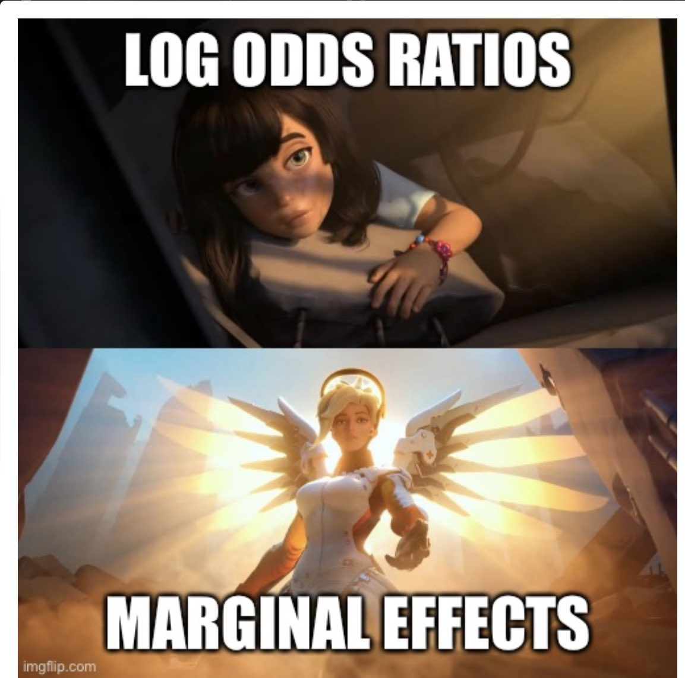{group="elsewhere" description="meme a"}

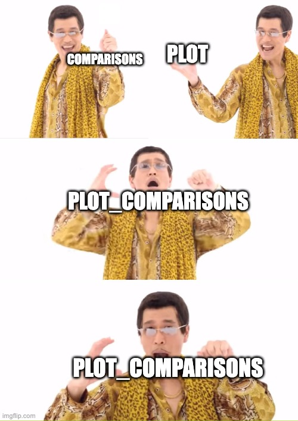{group="elsewhere" description="meme c"}

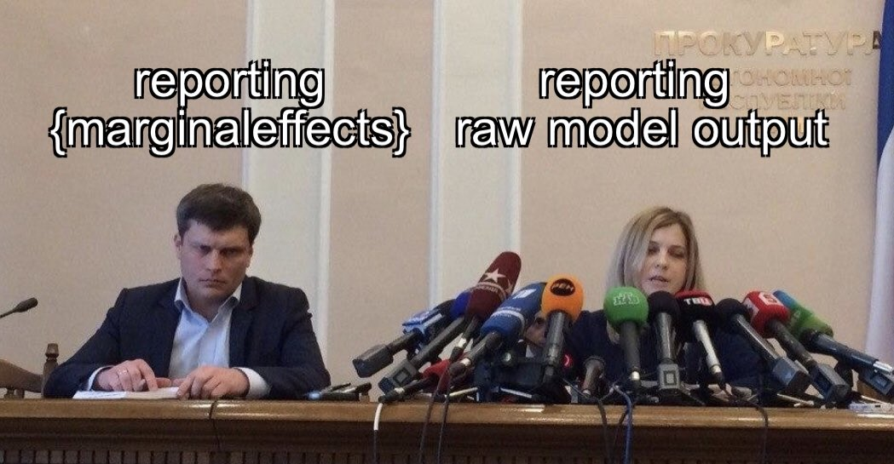{group="elsewhere" description="meme b"}

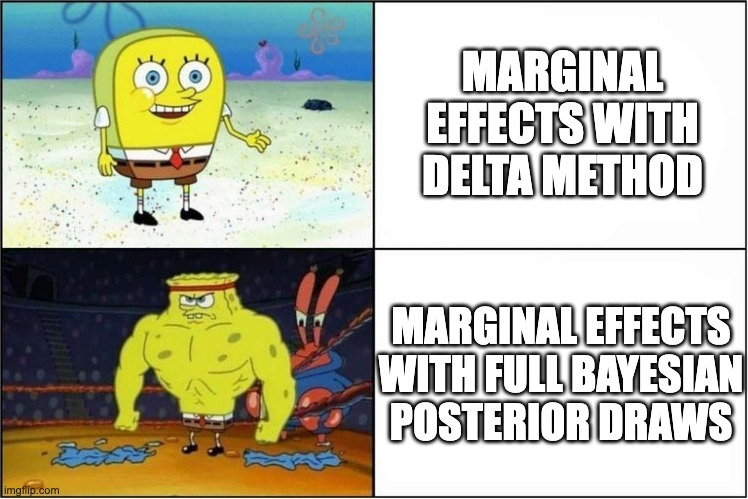{group="elsewhere" description="meme d"}

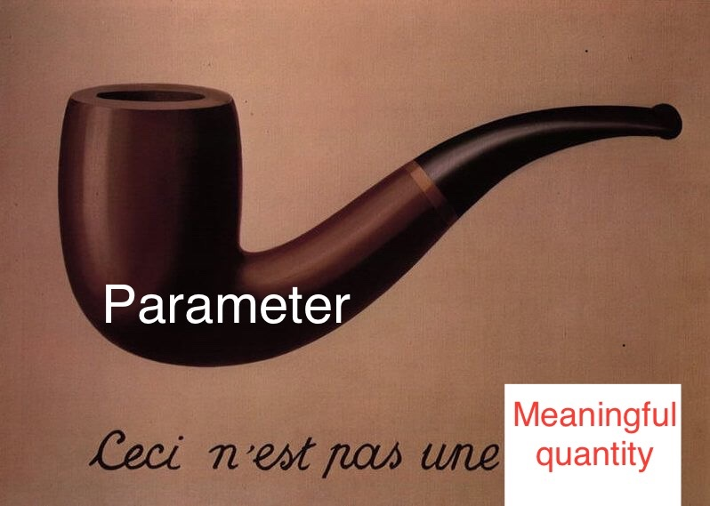{group="elsewhere" description="Source: @dan_p_simpson"}

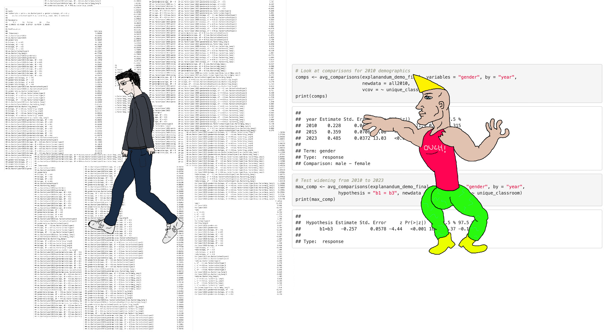{group="elsewhere" description="Source: @dingdingpeng.the100.ci"}

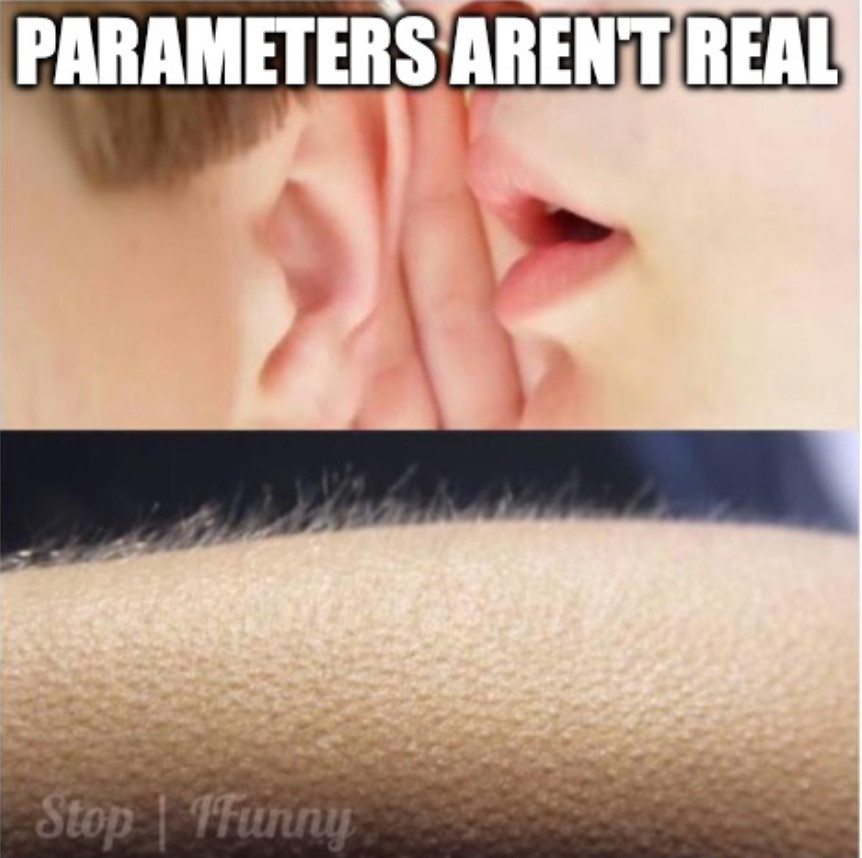{group="elsewhere" description="Source: @conjugateprior.org"}

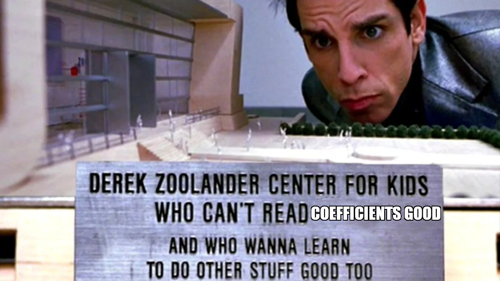{group="elsewhere" description="Derek Zoolander center for kids who can't read coefficients good. Source: @vincentab.bluesky."}

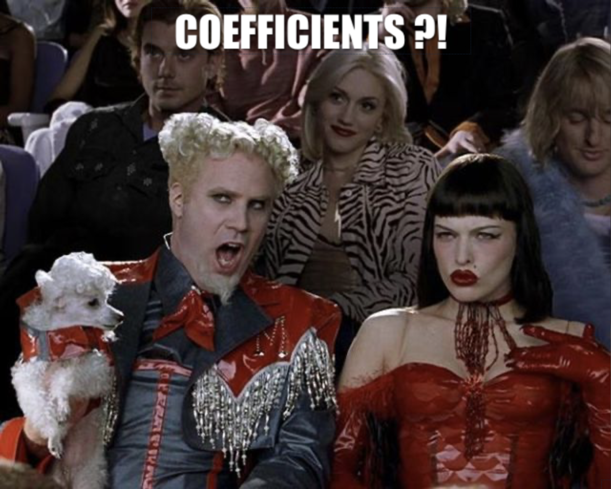{group="elsewhere" description="Mugatu reacts to coefficients. Source: @vincentab.bluesky."}

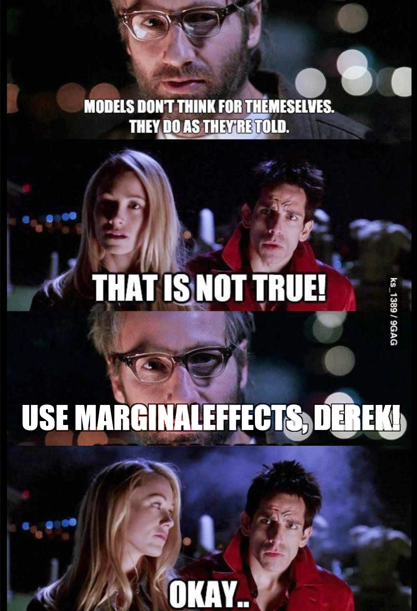{group="elsewhere" description="Mugatu reacts to coefficients. Source: @vincentab.bluesky."}

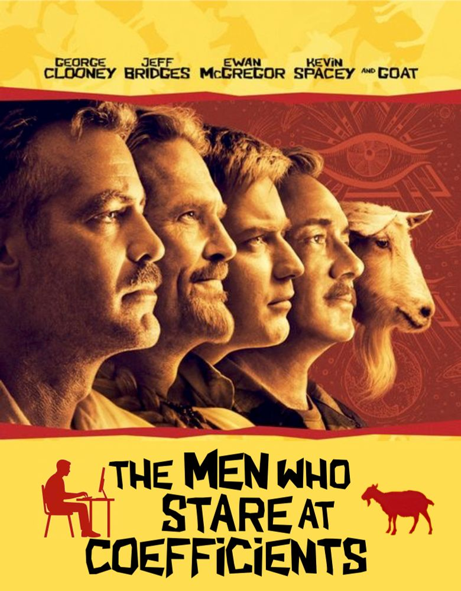{group="elsewhere" description="Men who stare at coefficients. Source: @dingdingpeng.the100.ci"}

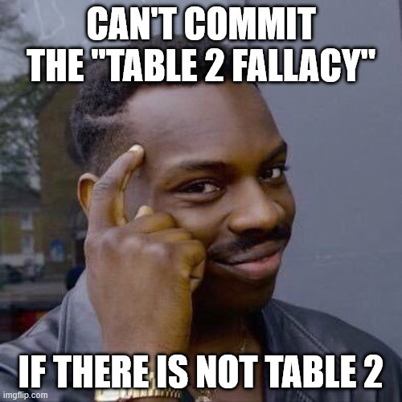{group="elsewhere" description="No table 2 fallacy. Source: @mattansb.msbstats.info"}

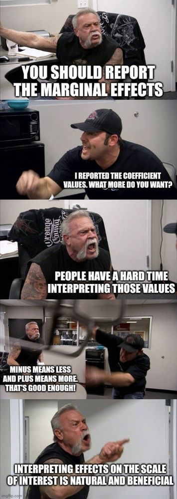{group="elsewhere" description="Wrestlers arguing about parameters. Source: @stephenjwild."}
:::

